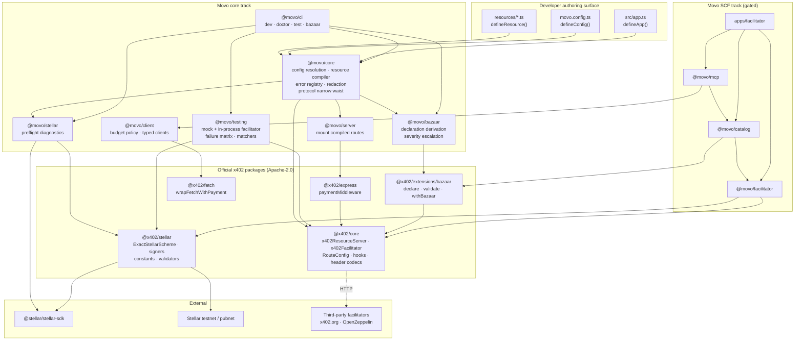
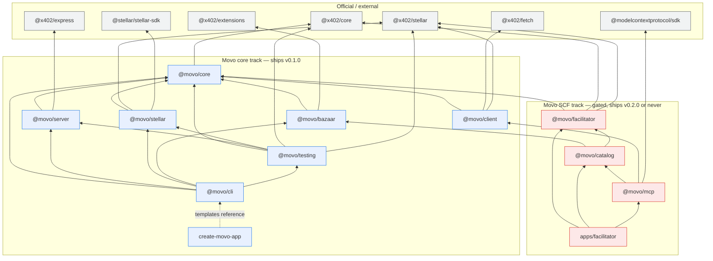
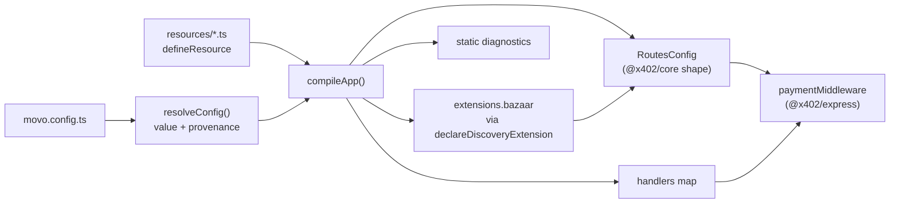
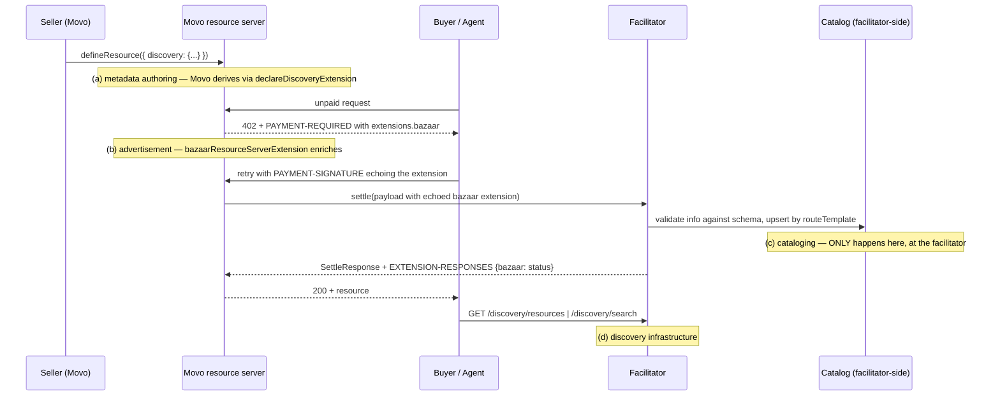
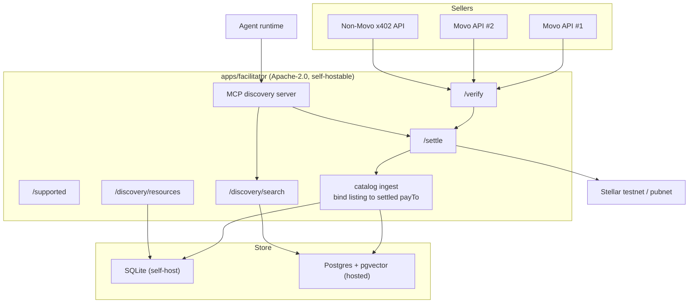
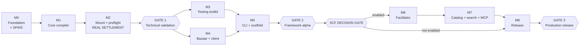

# MOVO FINAL ARCHITECTURE & IMPLEMENTATION SPECIFICATION

**Status:** Final — source of truth for implementation
**Date:** 2026-08-09
**Author role:** Lead protocol architect
**Basis:** Direct inspection of the published `@x402/*` 2.21.0 tarballs (type declarations and compiled output), the x402 Foundation specification and documentation, Stellar developer documentation, and the SCF #45 RFP Track.

### Evidence labelling used throughout

| Tag | Meaning |
|---|---|
| `[FACT]` | Verified by direct inspection of published package declarations or primary documentation during this analysis |
| `[ASSUMPTION]` | Believed true, not directly verified; stated so it can be challenged |
| `[DECISION]` | An architectural choice made here, not derived from upstream |
| `[INFERENCE]` | Conclusion drawn from facts, not itself observed |
| `[VERIFY]` | Must be confirmed against upstream before implementation; the specific check is named |

---

## 0. Executive Architecture Summary

### 0.1 The finding that reshapes the plan

I downloaded and read the type declarations of `@x402/core@2.21.0`, `@x402/stellar@2.21.0`, `@x402/express@2.21.0`, `@x402/extensions@2.21.0` and `@x402/fetch@2.21.0`. The upstream SDK is far more complete than its documentation suggests. Specifically:

`[FACT]` `@x402/core/server` already exports `x402ResourceServer`, `x402HTTPResourceServer`, `RouteConfig`, `RoutesConfig`, `PaymentOption`, `ResourceInfo`, `HTTPFacilitatorClient`, `FacilitatorClient`, `FacilitatorResponseError`, `FacilitatorTimeoutError`, and a complete lifecycle hook system: `BeforeVerifyHook`, `AfterVerifyHook`, `OnVerifyFailureHook`, `BeforeSettleHook`, `AfterSettleHook`, `OnSettleFailureHook`, `OnVerifiedPaymentCanceledHook`, plus `ProtectedRequestHook`, `UnpaidResponseBody`, `SettlementFailedResponseBody`, `PaywallConfig`, and `SettlementOverrides`.

`[FACT]` `RouteConfig` already carries `accepts`, `resource`, `description`, `mimeType`, `serviceName`, `tags`, `iconUrl`, `customPaywallHtml`, `unpaidResponseBody`, `settlementFailedResponseBody`, `extensions`. `PaymentOption` already supports `DynamicPayTo` and `DynamicPrice`. `Price = Money | AssetAmount` where `AssetAmount = { asset, amount, extra? }`.

`[FACT]` `@x402/core/facilitator` exports a full `x402Facilitator` class with `register(networks, facilitator)`, `registerV1`, `registerExtension`, `getSupported()`, `verify(payload, requirements)`, `settle(payload, requirements)`, and six lifecycle hooks with abort/recover semantics.

`[FACT]` `@x402/stellar` already exports `STELLAR_TESTNET_CAIP2` (`"stellar:testnet"`), `STELLAR_PUBNET_CAIP2` (`"stellar:pubnet"`), `STELLAR_WILDCARD_CAIP2`, `USDC_TESTNET_ADDRESS` (`CBIELTK6YBZJU5UP2WWQEUCYKLPU6AUNZ2BQ4WWFEIE3USCIHMXQDAMA`), `USDC_PUBNET_ADDRESS` (`CCW67TSZV3SSS2HXMBQ5JFGCKJNXKZM7UQUWUZPUTHXSTZLEO7SJMI75`), `DEFAULT_TOKEN_DECIMALS = 7`, `DEFAULT_ESTIMATED_LEDGER_SECONDS = 5`, `STELLAR_NETWORK_TO_PASSPHRASE`, `getUsdcAddress`, `convertToTokenAmount`, `getNetworkPassphrase`, `getRpcClient`, `getHorizonClient`, `getRpcUrl`, `validateStellarAssetAddress`, `validateStellarDestinationAddress`, `isStellarNetwork`, `createEd25519Signer`, `Ed25519Signer`, `ClientStellarSigner`, `FacilitatorStellarSigner`, `gatherAuthEntrySignatureStatus`, `handleSimulationResult`, and `ExactStellarScheme` at three subpaths (`/exact/client`, `/exact/server`, `/exact/facilitator`).

`[FACT]` `@x402/extensions/bazaar` already exports `declareDiscoveryExtension`, `bazaarResourceServerExtension`, `withBazaar`, `validateDiscoveryExtension`, `validateDiscoveryExtensionSpec`, `validateAndExtract`, `validateRouteTemplate`, `isValidRouteTemplate`, `isValidIconUrl`, `isValidServiceName`, `sanitizeTags`, `sanitizeResourceServiceMetadata`, `extractDiscoveryInfo`, `ListDiscoveryResourcesParams`, `SearchDiscoveryResourcesParams`, `DiscoveryResourcesResponse`, `DiscoveredHTTPResource`, `DiscoveredMCPResource`. `@x402/core/server` exports `checkIfBazaarNeeded`.

`[FACT]` `@x402/express` already exports `paymentMiddleware`, `paymentMiddlewareFromConfig`, `paymentMiddlewareFromHTTPServer`, `ExpressAdapter`. `@x402/fetch` already exports `wrapFetchWithPayment`, `wrapFetchWithPaymentFromConfig`, `x402Client`, `x402HTTPClient`, `PaymentPolicy`, `SelectPaymentRequirements`.

`[INFERENCE]` **A large fraction of what a naive "Movo framework" would build already exists upstream.** Route configuration, middleware, lifecycle hooks, Bazaar declaration *and validation* (including the icon-URL SSRF check and route-template validation), Stellar constants, decimals, asset addresses, network identifiers, signers, and client fetch-wrapping are all shipped, Apache-2.0, and maintained by the x402 Foundation.

`[DECISION]` **Movo's scope must therefore contract sharply.** Any Movo package whose primary content is a wrapper around one of the above is deleted from this specification. What remains is the genuinely absent layer.

### 0.2 What Movo actually is, after that contraction

Movo is **the project layer and the operations layer** around x402 + Stellar. Concretely, seven things nobody upstream provides:

1. **Project model and configuration.** `movo.config.ts`, environment separation (`local` / `testnet` / `pubnet`), resolution with provenance, secret handling. x402 gives you a `routes` object literal; it does not give you a project.
2. **Resource modules.** One typed declaration per file that compiles to an x402 `RouteConfig` *and* its Bazaar declaration *and* its test fixtures, with handler input/output types flowing through. Upstream requires you to keep those three in sync by hand.
3. **Preflight and diagnostics (`movo doctor`).** Trustline presence, account funding, asset resolution, facilitator/network agreement, clock skew, dependency pin drift, discovery-metadata conformance. This is the single largest onboarding cliff in Stellar x402 and it is unaddressed anywhere.
4. **Application-level test harness.** In-process facilitator wiring, a nine-scenario payment failure matrix, assertion matchers. Upstream has an e2e suite for *itself*, not for *your* API.
5. **Error and diagnostic translation.** Turning opaque facilitator rejection reasons into actionable, coded, documented errors.
6. **Scaffolding and CLI.** `create-movo-app`, `movo dev|doctor|test|bazaar`.
7. **(SCF track only) Facilitator service and Stellar Bazaar catalog.** The real infrastructure gap: no existing catalog carries Stellar.

`[DECISION]` Positioning: **"Movo — the project framework and operations toolkit for machine-payable Stellar APIs."** Not "the TypeScript framework for machine-payable applications," which over-claims against an SDK that already provides the framework primitives.

### 0.3 The Bazaar/facilitator distinction, made precise

The instruction to distinguish four concepts is correct and I adopt it as a hard architectural boundary:

| Concept | Owner | Movo's role |
|---|---|---|
| (a) Bazaar **metadata authoring** | Seller | Movo derives it from the resource module; upstream `declareDiscoveryExtension` emits the wire shape |
| (b) Bazaar-compatible **resource advertisement** | Resource server | Movo mounts `bazaarResourceServerExtension`; upstream enriches the 402 |
| (c) Facilitator-side **cataloging** | Facilitator | Movo only if Movo runs a facilitator (M6→M7) |
| (d) **Discovery / search infrastructure** | Catalog operator | Movo only on the SCF track (M7) |

`[FACT]` Cataloging is triggered when a facilitator processes a `PaymentPayload` carrying the echoed `bazaar` extension; a server-side declaration alone catalogs nothing. `[INFERENCE]` Therefore (a)+(b) without (c) is honest ergonomics and nothing more, and **Movo must never market (a)+(b) as "Bazaar support" without qualification.**

### 0.4 Structural shape

Two tracks, one repository, one licence, one CI.

```
CORE TRACK (M0–M5, M8)          — ships v0.1.0 regardless
   project model · resource modules · doctor · testing · CLI

SCF TRACK  (M6–M7, gated)       — ships v0.2.0 or not at all
   facilitator service · Bazaar catalog · search · MCP discovery
```

The core track has **zero** compile-time or runtime dependency on the SCF track. The SCF track depends on the core track. If the SCF gate fails at the end of M5, the repository still releases a coherent product.

### 0.5 The one thing to prove first

Everything above is speculation until a real payment settles. M0's spike answers a single question before any framework code is written: *can a Movo-shaped resource take a genuine x402 payment through to Stellar testnet settlement using only current official packages?* If the answer is no, the project stops and re-plans. If yes, the spike is deleted and its findings become the M1/M2 contract.

---

## 1. Architecture Decision Record

### 1.1 Executive summary

Movo is an Apache-2.0 TypeScript monorepo providing the project, diagnostics, testing and tooling layer for building x402-payable HTTP APIs settled on Stellar, composed over the official `@x402/*` packages without reimplementing any protocol primitive. It optionally provides a facilitator service and a Stellar-native Bazaar discovery catalog behind a decision gate, so that SCF requirements cannot distort the core framework.

### 1.2 Problem statement

A developer who wants to expose a paid HTTP API on Stellar today must, from the official quickstart: hand-assemble a routes object; know that Stellar USDC has 7 decimals; know the CAIP-2 network strings; create a keypair, fund it, and add a USDC trustline through three separate web tools; pick a facilitator and discover whether it needs an API key; discover empirically that a testnet fee limit requires cloning the payment transaction with `fee: "1"`; write their own tests for payment failure modes; and hand-maintain Bazaar discovery metadata that duplicates their route definition. None of that is protocol work. All of it is project work, and all of it is currently the developer's problem.

### 1.3 Goals

| # | Goal | Measured by |
|---|---|---|
| G1 | Zero to a settled Stellar testnet payment in under 15 minutes from a clean machine | Timed reproducibility run in M8 |
| G2 | Every failure on that path produces an actionable message | `movo doctor` covers each; each has an error code and a docs page |
| G3 | Payment failure modes are testable in CI without a funded account | Nine-scenario matrix runs green with no network |
| G4 | Zero reimplementation of x402 or Stellar protocol primitives | Lint-enforced import boundary; no XDR or signature code in `@movo/*` |
| G5 | Discovery claims are precise and honest | Docs distinguish (a)–(d) of §0.3 explicitly |
| G6 | The core product is valid whether or not the SCF track proceeds | Core track has no dependency on SCF packages |
| G7 | Permissive licence with no strong copyleft in the dependency path | Automated gate from M0 onward |

### 1.4 Non-goals

Restated formally in §16. In summary Movo does not: reimplement x402; reimplement Stellar settlement; wrap `@x402/*` packages merely to rename their exports; vendor AGPL infrastructure; claim to be a Bazaar network by virtue of emitting metadata; create a `@movo/x402` package; take custody of funds; sign on behalf of buyers; or admit SCF-specific infrastructure into the core framework packages.

### 1.5 Architectural principles

| P | Principle | Enforcement |
|---|---|---|
| P1 | **Compose, never wrap.** A Movo package must add capability, not rename exports. | Review rule + §3 forbidden-dependency lists |
| P2 | **One import boundary.** All `@x402/*` imports live in `packages/core/src/protocol/`. | Biome `noRestrictedImports`, tested to fire |
| P3 | **Protocol semantics stay visible.** Network, asset, amount, and payTo are never inferred silently. | API design §5; validation rules |
| P4 | **Diagnostics are a feature, not logging.** Every failure has a code, a cause, and a fix. | Error registry + docs sync test |
| P5 | **Real money paths get real tests.** No mock-only evidence of settlement. | M2 and M8 acceptance criteria require on-chain confirmation |
| P6 | **Secrets are redacted at construction, not at output.** | Property-based redaction test |
| P7 | **Testnet by default, pubnet by explicit act.** | Env guard; in-process facilitator refuses pubnet |
| P8 | **The gate protects the core.** SCF scope may not enter core packages. | Package dependency direction, CI check |

### 1.6 Key assumptions

| # | Assumption | Risk if wrong | Verification |
|---|---|---|---|
| A1 | `@x402/*` will remain Apache-2.0 and actively maintained | High | Monitored; licence gate would catch a change |
| A2 | The `exact` scheme on Stellar remains the settlement path for v1 | Medium | `[VERIFY]` re-read `scheme_exact_stellar.md` at M2 |
| A3 | A free, keyless testnet facilitator remains available at `https://www.x402.org/facilitator` | Medium — degrades quickstart | `[VERIFY]` probe `/supported` in M0; fallback documented |
| A4 | The testnet fee-limit workaround (`fee: "1"` transaction clone) is still required | Low | `[VERIFY]` empirically in the M0 spike; if unnecessary, delete the flag |
| A5 | Bazaar discovery endpoint shapes will continue to change | High — assumed true, planned for | Versioned wire mappers in M7 |
| A6 | Node 24 Active LTS is an appropriate floor | Low | `@x402/stellar` declares `engines.node >=22` `[FACT]` |

### 1.7 Constraints

- **C1 Licence.** Apache-2.0 output; no AGPL/SSPL/GPL in the dependency path, direct or transitive. Driven by the SCF requirement that the deliverable be operable as a network service under a permissive OSI licence.
- **C2 Upstream velocity.** `@x402/*` 2.21.0 published 2026-08-04 `[FACT]`; cross-package pins are `~`-tight `[FACT]`. Movo must pin exactly and verify compatibility mechanically.
- **C3 No protocol invention.** Where the spec or SDK answers a question, that answer is authoritative.
- **C4 No custody.** Movo never holds buyer or seller funds and never requires a payer secret key server-side.
- **C5 SCF isolation.** RFP-driven scope is confined to M6/M7 packages.

### 1.8 Decisions

---

**D1 — Do not create `@movo/x402`.**

- **DECISION:** No Movo package mirrors `@x402/core`. All protocol types and primitives are re-exported through a single internal module, `packages/core/src/protocol/index.ts`, which is the only file in the monorepo permitted to import `@x402/*`.
- **WHY:** `@x402/core` *is* the protocol abstraction `[FACT]`. A wrapper package would double the version-coupling surface, create a second set of type names for the same wire objects, and require a release every time upstream ships — which is roughly weekly.
- **ALTERNATIVES CONSIDERED:** (i) A published `@movo/x402` façade — rejected: pure cost. (ii) Unrestricted direct imports everywhere — rejected: upstream drift would then produce compile errors in dozens of files across seven packages with no single place to absorb them.
- **TRADE-OFFS:** The narrow waist adds one indirection and a small amount of re-export boilerplate. It also means a Movo consumer who wants an unaliased x402 type imports it from `@x402/core` themselves, which is correct but must be documented.
- **CONSEQUENCES:** Upstream breaking changes localise to one directory. `docs/COMPATIBILITY.md` is generated from that directory's imports. The rule is machine-enforced and proven to fire in M0.

---

**D2 — Delete `@movo/express`; do not wrap the middleware.**

- **DECISION:** Movo ships `@movo/server`, whose job is to *compile Movo resource modules into an `@x402/core` `RoutesConfig` and mount it via `@x402/express`'s existing `paymentMiddleware`*. Movo writes no HTTP header encoding, no 402 construction, and no lifecycle state machine.
- **WHY:** `@x402/express` already exports `paymentMiddleware`, `paymentMiddlewareFromConfig`, `paymentMiddlewareFromHTTPServer`, and `ExpressAdapter` `[FACT]`. `@x402/core/server` already implements the verify → handler → settle lifecycle with abort/recover hooks `[FACT]`. Reimplementing that lifecycle — which my earlier draft proposed — would duplicate upstream code that is more thoroughly tested than a new implementation could be, and would risk diverging on the exact ordering semantics that matter most.
- **ALTERNATIVES CONSIDERED:** (i) A Movo-owned lifecycle returning a discriminated union with framework adapters — rejected on discovery that upstream already owns this. (ii) Re-exporting `@x402/express` under a Movo name — rejected under P1.
- **TRADE-OFFS:** Movo loses control over the exact HTTP mapping and inherits upstream's choices about settlement ordering and unpaid-response shape. In exchange it inherits upstream's correctness and its ongoing maintenance. `[VERIFY]` M1 must read `x402HTTPResourceServer`'s settle-ordering behaviour and document it rather than assume it.
- **CONSEQUENCES:** `@movo/server` is small — a compiler plus a mount function. Adapter breadth (Hono, Fastify, Next) becomes a question of which upstream adapter packages exist, not of Movo writing adapters.

---

**D3 — `@movo/bazaar` is a *derivation and enforcement* package, not a validation library.**

- **DECISION:** Movo derives the Bazaar declaration from the resource module and calls upstream `declareDiscoveryExtension`. Validation calls upstream `validateDiscoveryExtensionSpec`, `validateRouteTemplate`, `isValidIconUrl`, `isValidServiceName`, `sanitizeTags`. Movo's addition is **severity escalation**: upstream soft-drops invalid fields at runtime; Movo turns the same findings into build-time and CI errors, and explains them.
- **WHY:** Every validator I would have specified already exists upstream `[FACT]`, including the icon-URL SSRF check and route-template validation. Writing a second implementation would be strictly worse — a divergence risk with no benefit.
- **ALTERNATIVES CONSIDERED:** Independent Movo validators for defence in depth — rejected: two validators that disagree is a bug factory, and the security-relevant checks belong upstream where the whole ecosystem benefits from fixes.
- **TRADE-OFFS:** If upstream's validator has a gap, Movo inherits it. Mitigation: if Movo finds a gap, the fix is contributed upstream and only temporarily shimmed locally, with the shim marked for deletion.
- **CONSEQUENCES:** `@movo/bazaar` is perhaps 300 lines. That is the correct size. The substantive Bazaar work is the catalog (M7), not the declaration.

---

**D4 — `@movo/stellar` is a diagnostics package, not a constants package.**

- **DECISION:** Movo does not define Stellar network identifiers, USDC addresses, decimals, passphrases, RPC URLs, address validators, or amount converters. All are imported from `@x402/stellar` `[FACT: all exported]`. `@movo/stellar` contains only preflight checks: account existence, trustline presence, asset resolution, facilitator/network agreement, ledger-based expiry headroom, and clock skew.
- **WHY:** Hard-coding a USDC contract address that upstream already exports is exactly the class of duplication that produces a silent money bug when one of the two changes.
- **ALTERNATIVES CONSIDERED:** A Movo constants module for "stability" — rejected: it creates a second source of truth for values that must never diverge.
- **TRADE-OFFS:** Movo's Stellar surface is now thin enough that a reader may ask what it is for. The answer is diagnostics, and the docs must say so plainly.
- **CONSEQUENCES:** `@movo/stellar` may be renamed `@movo/preflight` if the diagnostics framing proves clearer during M2. `[Open question OQ-3]`

---

**D5 — Movo's `Facilitator` abstraction is a *selection and diagnostics* layer over `FacilitatorClient`.**

- **DECISION:** Movo does not define a new facilitator interface. `@x402/core/server` exports `FacilitatorClient` and `HTTPFacilitatorClient` `[FACT]`; Movo consumes them. Movo adds: config-driven construction (URL, auth headers, timeouts from environment), a health probe used by `movo doctor`, and an in-process facilitator built from `x402Facilitator` + `ExactStellarScheme` from `@x402/stellar/exact/facilitator` `[FACT: subpath exists]`.
- **WHY:** A parallel interface would need adapters in both directions and would break the moment upstream adds a method.
- **ALTERNATIVES CONSIDERED:** A Movo `Facilitator` port with hosted/in-process/mock implementations — partially retained: the *implementations* are useful, the *new interface* is not. They implement `FacilitatorClient`.
- **TRADE-OFFS:** Movo cannot present a simplified facilitator surface. Given P3 (protocol semantics stay visible), that is acceptable and arguably desirable.
- **CONSEQUENCES:** Swapping hosted → in-process → mock is a one-line config change and requires no Movo-specific type.

---

**D6 — Resource modules are the primary Movo abstraction.**

- **DECISION:** The unit of authorship is a file exporting a single `defineResource({...})` object. It compiles to: an `@x402/core` `RouteConfig` entry, an optional Bazaar declaration, a typed handler, and a test fixture. Movo's `defineApp` collects resource modules from a directory and produces the `RoutesConfig` object plus the handler mounting.
- **WHY:** This is the one genuine ergonomic gap. Upstream's model requires the developer to maintain the routes object, the handler, and the discovery declaration as three separate artefacts kept in sync manually — and desynchronisation is silent.
- **ALTERNATIVES CONSIDERED:** (i) `movo.resource(...)` on a mutable app instance — rejected: implicit global state, poor for testing, hostile to serverless. (ii) A `paid()` handler decorator à la Next route handlers — retained only as a thin adapter in POST-MVP, because it cannot express route-level discovery metadata cleanly. (iii) Config-file-driven routes — rejected: loses type inference from handler to client.
- **TRADE-OFFS:** File-convention discovery adds a build/scan step and some magic. Mitigated by making explicit registration equally supported: `defineApp({ resources: [weather, forecast] })` is first-class, and directory scanning is opt-in.
- **CONSEQUENCES:** `defineResource` is the API most exposed to backwards-compatibility pressure. It gets the strictest stability treatment (§1.15).

---

**D7 — Naming: `defineResource` / `defineApp` / `defineConfig`, not `movo.resource(...)` or `createResource(...)`.**

- **DECISION:** `define*` free functions returning plain data objects.
- **WHY:** `define*` signals "declare a value, no side effects," matches the prevailing convention in the TypeScript tooling ecosystem, and keeps every declaration serialisable, inspectable, and testable without instantiating a server. `movo.resource(...)` implies a registry with hidden state. `createResource(...)` implies an instantiated object with behaviour.
- **ALTERNATIVES CONSIDERED:** Both alternatives named above.
- **TRADE-OFFS:** Slightly less discoverable via autocomplete than a namespaced object.
- **CONSEQUENCES:** All Movo declarations are pure data, so `movo doctor` can analyse a project statically without booting it — which is what makes doctor cheap and reliable.

---

**D8 — Two-track repository with a formal gate after M5.**

- **DECISION:** M6 (facilitator) and M7 (catalog/discovery/MCP) live in separate packages and a separate `apps/` service, gated by a decision matrix evaluated at the end of M5.
- **WHY:** The SCF RFP requires substantially more than the core framework thesis. Admitting it into the core would make Movo an infrastructure project with a framework attached, and would make v0.1.0 hostage to operational work (key management, uptime, ranking quality) that the framework does not need.
- **ALTERNATIVES CONSIDERED:** (i) Separate repository — rejected: the catalog needs the resource model and the testing harness, and a split would duplicate CI, licence tooling and docs. (ii) SCF-first — rejected: nothing about the facilitator is validated until the framework proves the payment path anyway.
- **TRADE-OFFS:** One repository with two audiences needs careful documentation partitioning.
- **CONSEQUENCES:** Package dependency direction is one-way and CI-enforced: nothing in `packages/{core,server,stellar,bazaar,client,testing,cli}` may import from `packages/{facilitator,catalog,mcp}`.

---

**D9 — ESM-only, Node 24 target, `>=22` floor.**

- **DECISION:** `engines.node: ">=22"`, development and primary CI on 24, matrix 22/24/26. ESM-only output.
- **WHY:** `@x402/stellar` declares `engines.node >=22` `[FACT]`; `@stellar/stellar-sdk@16.2.0` declares `>=22` `[FACT]`. Node 24 is Active LTS `[FACT]`. Dual CJS/ESM publishing doubles the resolution failure surface for no gain at this floor.
- **ALTERNATIVES CONSIDERED:** Dual publishing — rejected. Note that upstream `@x402/*` do publish dual `[FACT]`, so Movo consuming them from ESM is safe.
- **TRADE-OFFS:** CJS consumers cannot `require()` Movo. Documented prominently; revisit on real user demand.
- **CONSEQUENCES:** Simpler build (`tsc` project references, no bundler).

---

**D10 — TypeScript version is pinned and validated, not tracked to latest.**

- **DECISION:** Pin an exact TypeScript version in the root. `[FACT]` TypeScript 7.0.2 is current (the native-port compiler). `[VERIFY]` M0 must confirm that Biome, Vitest 4, and `tsc` project references behave correctly under TS 7 before adopting it; if any tool misbehaves, pin the latest 5.x line and record the reason in `docs/COMPATIBILITY.md`.
- **WHY:** A compiler major that changed implementation language is not something to adopt implicitly in a payments codebase.
- **CONSEQUENCES:** A named, revisitable decision instead of an accident.

---

**D11 — No telemetry, ever.**

- **DECISION:** Movo collects no usage data, in the CLI, the framework, or the facilitator service beyond what an operator configures for their own instance.
- **WHY:** A tool that sits in a payment path and phones home is not adoptable by the audience Movo targets.
- **CONSEQUENCES:** Stated in the README and enforced by review.

### 1.9 Rejected alternatives (summary)

| Rejected | Reason |
|---|---|
| `@movo/x402` package | `@x402/core` already owns it (D1) |
| Movo-owned payment lifecycle state machine | `x402ResourceServer` already implements it with hooks (D2) |
| Movo-owned Bazaar validators | Upstream ships all of them, including SSRF and route-template checks (D3) |
| Movo Stellar constants module | Upstream exports every constant (D4) |
| New `Facilitator` interface | `FacilitatorClient` exists; a parallel interface breaks on upstream change (D5) |
| `movo.resource()` mutable registry | Hidden state; hostile to static analysis and serverless (D7) |
| SCF scope in core packages | Distorts the product and hostages v0.1.0 (D8) |
| Separate SCF repository | Duplicated CI, licence tooling, docs; needs core packages anyway (D8) |
| Dual CJS/ESM publishing | Doubles resolution failure surface at a Node 22 floor (D9) |
| Movo-operated hosted service in v0.1.0 | Operational commitment unrelated to framework value |

### 1.10 Trade-offs accepted

1. **Thin packages look unimpressive.** `@movo/bazaar` at ~300 lines and `@movo/stellar` as diagnostics-only will invite "is this a framework?" The honest answer is that the value is in the project layer and the diagnostics, and the docs must lead with that rather than with a package count.
2. **Coupling to upstream velocity.** Exact pins mean Movo lags upstream by design. Compatibility verification is a scheduled job, not an afterthought.
3. **Inheriting upstream's HTTP semantics.** Movo cannot fix an upstream settle-ordering choice it disagrees with except by contributing upstream. Accepted under P1.
4. **Two-track repository complexity.** Mitigated by strict dependency direction and partitioned docs.
5. **Directory-scan magic in `defineApp`.** Mitigated by making explicit registration equally supported and by `movo doctor` printing exactly which resources were discovered and from where.

### 1.11 Security considerations

| Area | Threat | Control | Milestone |
|---|---|---|---|
| Secret exposure | Facilitator API key, Stellar seed, payment payload in logs or error output | Construction-time redaction; property-based test with fixture seeds; CLI output test asserting zero bytes | M1, M5 |
| Server-side key custody | Framework accepts a payer key and becomes a custody surface | Type system permits no payer key in server config; documented in `SECURITY.md` | M1 |
| Hostile 402 response | Server names arbitrary `payTo`/amount; buyer signs | Client-side `PaymentPolicy` with amount cap, `payTo` allowlist, network allowlist, enforced **before** signing | M4 |
| Accidental pubnet spend | Test or example configured against mainnet | Env guard; in-process facilitator refuses pubnet without `allowMainnet`; CI check that no committed config outside `apps/facilitator` names `stellar:pubnet` | M1, M3, M8 |
| Unpaid access | Handler executes on failed verification | Upstream owns this; Movo asserts it with tests against the real middleware | M2 |
| Charging for failed work | Settlement after a throwing handler | `[VERIFY]` upstream behaviour in M1; assert with a test; document the policy | M2 |
| Discovery metadata leakage | Internal hostnames published in `resource.url` | `movo bazaar validate` warns on private/loopback/internal hosts | M4 |
| Catalog poisoning (SCF) | Client-echoed metadata forges another seller's listing | Bind listings to the settled `payTo`; percent-decode before traversal checks; upstream sanitizers; six adversarial tests | M7 |
| Sponsor key compromise (SCF) | Facilitator sponsoring account drained | External signer/KMS injection; no raw seeds in production config; balance floor; rate limiting; third-party review | M6, M8 |
| Supply chain | Malicious or copyleft transitive dependency | Exact pins for `@x402/*`; licence gate; scheduled audit; provenance publishing | M0, M8 |

### 1.12 Licensing considerations

- **Movo output licence:** Apache-2.0. Chosen over MIT for the explicit patent grant, and matching `@x402/*` which are Apache-2.0 `[FACT]`.
- **Prohibited in the dependency path:** AGPL-3.0-or-later, SSPL, GPL-2.0/3.0. Rationale: Movo's facilitator is operated as a network service, and AGPL's network clause would extend to third parties served by it.
- **Specifically excluded from vendoring:** the OpenZeppelin Relayer, the x402 Facilitator Plugin, and the OpenZeppelin Relayer SDK. `[FACT — per the SCF RFP]` these are AGPL-3.0-or-later and are named as unusable as a base for an RFP deliverable. `[DECISION]` Movo may *call* the hosted Built-on-Stellar facilitator over HTTP as a configured URL — network invocation of a remote service is not a derivative work — but must not import, fork, vendor, or copy that code.
- **Enforcement:** `scripts/check-licenses.ts` runs in PR CI and scheduled CI from M0, tested against a fixture containing a planted AGPL package so the gate is proven to fire.
- `[VERIFY]` Every licence claim in §14 must be confirmed by the tooling at M0 and re-confirmed at M8; entries not yet confirmed are marked as such rather than asserted.

### 1.13 Dependency strategy

| Class | Policy |
|---|---|
| `@x402/*` | **Exact pins**, no ranges. Bumps go through a dedicated PR that regenerates `docs/COMPATIBILITY.md` and re-runs conformance. |
| `@stellar/stellar-sdk` | Caret within the major that `@x402/stellar` depends on `[FACT: ^16.0.1]`; a test asserts a single resolved copy. |
| `zod` | Match the major that `@x402/core` resolves `[FACT: @x402/core depends on zod ^3.24.2, while zod's current latest is 4.x]`. `[VERIFY]` M1 must check the actual resolved tree and assert a single zod instance; a duplicated zod across the boundary produces confusing type errors and larger installs. |
| Runtime dependencies generally | Every addition requires written justification in the PR. Prefer Node built-ins (`util.parseArgs`, `node:sqlite`, `node --watch`, `node:test`-adjacent primitives) over packages. |
| Dev tooling | Caret ranges permitted; pinned in the lockfile; covered by the licence gate. |
| Transitive risk | Scheduled `pnpm audit` + OSV scan + licence gate; lockfile committed; `provenance` on publish. |

### 1.14 Compatibility strategy

`docs/COMPATIBILITY.md` is **generated, never hand-edited**, by `scripts/generate-compatibility.ts`, which reads installed `@x402/*` versions, probes the configured facilitator's `/supported`, and records Node/TypeScript/pnpm versions with a timestamp. A pre-publish check fails the release if the file is stale. A scheduled CI job regenerates it weekly and opens an issue on drift. `movo doctor` compares the developer's installed versions against it and warns.

### 1.15 Upgrade and versioning strategy

- Semantic versioning, Changesets-driven, npm provenance on publish.
- **Stability tiers**, declared per package in §3 and in each package README:
  - **Stable** — breaking change requires a major and a migration note.
  - **Experimental** — may break in a minor; must be marked in the package README and in the type doc comments.
  - **Internal** — `private: true`, never published, no compatibility promise.
- `defineResource`, `defineApp`, `defineConfig` are the strictest surfaces and are Stable from v0.1.0.
- An `@x402/*` breaking change that forces a Movo API change is a Movo major. Movo does not silently absorb protocol breaks.
- `SUPPORT.md` states supported Node versions, the `@x402/*` compatibility window, and the deprecation policy (one minor of deprecation warnings before removal).

### 1.16 Testing philosophy

Four layers, each with a stated purpose and a stated limitation:

1. **Unit, no network.** Config resolution, error construction, redaction, resource compilation. The unit suite fails if any test performs a real `fetch`.
2. **Integration with `MockFacilitator`.** Orchestration correctness for all nine payment failure scenarios, runnable by anyone with no funded account. Limitation: proves Movo's wiring, not the protocol.
3. **Integration with `InProcessFacilitator`.** Real verification and real Stellar testnet settlement, driven locally. Gated behind `MOVO_E2E=1`. Limitation: requires a funded testnet key.
4. **Conformance.** Unmodified stock `@x402/fetch` client against a Movo app; the x402 repository's own e2e suite against the Movo facilitator (SCF track). Limitation: depends on third-party availability, so it never blocks the PR gate.

**Prohibited as evidence:** any mocked settlement presented as proof that settlement works. M2 and M8 acceptance requires an on-chain-confirmed transaction hash, fetched independently from the Stellar network by the test itself.

### 1.17 Local development strategy

Three modes, selected by one flag:

| Mode | Facilitator | Network | Use |
|---|---|---|---|
| `--facilitator mock` | `MockFacilitator` | none | Fast inner loop, unit and orchestration tests, no keys needed |
| `--facilitator in-process` | `x402Facilitator` + `ExactStellarScheme` in the dev server | `stellar:testnet` | Hermetic end-to-end; real settlement without a third-party service |
| `--facilitator <url>` | `HTTPFacilitatorClient` | `stellar:testnet` | Default; free keyless public facilitator |

`movo dev` prints, at boot, the resolved configuration with the provenance of each value, and every registered resource with its method, path, price, network and `payTo`. `movo doctor` is runnable at any time and is the first thing the quickstart tells a developer to run.

### 1.18 Production deployment strategy

Movo apps are ordinary Node HTTP services; Movo does not provide a deployment platform and ships no `movo deploy`. What Movo does provide for production: `MOVO_ENV=pubnet` requiring an explicit opt-in and rejecting a testnet network; a `movo doctor --json` suitable for a pre-deploy CI gate; documented guidance on facilitator selection, key handling (the resource server needs no key), and correlation-ID propagation. For the SCF track, `apps/facilitator` ships a Dockerfile, `/health`, `/ready`, metrics, and an operational runbook — that service *is* infrastructure and is documented as such.

### 1.19 SCF-specific architecture considerations

The RFP's highest-value item is discovery, and its hard acceptance criteria are wire-level: an unmodified canonical client completing a payment on both networks, `/supported` emitting the Stellar `extra` including `areFeesSponsored`, and a passing run of the x402 repository's e2e suite. `[INFERENCE]` Conformance discipline therefore outranks feature count in the M6/M7 design: every acceptance criterion in those milestones is expressed as an observable wire behaviour or a measured metric, never as "implemented."

Three consequences for architecture:

1. The catalog store is **spec-shaped with versioned wire mappers**, so an upstream shape change is a mapper change, not a migration.
2. Search quality is a **measured** deliverable with an eval harness and a CI floor, because an unevaluated ranker cannot be defended in review.
3. The `upto` scheme is **excluded** from M6/M7 and tracked as a separate workstream. It requires authoring a new upstream network spec and, per the RFP's own analysis, probably a Soroban contract with its own audit. Bundling it would put the framework release behind a contract audit.

### 1.20 Open architectural questions

| # | Question | Decide by | Default if undecided |
|---|---|---|---|
| OQ-1 | Does upstream settle before or after the handler, and can it be configured? `[VERIFY: read `x402HTTPResourceServer` process flow and the `SkipHandlerDirective` / `OnVerifiedPaymentCanceledHook` semantics]` | M1 | Document upstream's actual behaviour; do not override it |
| OQ-2 | Is the `fee: "1"` testnet clone still required? | M0 spike | Implement behind a flag defaulting on for testnet; delete if unnecessary |
| OQ-3 | Rename `@movo/stellar` → `@movo/preflight`? | M2 | Keep `@movo/stellar`; revisit before v0.1.0 since renaming after publish is a breaking change |
| OQ-4 | Directory-scan resource discovery on by default, or opt-in? | M2 | Opt-in; explicit registration is the documented default |
| OQ-5 | TypeScript 7 or pinned 5.x? | M0 | Whichever passes the full toolchain check; record the reason |
| OQ-6 | Does `@x402/core`'s `PaymentPolicy` cover Movo's budget requirements, or is a stateful spend accountant needed? `[VERIFY: PaymentPolicy is `(x402Version, requirements[]) => requirements[]` — stateless selection]` | M4 | Build the stateful accountant on top of `PaymentPolicy`, not instead of it |
| OQ-7 | Embedding model for search: local or hosted? | M7 | Local by default so self-hosters are not forced onto a paid API |
| OQ-8 | Does Movo operate a hosted facilitator, or only ship a self-hostable one? | M6 gate | Ship self-hostable only; hosting is an operational commitment, not an architectural one |

---

## 2. Final System Architecture



**Reading the diagram.** Everything in `MOVOCORE` is Movo-owned and thin. Everything in `X402` is upstream and does the protocol work. The arrow from `COMPILE` to `XCORE` passes exclusively through `packages/core/src/protocol/`. The `SCF` box has arrows *into* the core and upstream boxes and none coming out — that one-way direction is what keeps the gate meaningful.

### 2.1 Layer responsibilities

| Layer | Owns | Explicitly does not own |
|---|---|---|
| **Authoring** | Resource declarations, config file | Nothing executable |
| **`@movo/core`** | Config resolution + provenance, resource → `RoutesConfig` compilation, error registry, redaction, the protocol narrow waist | Protocol types, HTTP, lifecycle, headers |
| **`@movo/server`** | Mounting compiled routes and handlers onto a Node HTTP framework | Middleware implementation, 402 construction, settlement ordering |
| **`@movo/stellar`** | Preflight diagnostics and their remediation hints | Network ids, asset addresses, decimals, signers, RPC clients |
| **`@movo/bazaar`** | Deriving declarations from resources; escalating soft-drop findings to build errors | Wire shapes, validators, sanitizers |
| **`@movo/client`** | Stateful spend accounting, typed resource clients, diagnostic decoding | Fetch wrapping, payment creation, signing |
| **`@movo/testing`** | Facilitator fixtures, failure matrix, matchers, harness | Verification, settlement |
| **`@movo/cli`** | Composition of the above into commands; scaffolding | Any business logic (all checks are library exports) |
| **`@x402/*`** | The entire protocol | — |
| **`@stellar/stellar-sdk`** | Chain access | — |

---

## 3. Final Monorepo Structure

```
movo/
├── .changeset/
│   └── config.json
├── .github/
│   ├── CODEOWNERS
│   ├── ISSUE_TEMPLATE/{bug.yml,feature.yml,protocol-drift.yml}
│   ├── PULL_REQUEST_TEMPLATE.md
│   └── workflows/
│       ├── ci.yml                     # PR gate: licence, typecheck, lint, build, unit+mock tests
│       ├── conformance.yml             # manual/scheduled: MOVO_E2E=1, never blocks PRs
│       ├── audit.yml                   # scheduled: pnpm audit, OSV, licence, compat drift
│       └── release.yml                 # changesets → publish with provenance
├── packages/
│   ├── core/                          # @movo/core
│   │   └── src/
│   │       ├── protocol/index.ts      # ONLY @x402/* import site in the monorepo
│   │       ├── config/{defineConfig,resolve,env,schema}.ts
│   │       ├── resource/{defineResource,defineApp,compile,types}.ts
│   │       ├── errors/{MovoError,registry,serialize}.ts
│   │       └── observability/{redact,logger,correlation}.ts
│   ├── server/                        # @movo/server
│   │   └── src/{mount,express,node-http}.ts
│   ├── stellar/                       # @movo/stellar  (diagnostics only)
│   │   └── src/preflight/{account,trustline,asset,facilitator,expiry,clock,index}.ts
│   ├── bazaar/                        # @movo/bazaar
│   │   └── src/{derive,escalate,query}.ts
│   ├── client/                        # @movo/client
│   │   └── src/{budget,typedClient,decode}.ts
│   ├── testing/                       # @movo/testing
│   │   └── src/{mockFacilitator,inProcessFacilitator,harness,scenarios,matchers}.ts
│   ├── cli/                           # @movo/cli
│   │   └── src/{index,commands/{dev,doctor,test,bazaar},render/{findings,errors}}.ts
│   ├── create-movo-app/               # create-movo-app
│   │   ├── src/{index,prompts}.ts
│   │   └── templates/{minimal,discoverable}/
│   │
│   ├── facilitator/                   # @movo/facilitator   — SCF TRACK, M6
│   │   └── src/{handlers,signers/{pool,channelAccounts,health},config}.ts
│   ├── catalog/                       # @movo/catalog       — SCF TRACK, M7
│   │   └── src/{ingest,integrity,store/{port,sqlite,postgres},search/{lexical,embedding,rank,eval},filters}.ts
│   └── mcp/                           # @movo/mcp           — SCF TRACK, M7
│       └── src/{server,tools/{search,get,paidCall}}.ts
├── apps/
│   ├── docs/                          # documentation site (private)
│   └── facilitator/                   # deployable service  — SCF TRACK, M6/M7
│       ├── src/{server,routes,auth,ratelimit,metrics}.ts
│       ├── Dockerfile
│       └── docs/RUNBOOK.md
├── examples/
│   ├── weather-api/                   # minimal paid API            (M2)
│   ├── discoverable-api/              # + Bazaar declaration        (M4)
│   └── agent-buyer/                   # buyer/agent client          (M4)
├── tests/
│   ├── integration/                   # cross-package, MockFacilitator, no network
│   ├── e2e/                           # MOVO_E2E=1, real testnet settlement
│   ├── conformance/                   # stock-client + upstream e2e suite
│   └── fixtures/                      # invalid-but-well-formed payloads, licence fixture
├── scripts/
│   ├── generate-compatibility.ts
│   ├── check-licenses.ts
│   ├── check-track-isolation.ts       # fails if core imports SCF packages
│   └── docs-codeblocks.ts             # extract & compile every docs code block
├── docs/
│   ├── adr/0001..NNNN-*.md
│   ├── COMPATIBILITY.md               # generated
│   ├── CONFORMANCE.md                 # evidence: tx hashes, e2e results
│   ├── THREAT_MODEL.md
│   ├── SECURITY_REVIEW.md
│   └── PERFORMANCE.md
├── biome.json
├── tsconfig.base.json
├── vitest.config.ts
├── pnpm-workspace.yaml
├── package.json
├── LICENSE  (Apache-2.0)
├── README.md  CONTRIBUTING.md  CODE_OF_CONDUCT.md  SECURITY.md  SUPPORT.md  CHANGELOG.md
└── .env.example
```

### 3.1 Package register

| Package | Purpose | Public API responsibility | Depends on | Forbidden dependencies | Stability | Published | Track |
|---|---|---|---|---|---|---|---|
| `@movo/core` | Config, resource model, compilation, errors, redaction, protocol waist | `defineConfig`, `defineResource`, `defineApp`, `compileApp`, `MovoError`, error registry, `redact` | `@x402/core` (only via `protocol/`), `zod` (matched major) | any other `@movo/*`; `express`; `@stellar/stellar-sdk` | **Stable** | yes | core |
| `@movo/server` | Mount compiled routes onto a Node HTTP framework | `mountExpress`, `mountNodeHttp` | `@movo/core`, `@x402/express` (via core waist re-export), `express` (peer) | `@movo/stellar`, `@movo/cli`, any SCF package | **Stable** | yes | core |
| `@movo/stellar` | Preflight diagnostics + remediation hints | `preflight`, individual checks, `PreflightFinding` | `@movo/core`, `@x402/stellar`, `@stellar/stellar-sdk` | `express`; any SCF package | **Stable** | yes | core |
| `@movo/bazaar` | Derive declarations from resources; escalate soft-drop findings | `deriveDiscovery`, `validateDiscoveryStrict`, `queryCatalog` | `@movo/core`, `@x402/extensions` | own validator implementations; any SCF package | **Stable** | yes | core |
| `@movo/client` | Stateful budget accounting, typed resource clients, response decoding | `createBudget`, `createMovoClient`, `decodePaymentOutcome` | `@movo/core`, `@x402/fetch`, `@x402/stellar` (client subpath) | key generation or storage of any kind | **Experimental** in v0.1.0 | yes | core |
| `@movo/testing` | Facilitator fixtures, failure matrix, harness, matchers | `MockFacilitator`, `createInProcessFacilitator`, `withPaidServer`, `scenarios`, matchers | all core packages, `@x402/core`, `@x402/stellar` | being a dependency of any non-dev consumer | **Stable** | yes | core |
| `@movo/cli` | Commands; composition only | `movo` binary | all core packages | containing any check logic not exported by a library package | **Stable** | yes | core |
| `create-movo-app` | Scaffolding | `npm create movo-app` | none at runtime (templates reference published packages) | — | **Stable** | yes | core |
| `@movo/facilitator` | verify/settle/supported handlers, signer pool | `createFacilitator`, handlers | `@movo/core`, `@x402/core`, `@x402/stellar` | any AGPL package; XDR or signature code | **Experimental** | yes | **SCF** |
| `@movo/catalog` | Ingest, integrity, store, search | `createCatalog`, store port, search | `@movo/bazaar`, `@movo/facilitator` | any core package importing it | **Experimental** | yes | **SCF** |
| `@movo/mcp` | MCP discovery server | `createMcpDiscoveryServer` | `@movo/catalog`, `@movo/client`, `@modelcontextprotocol/sdk` | — | **Experimental** | yes | **SCF** |
| `apps/facilitator` | Deployable service | none (a service, not a library) | `@movo/{facilitator,catalog,mcp}`, `hono` | — | n/a | **no** (`private: true`) | **SCF** |
| `apps/docs` | Documentation site | none | — | — | n/a | **no** | core |
| `examples/*` | Reference projects | none | published Movo packages | — | n/a | **no** | core |

### 3.2 Strategies

**Publishing.** All `@movo/*` and `create-movo-app` publish to npm with provenance under a single Changesets-managed version line. `apps/*` and `examples/*` are `private: true`. SCF-track packages publish under the `next` dist-tag until the SCF gate passes.

**Build.** `tsc` project references only. No bundler in any published package — bundling a library that ships `.d.ts` and re-exports upstream types adds failure modes without benefit. `isolatedDeclarations` is enabled to keep declaration emit fast and unambiguous. `apps/facilitator` may bundle for its Docker image; that is a leaf, not a library.

**Test.** Vitest workspace. Four projects: `unit` (no network, `fetch` stubbed and asserted unused), `integration` (MockFacilitator), `e2e` (gated, real testnet), `conformance` (gated, third-party). Coverage floor 90% lines on `@movo/core`, 80% elsewhere; SCF packages 85% with the adversarial suite mandatory.

**Docs.** `apps/docs` site; every fenced code block extracted and compiled by `scripts/docs-codeblocks.ts` in CI. Documentation that does not compile is a build failure.

**Examples.** Workspace members, compiled and unit-tested in PR CI, exercised against testnet in the gated suite.

**Fixtures.** `tests/fixtures/` holds: validly-signed-then-mutated payment payloads (so rejections come from real verification, not malformed shapes), a planted-AGPL dependency tree for the licence gate test, and a fixture Stellar secret seed used only to assert redaction.

**Licence tooling.** `scripts/check-licenses.ts` in PR CI and scheduled CI.

**CI.** Four workflows as listed in the tree. Only `ci.yml` blocks merges.

**Release automation.** Changesets → version PR → `release.yml` publishes with npm provenance; a pre-publish step fails if `docs/COMPATIBILITY.md` is stale.

---

## 4. Package Dependency Graph



### 4.1 Ownership classification

| Classification | Components |
|---|---|
| **Movo-owned code** | `@movo/{core,server,stellar,bazaar,client,testing,cli}`, `create-movo-app`, and on the gated track `@movo/{facilitator,catalog,mcp}` + `apps/facilitator` |
| **Official x402 code** | `@x402/core`, `@x402/stellar`, `@x402/express`, `@x402/extensions`, `@x402/fetch` — Apache-2.0, consumed, never forked |
| **Stellar SDK code** | `@stellar/stellar-sdk` — consumed by `@movo/stellar` for preflight and by `@x402/stellar` for settlement |
| **Optional integrations** | Third-party facilitators reached over HTTP (`https://www.x402.org/facilitator`, `https://channels.openzeppelin.com/x402*`), Postgres/pgvector, an embedding model, `@modelcontextprotocol/sdk` |
| **Prohibited** | OpenZeppelin Relayer, x402 Facilitator Plugin, OpenZeppelin Relayer SDK — AGPL, remote invocation only, never vendored |

### 4.2 Enforced invariants

1. No cycles. Verified by `tsc` project references plus an explicit check in `check-track-isolation.ts`.
2. `@movo/core` depends on no other `@movo/*` package.
3. Only `packages/core/src/protocol/**` imports `@x402/*`. Lint-enforced; proven to fire in M0.
4. No core-track package imports an SCF-track package. Script-enforced.
5. `@movo/testing` appears only in `devDependencies` of consumers.
6. No package generates, derives, or persists a private key. Grep-enforced in CI.

---

## 5. Exact Public API Design

All signatures below are declaration-level design, not implementation. Types marked `[VERIFY]` must be reconciled against the installed `@x402/core` declarations at implementation time.

### 5.1 Configuration — `defineConfig`

```ts
// movo.config.ts
import { defineConfig } from "@movo/core";

export default defineConfig({
  env: "testnet",                       // "local" | "testnet" | "pubnet"
  network: "stellar:testnet",           // Network — CAIP-2, from @x402/core
  payTo: process.env.MOVO_PAY_TO!,      // Stellar G... address
  facilitator: {
    url: "https://www.x402.org/facilitator",
    // authHeaders?: () => Promise<{ verify; settle; supported }>   — never inline secrets
    timeoutMs: 10_000,
  },
  defaults: {
    price: "$0.001",                    // Price — Money | AssetAmount, from @x402/core
    maxTimeoutSeconds: 60,
  },
  discovery: {
    enabled: true,
    serviceName: "Example Weather",     // <= 32 printable ASCII, validated upstream
    tags: ["weather", "forecast"],      // <= 5
    iconUrl: "https://example.com/i.png",
  },
  stellar: {
    rpcUrl: undefined,                  // defaults via @x402/stellar getRpcUrl()
    testnetFeeWorkaround: "auto",       // "auto" | true | false — see OQ-2
  },
});
```

**Semantics.** `defineConfig` is a pure identity-with-validation function returning a `MovoConfig`. It performs no I/O.

**Resolution precedence** (lowest to highest): built-in defaults → `movo.config.ts` → environment variables → per-resource override → explicit call-site argument. Every resolved value is returned with provenance:

```ts
type Resolved<T> = { value: T; source: "default" | "config" | "env" | "resource" | "argument" };
type ResolvedConfig = { [K in keyof MovoConfig]: Resolved<MovoConfig[K]> };
export declare function resolveConfig(input?: Partial<MovoConfig>): ResolvedConfig;
```

**Validation rules.**
- `network` must satisfy `isStellarNetwork` from `@x402/stellar` `[FACT: exported]`. Any other value → `MOVO_E_NETWORK_UNSUPPORTED` naming `stellar:testnet` and `stellar:pubnet`.
- `payTo` must satisfy `validateStellarDestinationAddress` `[FACT: exported]` → `MOVO_E_PAYTO_INVALID`.
- `env: "pubnet"` with a testnet `network`, or `env: "testnet"` with `stellar:pubnet`, → `MOVO_E_ENV_NETWORK_MISMATCH`. There is no coercion.
- `env: "pubnet"` additionally requires `MOVO_ALLOW_PUBNET=1` in the process environment → `MOVO_E_PUBNET_NOT_ENABLED`.
- `facilitator.authHeaders` must be a function. A string token in config → `MOVO_E_SECRET_IN_CONFIG` (fails fast rather than logging a secret later).
- `discovery.serviceName` / `tags` / `iconUrl` are validated with upstream `isValidServiceName`, `sanitizeTags`, `isValidIconUrl` `[FACT: exported]`; failures are **errors** here, not soft drops (D3).

**Error behaviour.** All validation is eager and throws `MovoError` at `resolveConfig` time, never at request time.

**Network behaviour.** None. `defineConfig` and `resolveConfig` perform no network I/O; that is `preflight`'s job.

**Backwards compatibility.** Stable. Adding an optional field is a minor; changing precedence or removing a field is a major.

### 5.2 Resource definition — `defineResource`

```ts
import { defineResource } from "@movo/core";
import { z } from "zod";

export default defineResource({
  method: "GET",                        // "GET"|"POST"|"PUT"|"PATCH"|"DELETE"|"HEAD"
  path: "/weather/:city",               // Express-style; compiles to a Bazaar routeTemplate
  price: "$0.001",                      // Price — omit to inherit config.defaults.price
  // network / payTo / maxTimeoutSeconds — omit to inherit from config
  description: "Current weather for a city",
  mimeType: "application/json",

  input: z.object({ city: z.string().describe("City name or IATA code") }),
  output: z.object({ city: z.string(), tempC: z.number(), conditions: z.string() }),

  discovery: {
    example: { city: "San Francisco" },
    outputExample: { city: "San Francisco", tempC: 14, conditions: "foggy" },
  },

  handler: async (ctx) => ({ city: ctx.input.city, tempC: 14, conditions: "foggy" }),
});
```

**Semantics.** Returns a plain, serialisable `MovoResource<TIn, TOut>`. No side effects, no registration. `input`/`output` are standard-schema-compatible validators; `input` drives both runtime request parsing and the Bazaar `inputSchema` via JSON Schema conversion.

**Type signature (design level):**

```ts
interface MovoResource<TIn, TOut> {
  readonly method: HttpMethod;
  readonly path: string;
  readonly price?: Price;                          // from @x402/core
  readonly network?: Network;                      // from @x402/core
  readonly payTo?: string;
  readonly maxTimeoutSeconds?: number;
  readonly description?: string;
  readonly mimeType?: string;
  readonly serviceName?: string;
  readonly tags?: readonly string[];
  readonly iconUrl?: string;
  readonly input?: StandardSchema<TIn>;
  readonly output?: StandardSchema<TOut>;
  readonly discovery?: DiscoveryDeclaration | false;   // false = explicitly not discoverable
  readonly handler: (ctx: MovoRequestContext<TIn>) => Promise<TOut> | TOut;
}
export declare function defineResource<TIn, TOut>(r: MovoResource<TIn, TOut>): MovoResource<TIn, TOut>;
```

**Validation rules.**
- `path` must begin with `/`. Parameters use `:name`; wildcards are rejected with `MOVO_E_PATH_WILDCARD` (they degrade catalog keys and are almost never intended).
- `price` as a bare string must match `/^\$\d+(\.\d+)?$/` or be an `AssetAmount` `{ asset, amount }`. A value like `{ asset: "USDC" }` → `MOVO_E_PRICE_ASSET_ALIAS`, whose message states: Stellar SEP-41 asset addresses are contract ids beginning with `C`; use `getUsdcAddress(network)` from `@x402/stellar`; Stellar USDC has 7 decimals `[FACT: DEFAULT_TOKEN_DECIMALS = 7]` so 1 USDC = `"10000000"` base units.
- `discovery` present while `config.discovery.enabled === false` → `MOVO_E_DISCOVERY_DISABLED`.
- A resource with `input` but no `describe()` on a field produces a **warning** (`MOVO_W_PARAM_UNDESCRIBED`) — agent-callable endpoints need parameter descriptions.

**Error behaviour.** Structural errors throw at `defineResource`. Config-dependent errors (missing `payTo`, network mismatch) throw at `compileApp`, because that is where config becomes available.

**What Movo deliberately does not abstract here:** the `accepts` array. If a resource needs multiple payment options, the author writes `accepts: PaymentOption[]` directly using the upstream type. Movo's `price`/`network`/`payTo` shorthand is sugar for the single-option case only, and the escape hatch is documented, not hidden.

### 5.3 Application assembly — `defineApp` and `compileApp`

```ts
import { defineApp } from "@movo/core";
import weather from "./resources/weather.js";
import forecast from "./resources/forecast.js";

export default defineApp({
  resources: [weather, forecast],       // explicit registration — the documented default
  // resourcesDir: "./src/resources",   // opt-in directory scan (OQ-4)
});
```

```ts
interface CompiledApp {
  routes: RoutesConfig;                         // @x402/core shape, ready for paymentMiddleware
  handlers: ReadonlyMap<string, CompiledHandler>;  // "GET /weather/:city" → handler
  discoveryDeclared: ReadonlyArray<string>;     // route keys carrying a bazaar extension
  resolvedConfig: ResolvedConfig;
  diagnostics: ReadonlyArray<Finding>;          // static findings; no network access
}
export declare function compileApp(app: MovoApp, config?: Partial<MovoConfig>): CompiledApp;
```

**Semantics.** `compileApp` is the heart of Movo and is entirely pure. It merges config into each resource, produces the `RouteConfig` entries (including `resource`, `description`, `mimeType`, `serviceName`, `tags`, `iconUrl`, and `extensions.bazaar` when discovery is enabled), and returns diagnostics without touching the network. `movo doctor` runs `compileApp` first, then adds network checks.

**Backwards compatibility.** `CompiledApp.routes` is deliberately the raw upstream type, so a developer can bypass `@movo/server` entirely and pass it to `paymentMiddleware` themselves. This is the primary escape hatch and it is a stability promise.

### 5.4 Mounting — `@movo/server`

```ts
import express from "express";
import { mountExpress } from "@movo/server";
import app from "./app.js";

const server = express();
await mountExpress(server, app, {
  facilitator: "config",                // "config" | "in-process" | "mock" | FacilitatorClient
});
server.listen(4021);
```

```ts
export declare function mountExpress(
  express: ExpressApp,
  app: MovoApp,
  options?: MountOptions,
): Promise<MountResult>;

export declare function mountNodeHttp(app: MovoApp, options?: MountOptions): Promise<RequestListener>;

interface MountOptions {
  facilitator?: "config" | "in-process" | "mock" | FacilitatorClient;  // FacilitatorClient from @x402/core
  config?: Partial<MovoConfig>;
  onFinding?: (f: Finding) => void;
}
interface MountResult { compiled: CompiledApp; server: x402ResourceServer; }
```

**Semantics.** `mountExpress` calls `compileApp`, constructs an `x402ResourceServer` with the chosen `FacilitatorClient`, registers `ExactStellarScheme` from `@x402/stellar/exact/server` for the configured network, registers `bazaarResourceServerExtension` when any route declares discovery `[FACT: `checkIfBazaarNeeded` exists upstream for exactly this decision]`, applies `paymentMiddleware` from `@x402/express`, and then registers the plain route handlers. Movo writes no header code and no lifecycle code.

**Network behaviour.** `mountExpress` performs no network I/O at mount time other than what upstream does lazily. Facilitator reachability is `movo doctor`'s job, deliberately, so a transient facilitator outage does not prevent a server from starting.

**Backwards compatibility.** Stable. `MountResult.server` exposes the raw `x402ResourceServer` so consumers can attach upstream hooks Movo does not surface.

### 5.5 Request and payment context

```ts
interface MovoRequestContext<TIn> {
  readonly input: TIn;                     // parsed & validated from query/body per method
  readonly params: Readonly<Record<string, string>>;
  readonly headers: Readonly<Record<string, string | undefined>>;
  readonly correlationId: string;
  readonly payment: MovoPaymentContext;
  readonly raw: { req: unknown; res: unknown };   // escape hatch, framework-specific
}

interface MovoPaymentContext {
  readonly verified: true;                  // a handler only runs post-verification
  readonly network: Network;
  readonly asset: string;
  readonly amount: string;                  // base units
  readonly payer?: string;
  readonly requirements: PaymentRequirements;   // @x402/core
  /** Settlement result is NOT available inside the handler by design — see §6.2. */
}
```

**Semantics.** `verified: true` is a literal type, encoding the invariant that handlers do not run on unverified requests. `[VERIFY]` M1 must confirm upstream guarantees this and that `SkipHandlerDirective` cannot bypass it; if it can, the type becomes `verified: boolean` and the docs say why.

**Deliberately not abstracted:** the settlement result. Whether settlement has occurred when the handler runs depends on upstream ordering (OQ-1). Rather than expose a field whose meaning is ambiguous, Movo exposes settlement only through hooks (§5.9) and the `PAYMENT-RESPONSE` header the client decodes.

### 5.6 Preflight — `@movo/stellar`

```ts
type FindingLevel = "ok" | "warn" | "error";

interface Finding {
  id: string;                  // "stellar.trustline"
  level: FindingLevel;
  title: string;
  detail: string;
  fix?: string;                // copy-pasteable command or URL
  docs?: string;               // https://movo.dev/errors/<CODE>
}

export declare function preflight(config: ResolvedConfig, opts?: { checks?: string[] }): Promise<Finding[]>;

export declare const checks: {
  account(cfg: ResolvedConfig): Promise<Finding>;      // payTo exists and is funded
  trustline(cfg: ResolvedConfig): Promise<Finding>;    // payTo trusts the configured asset
  asset(cfg: ResolvedConfig): Promise<Finding>;        // asset contract resolves; decimals read
  facilitator(cfg: ResolvedConfig): Promise<Finding>;  // reachable; /supported advertises network+scheme
  expiry(cfg: ResolvedConfig): Promise<Finding>;       // maxTimeoutSeconds vs ledger close time headroom
  clock(cfg: ResolvedConfig): Promise<Finding>;        // local clock skew vs network
};
```

**Semantics.** Every check returns a `Finding` and never throws for a *negative result* — a missing trustline is data, not an exception. Checks throw only on programmer error. The CLI decides severity policy; the library does not.

**Validation rules.** `trustline` is the highest-value check: `[FACT — Stellar docs]` an account requires a trustline to a SEP-41 asset before it can receive it, and the official quickstart routes developers through three separate tools to establish one. The `fix` field must name the concrete remedy (Stellar Lab change-trust, or the `stellar` CLI invocation, plus the Circle faucet for balance).

**Network behaviour.** All checks perform network I/O with a bounded timeout; a timeout is a `warn`, not an `error`, because a slow RPC is not a misconfiguration.

**Backwards compatibility.** Adding a check is a minor. Changing a `Finding.id` is a major, because CI configurations filter on them.

### 5.7 Bazaar — `@movo/bazaar`

```ts
/** Derive an upstream discovery declaration from a compiled resource. Delegates to
 *  declareDiscoveryExtension / declareMcpDiscoveryExtension from @x402/extensions/bazaar. */
export declare function deriveDiscovery(resource: MovoResource<any, any>, cfg: ResolvedConfig): Record<string, unknown> | undefined;

/** Run upstream validators and escalate every soft-drop finding to an error-level Finding. */
export declare function validateDiscoveryStrict(compiled: CompiledApp): Finding[];

/** Query a facilitator's catalog. Thin wrapper over withBazaar(...).extensions.bazaar. */
export declare function queryCatalog(facilitatorUrl: string): {
  list(params?: ListDiscoveryResourcesParams): Promise<DiscoveryResourcesResponse>;
  search(params: SearchDiscoveryResourcesParams): Promise<SearchDiscoveryResourcesResponse>;
};

/** Interpret the EXTENSION-RESPONSES header. Absence carries NO signal. */
export declare function readCatalogOutcome(headerValue: string | undefined):
  | { status: "success" | "processing" }
  | { status: "rejected"; rejectedReason?: string }
  | { status: "unknown" };   // returned when the header is absent
```

**Semantics.** `deriveDiscovery` maps `input`/`output` schemas and `discovery.example` onto the upstream config shape. Movo implements no validation of its own `[FACT: `validateDiscoveryExtensionSpec`, `validateRouteTemplate`, `isValidIconUrl`, `isValidServiceName`, `sanitizeTags` all exported upstream]`.

**The `unknown` status is deliberate and load-bearing.** `[FACT]` The specification says facilitators *may* return `EXTENSION-RESPONSES` and its absence carries no signal; there is a filed upstream issue about a major facilitator not emitting it at all. Returning `"unknown"` rather than `"rejected"` prevents Movo from teaching developers a false failure signal.

**What Movo does not abstract:** the catalog's inclusion policy. `queryCatalog` returns what the facilitator returns. Movo documents that catalog inclusion is the facilitator operator's decision and that settlement success does not imply listing.

### 5.8 Client — `@movo/client`

```ts
interface BudgetOptions {
  maxAmountPerRequest?: string;          // base units
  maxTotalSpend?: string;                // base units, across the budget's lifetime
  allowedNetworks?: Network[];
  allowedPayTo?: string[];
  onRefusal?: (reason: BudgetRefusal) => void;
}

/** Returns an upstream PaymentPolicy plus a stateful accountant.
 *  The policy filters requirements BEFORE payment creation; the accountant
 *  tracks cumulative spend, which a stateless PaymentPolicy cannot. */
export declare function createBudget(o: BudgetOptions): {
  policy: PaymentPolicy;                 // from @x402/core — passed to x402Client
  spent(): string;
  remaining(): string | undefined;
  reset(): void;
};

export declare function createMovoClient(o: {
  signer: ClientStellarSigner;           // from @x402/stellar — caller supplies, always
  network: Network;
  budget?: ReturnType<typeof createBudget>;
  rpc?: RpcConfig;
}): {
  fetch: typeof fetch;                   // wrapFetchWithPayment under the hood
  call<TIn, TOut>(resource: MovoResource<TIn, TOut>, input: TIn, baseUrl: string): Promise<{
    data: TOut;
    payment: { status: "settled" | "settle_failed" | "payment_required" | "none"; transaction?: string };
    catalog: ReturnType<typeof readCatalogOutcome>;
  }>;
};
```

**Semantics.** `createMovoClient` composes `x402Client` + `ExactStellarScheme` (client subpath) + `wrapFetchWithPayment` `[FACT: all exported upstream]`. Movo's additions are exactly two: the stateful spend accountant, and `call()`, which reuses the *server's* `MovoResource` declaration to get end-to-end type safety from handler return type to client call site.

**Validation rules.** A budget violation refuses **before** payment creation, so no signature is produced. The refusal is a typed error naming which constraint failed and what the offer contained.

**Threat note (documented, not hidden).** A hostile server can name any `payTo` and any amount in a 402. The buyer is the only party that can refuse. `allowedPayTo` and `maxAmountPerRequest` are therefore security controls, not conveniences, and the docs say so.

**Never abstracted:** signing, key generation, key storage. `signer` is always supplied by the caller. No Movo package contains a keypair-generation code path; CI greps for it.

### 5.9 Hooks

```ts
interface MovoHooks {
  onCompile?: (compiled: CompiledApp) => void;
  onFinding?: (f: Finding) => void;
  onPaymentRequired?: (ctx: { route: string; correlationId: string }) => void;
  onVerifyFailure?: (ctx: { route: string; reason: string; correlationId: string }) => void;
  onSettled?: (ctx: { route: string; transaction?: string; correlationId: string }) => void;
  onSettleFailure?: (ctx: { route: string; reason: string; correlationId: string }) => void;
}
```

**Semantics.** Movo hooks are **observers only** — they cannot abort or recover. Developers who need abort/recover semantics use the upstream hooks on `MountResult.server` (`onBeforeVerify` can abort; `onVerifyFailure` can recover) `[FACT: upstream signatures support this]`. This split is deliberate: Movo provides ergonomic observability, upstream provides control flow, and there is exactly one implementation of each.

**Redaction.** Every hook payload passes through `redact()` before delivery. A hook never receives a payment payload or an auth header.

### 5.10 Errors

```ts
class MovoError extends Error {
  readonly code: string;                     // "MOVO_E_TRUSTLINE_MISSING"
  readonly context: Readonly<Record<string, unknown>>;   // redacted at construction
  readonly correlationId?: string;
  readonly docs: string;                     // "https://movo.dev/errors/MOVO_E_TRUSTLINE_MISSING"
  readonly cause?: unknown;
  toJSON(): SerializedMovoError;             // the ONLY serialisation path
}
```

**Registry.** `packages/core/src/errors/registry.ts` holds every code with a one-line meaning, a severity, and a `fix` template. `docs/reference/errors.md` is generated from it and a test asserts they cannot diverge. Codes are `MOVO_E_*` (error) or `MOVO_W_*` (warning). A code is never reused or renamed; it is deprecated and superseded.

**Redaction is a construction-time invariant.** `context` is redacted when the error is created, not when it is logged, so an unredacted value cannot escape via an unexpected serialisation path.

**Translation duty.** Where upstream returns an opaque rejection reason, Movo maps it to a `MOVO_E_*` code with a `fix`. The mapping table is data, is tested against fixtures, and falls back to a pass-through code (`MOVO_E_FACILITATOR_REJECTED`) carrying the original reason verbatim rather than swallowing an unknown reason.

### 5.11 Testing utilities

```ts
export declare class MockFacilitator implements FacilitatorClient {
  constructor(outcome?: MockOutcome);
  setOutcome(o: MockOutcome): void;
  readonly calls: ReadonlyArray<{ kind: "verify" | "settle" | "supported"; at: number }>;
}
type MockOutcome =
  | { kind: "ok" }
  | { kind: "verify_rejected"; reason: string }
  | { kind: "settle_failed"; reason: string }
  | { kind: "timeout" }
  | { kind: "malformed" };

/** REAL verification and REAL settlement, orchestrated in-process. Not a fake. */
export declare function createInProcessFacilitator(o: {
  signer: FacilitatorStellarSigner;
  network: Network;
  allowMainnet?: boolean;                    // required to accept stellar:pubnet
}): FacilitatorClient & { asHandler(): RequestListener };

export declare function withPaidServer(
  app: MovoApp,
  o: { facilitator: FacilitatorClient },
): Promise<{ url: string; close(): Promise<void> }>;

export declare const scenarios: {
  wrongNetwork(p: PaymentPayload): PaymentPayload;
  wrongAsset(p: PaymentPayload): PaymentPayload;
  wrongAmount(p: PaymentPayload): PaymentPayload;
  expired(p: PaymentPayload): PaymentPayload;
  replayed(p: PaymentPayload): PaymentPayload;
  // facilitator-side scenarios are driven via MockFacilitator outcomes
};

export declare function assertNoSecretsLogged(lines: string[]): void;
```

**Naming is load-bearing.** `InProcessFacilitator`, never `FakeFacilitator`: it performs genuine verification and genuine on-chain settlement. Docs state this explicitly so nobody mistakes it for an offline stub.

**Scenario construction rule.** Every invalid scenario is produced by mutating a **validly signed** payload, so the rejection originates in real verification. Structurally-garbage payloads prove nothing and are prohibited as test evidence.

### 5.12 CLI surface

```
movo dev     [--facilitator config|in-process|mock] [--port N] [--no-watch]
movo doctor  [--json] [--check <id>...] [--fail-on warn|error]
movo test    [...vitest args]
movo bazaar  validate
movo bazaar  list   [--facilitator <url>] [--type http|mcp] [--pay-to <G...>]
movo bazaar  search --query "<text>" [--facilitator <url>]
```

`movo doctor --json` emits `{ ok: boolean; findings: Finding[]; config: RedactedResolvedConfig }` and exits non-zero when any finding is at or above `--fail-on` (default `error`). Every check the CLI runs is a library export; the CLI contains no check logic.

### 5.13 Environment variables

| Variable | Purpose | Notes |
|---|---|---|
| `MOVO_ENV` | `local` \| `testnet` \| `pubnet` | Must agree with `network` |
| `MOVO_ALLOW_PUBNET` | Must equal `1` for `env: "pubnet"` | Deliberate friction |
| `MOVO_NETWORK` | Override `network` | CAIP-2 only |
| `MOVO_PAY_TO` | Receiving Stellar address | Never a secret |
| `MOVO_FACILITATOR_URL` | Facilitator endpoint | Defaults to the free keyless testnet facilitator |
| `MOVO_FACILITATOR_API_KEY` | Bearer token if the facilitator requires one | Read only inside `authHeaders`; never stored, never printed |
| `MOVO_E2E` | `1` enables gated network tests | Never set in PR CI |
| `STELLAR_PRIVATE_KEY` | **Buyer/test client only**, never the resource server | Guarded: refuses to load when `network` is `stellar:pubnet` unless `MOVO_ALLOW_PUBNET=1` |
| `MOVO_LOG_LEVEL` | `silent`\|`error`\|`warn`\|`info`\|`debug` | `debug` still redacts |
| `NO_COLOR` | Honoured | |

### 5.14 What Movo intentionally does not abstract

| Not abstracted | Why |
|---|---|
| x402 wire types (`PaymentRequirements`, `PaymentPayload`, `SettleResponse`) | Renaming upstream types creates a second vocabulary for identical objects |
| The `accepts` array for multi-option pricing | Sugar covers the common case; the escape hatch is the upstream type, documented |
| Header encoding and decoding | `@x402/core/http` owns it |
| The verify → handler → settle lifecycle | `x402ResourceServer` owns it, with abort/recover hooks |
| Soroban auth entries, XDR, simulation | `@x402/stellar` owns it; Movo code containing XDR is a review rejection |
| Stellar constants and validators | Upstream exports all of them |
| Buyer signing and key management | Custody boundary; permanent non-goal |
| Facilitator catalog inclusion policy | Third-party operator decision; Movo reports, never promises |
| Deployment | Movo apps are ordinary Node services |

---

## 6. Runtime & Payment Flows

### 6.1 Build-time flow (no network)



### 6.2 Request / payment flow

```mermaid
sequenceDiagram
    participant B as Buyer / Agent
    participant M as Movo app (Express + paymentMiddleware)
    participant X as x402ResourceServer (@x402/core)
    participant F as Facilitator (hosted | in-process | mock)
    participant S as Stellar (Soroban)

    B->>M: GET /weather/SFO  (no PAYMENT-SIGNATURE)
    M->>X: process request
    X-->>B: 402 + PAYMENT-REQUIRED (accepts, resource info, extensions.bazaar)
    Note over B: budget policy filters offers BEFORE signing
    B->>B: sign Soroban auth entry (ExactStellarScheme client)
    B->>M: retry + PAYMENT-SIGNATURE
    M->>X: process request with payload
    X->>F: POST /verify
    F->>S: simulate invocation
    S-->>F: simulation result
    F-->>X: VerifyResponse
    alt invalid
        X-->>B: 402 + non-null reason
        Note over X: handler NEVER runs
    else valid
        X->>M: invoke Movo handler
        M-->>X: TOut
        X->>F: POST /settle
        F->>S: submit invokeHostFunction (fees sponsored)
        S-->>F: tx hash
        F-->>X: SettleResponse (+ EXTENSION-RESPONSES)
        alt settle failed
            X-->>B: 402 + reason; resource body withheld
        else settled
            X-->>B: 200 + body + PAYMENT-RESPONSE (+ EXTENSION-RESPONSES)
        end
    end
```

**Ordering invariants Movo must assert with tests (but does not implement):**

| # | Invariant | Test location |
|---|---|---|
| I1 | No `PAYMENT-SIGNATURE` → 402, handler not invoked | M2 integration |
| I2 | Verification failure → 402 with a non-null reason, handler not invoked | M2 integration |
| I3 | Handler throws → error status, `settle` not called | M2 integration |
| I4 | Settlement failure → 402, response body withheld | M2 integration |
| I5 | Success → 200 + `PAYMENT-RESPONSE` containing a transaction reference | M2 e2e, on-chain confirmed |

`[VERIFY — OQ-1]` I3 and I4 describe the *desired* semantics. M1 must read `x402HTTPResourceServer`'s actual process flow, the `SkipHandlerDirective`, and `OnVerifiedPaymentCanceledHook` semantics, then either confirm these invariants hold or document the real behaviour and adjust the tests to assert what is true. **Movo must not claim an invariant it has not verified upstream.**

### 6.3 Discovery flow



**The load-bearing point:** steps (c) and (d) occur inside whichever facilitator the seller configured. On the core track Movo participates in (a) and (b) only, and reports (c)'s outcome when the facilitator chooses to tell it. On the SCF track Movo also *is* the facilitator and therefore owns (c) and (d).

### 6.4 Optional SCF architecture flow



---

## 7. Bazaar & Discovery Architecture

### 7.1 The four concepts, with owners and Movo's obligations

| Concept | Trigger | Owner | Movo core track | Movo SCF track |
|---|---|---|---|---|
| (a) Metadata authoring | `defineResource({ discovery })` | Seller | **Derives** from the resource; upstream emits the shape | same |
| (b) Advertisement | 402 response construction | Resource server | **Mounts** `bazaarResourceServerExtension` when any route declares discovery | same |
| (c) Cataloging | Facilitator processes a settled payload carrying the echoed extension | Facilitator | **Reports** via `readCatalogOutcome`; promises nothing | **Owns** — validate + upsert by `routeTemplate` / `(url, toolName)` |
| (d) Discovery & search | Buyer queries the facilitator | Catalog operator | **Queries** third-party catalogs via `queryCatalog` | **Owns** — `/discovery/resources`, `/discovery/search`, MCP |

### 7.2 Documentation obligation

The docs must state, in the Bazaar page's first paragraph: *declaring discovery metadata does not create a Bazaar listing. A listing is created by the facilitator you configured, when a buyer pays and echoes your declaration, and only if that facilitator operates a catalog. Movo tells you what your facilitator reported; it cannot promise inclusion.* `[DECISION]` This sentence is a release-gate item, not a stylistic preference — over-claiming here is the most likely way for Movo to lose credibility.

### 7.3 Catalog integrity model (SCF track)

The catalog is a trust boundary because clients echo the seller's `resource` block into the payment payload, so every field arriving at ingest is attacker-influenced.

| Control | Mechanism |
|---|---|
| Listing ownership | Bind each listing to the `payTo` that **actually settled**; reject updates whose settled `payTo` differs from the stored owner |
| Path traversal | Percent-decode `routeTemplate` **before** traversal checks; reuse upstream `validateRouteTemplate` and add the decode-order test |
| Field sanitisation | Upstream `sanitizeResourceServiceMetadata`, `sanitizeTags`, `isValidServiceName`, `isValidIconUrl` |
| Schema injection | Upstream rejection of non-fragment `$ref`/`$id`; asserted by Movo's adversarial suite |
| Resource exhaustion | Size caps on every field; capped page sizes; query-length caps; rate limiting |
| Activity inflation | Minimum-settlement threshold before a settle counts toward activity signals |
| Ranking manipulation | Ranking is never for sale; failure-rate demotion; no seller-supplied ranking inputs |

### 7.4 Search design (SCF track)

Hybrid retrieval, because either half alone fails a known way: lexical alone misses paraphrase, embeddings alone miss exact product names.

- **Lexical:** BM25/FTS over `serviceName`, `description`, `tags`, and per-parameter descriptions.
- **Semantic:** embeddings over a synthesised document per resource. `[DECISION — OQ-7]` local model by default so self-hosters are not forced onto a paid API; hosted opt-in.
- **Fusion:** reciprocal-rank fusion — no tuned weights to overfit at this data volume.
- **Signals:** demote resources with a high recent failure rate; count activity only above a dust threshold.
- **Degradation:** if one retriever is unavailable, return results with `partialResults` set rather than failing.

**Evaluation is a deliverable.** ≥100 labelled query/resource pairs committed under `tests/search/eval/`; nDCG@10 and recall@20 computed in CI with a floor that fails the build; the refresh process documented. `[DECISION]` An unevaluated ranker may not be described as "real ranking" in any Movo document.

---

## 8. Facilitator Architecture

### 8.1 Three facilitator roles, one interface

`[FACT]` `@x402/core/server` exports `FacilitatorClient`; `@x402/core/facilitator` exports `x402Facilitator`. Movo defines no new interface (D5).

| Role | Construction | Network | Use |
|---|---|---|---|
| **Hosted** | `new HTTPFacilitatorClient({ url, createAuthHeaders })` | testnet or pubnet | Default; the free keyless testnet facilitator in templates |
| **In-process** | `x402Facilitator().register(network, new ExactStellarScheme([signer]))` from `@x402/stellar/exact/facilitator` | testnet (pubnet requires `allowMainnet`) | Hermetic dev loop and e2e tests |
| **Mock** | `MockFacilitator` implementing `FacilitatorClient` | none | Orchestration tests in CI without funds |

`[VERIFY]` M3 must confirm the exact constructor shape of `ExactStellarScheme` in the `/exact/facilitator` subpath and whether it accepts an array of signers, before writing the in-process factory.

### 8.2 Movo facilitator service (SCF track, M6)

The service is composition plus operations. It contains **no cryptography of its own**.

| Concern | Owner |
|---|---|
| Auth-entry validation, simulation, submission, expiry checks | `@x402/stellar` `ExactStellarScheme` |
| Protocol request/response shapes, hooks, `getSupported()` | `@x402/core` `x402Facilitator` |
| HTTP surface, auth, metering, rate limiting | `apps/facilitator` |
| Signer pool, channel accounts, balance floors, readiness | `@movo/facilitator` |
| Catalog ingest hook | `@movo/catalog`, mounted as a facilitator hook |

**Non-custody invariant.** For any settled payment, the facilitator address must appear as none of: transaction source, operation source, transfer `from`, or an address in any authorization entry. This is asserted by tests, not by comment.

**Throughput.** `[ASSUMPTION]` agent traffic is bursty, and Stellar sequence numbers serialise per source account. Channel accounts are therefore designed in from the start rather than retrofitted, and validated by a 200-concurrent-settlement load test.

**Fee policy.** Fee sponsorship advertised via `extra.areFeesSponsored` on `/supported`. Any mainnet fee is a configuration value, never hard-coded, so a self-hoster can change or remove it.

---

## 9. MVP Boundary

### 9.1 The smallest product that demonstrates the thesis

> A developer runs `npm create movo-app`, defines one resource, runs `movo doctor` to fix their trustline, runs `movo dev`, and a buyer pays them USDC on Stellar testnet — with tests for the failure cases they did not think of.

### 9.2 IN the MVP (v0.1.0 — core track, M0–M5 + M8)

- Apache-2.0 monorepo, ESM, Node ≥22 with CI on 22/24/26, licence gate, generated compatibility matrix
- `defineConfig` / `defineResource` / `defineApp` / `compileApp` with provenance-tracked resolution and environment separation
- `mountExpress` / `mountNodeHttp` over `@x402/express` + `x402ResourceServer`
- Stellar `exact` on `stellar:testnet` via `@x402/stellar`; explicit asset/amount/network semantics
- Preflight: account, trustline, asset, facilitator, expiry, clock
- Bazaar declaration derivation + strict build-time validation + honest catalog-outcome reporting
- `@movo/client` with a stateful budget accountant and typed `call()`
- `@movo/testing`: `MockFacilitator`, `InProcessFacilitator`, harness, nine-scenario matrix, matchers
- `create-movo-app` (two templates) and `movo dev|doctor|test|bazaar`
- Error registry with generated docs; construction-time redaction
- Docs site with compiled code blocks; three examples; conformance evidence with an on-chain-confirmed transaction hash; threat model; security review; performance baselines

### 9.3 NOT in the MVP (POST-MVP)

| Item | Where it goes |
|---|---|
| Facilitator service | M6, gated |
| Bazaar catalog, `/discovery/*`, search, ranking | M7, gated |
| MCP discovery server | M7, gated |
| `upto` scheme + `scheme_upto_stellar.md` | Separate workstream, own audit |
| `batch-settlement`, `auth-capture` | Not planned |
| On-chain Soroban registry | Explicitly rejected for v1 |
| `stellar:pubnet` as a *supported* target for the framework | v0.2.0; the code paths exist and are guarded, but pubnet is not a v0.1.0 support claim |
| Multi-chain (EVM/SVM) | Abstractions permit it; nothing implements it |
| Hono / Fastify / Next adapters | Follow upstream adapter availability |
| `movo build`, `movo deploy` | Not planned |
| Paywall / human-payment UI | Upstream `PaywallConfig` exists; Movo does not add to it |
| Hosted Movo service of any kind | Not planned |
| Telemetry | Never |

### 9.4 Why the MVP is drawn here

`[INFERENCE]` The core track's value proposition — project layer plus diagnostics plus testing — is provable with one resource, one network, and one facilitator. Adding a second network, a second scheme, or infrastructure ownership multiplies operational surface without strengthening the claim. The SCF track is where infrastructure ownership becomes justified, and that decision has its own gate with its own evidence requirements.

---

## 10. M0–M8 Milestone Specification

### M0 — Foundation, Compliance Gate & Protocol Spike

1. **Name.** Foundation, Compliance Gate & Protocol Spike
2. **Objective.** Establish the monorepo, toolchain, CI, licence gate and generated compatibility matrix; and, on a throwaway branch, prove that a genuine x402 payment settles on Stellar testnet using only official packages.
3. **Why it exists.** Two risks dominate before any architecture is worth building: that the licence/dependency posture is unworkable, and that the payment path does not actually function as documented. Both are cheap to test and catastrophic to discover late.
4. **Scope.** pnpm workspace; `tsconfig.base.json` (strict, `noUncheckedIndexedAccess`, `exactOptionalPropertyTypes`, `verbatimModuleSyntax`, `isolatedDeclarations`, `module: nodenext`); Biome; Vitest workspace with four projects; Changesets; empty-but-buildable core-track packages; `scripts/{generate-compatibility,check-licenses,check-track-isolation}.ts`; the narrow-waist lint rule proven to fire; OSS files; ADRs 0001–0004; CI workflows; **and the `spike/x402-stellar-e2e` branch**.
5. **Explicit non-scope.** No `defineResource`, no config resolution, no preflight, no CLI commands beyond `--version`, no docs site, no SCF packages, no code retained from the spike.
6. **Dependencies.** None. External: Node ≥22, pnpm 10.x, a Stellar testnet keypair.
7. **Inputs.** This specification; current `@x402/*` versions from the npm registry.
8. **Outputs.** A clean clone that builds and tests green on Node 22/24/26; `docs/COMPATIBILITY.md`; `docs/adr/0001..0004`; `docs/SPIKE_REPORT.md`; a deleted spike branch.
9. **Files/packages affected.** Repository root, `packages/{core,server,stellar,bazaar,client,testing,cli,create-movo-app}` skeletons, `scripts/`, `.github/`, `docs/`.
10. **Public APIs introduced.** None. Each package exports only a `VERSION` constant.
11. **Tests required.** Per-package smoke test; `generate-compatibility` against a fixture `node_modules` and a mocked `/supported`; `check-licenses` against a planted-AGPL fixture, asserting failure; `check-track-isolation` against a fixture violating the rule, asserting failure; a lint test proving the narrow-waist rule fires; a gated conformance probe of the live `/supported`.
12. **Documentation required.** `README`, `CONTRIBUTING` (narrow-waist rule, PR checklist), `CODE_OF_CONDUCT`, `SECURITY`, `SUPPORT` stub, `docs/COMPATIBILITY.md` (generated), ADRs 0001 (abstraction model), 0002 (package boundaries incl. why no `@movo/x402`), 0003 (facilitator composition), 0004 (narrow waist), and `docs/SPIKE_REPORT.md`.
13. **Acceptance criteria.**
    - AC0.1 `pnpm install && pnpm check:licenses && pnpm typecheck && pnpm lint && pnpm build && pnpm test` exits 0 on Node 22, 24 and 26.
    - AC0.2 `pnpm generate:compat` writes `docs/COMPATIBILITY.md` containing the exact installed `@x402/core` version and the live `/supported` payload.
    - AC0.3 A file under `packages/stellar/src/` importing `@x402/core` fails lint with the narrow-waist error; the demonstration is shown and the file removed.
    - AC0.4 `pnpm check:licenses` exits 0 on the real tree and non-zero on the AGPL fixture.
    - AC0.5 `pnpm check:track-isolation` exits 0 on the real tree and non-zero on the violating fixture.
    - AC0.6 `docs/SPIKE_REPORT.md` records a real Stellar testnet transaction hash, independently confirmed on-chain, or an explicit failure report explaining precisely where the flow broke.
    - AC0.7 The spike branch is deleted; no spike code exists on `main`.
14. **Security requirements.** `.gitignore` covers `.env*`, `*.key`, `secrets/`; gitleaks (or equivalent) in CI; `SECURITY.md` states Movo never accepts payer private keys server-side; the spike's key is testnet-only and never committed.
15. **Licence requirements.** Apache-2.0 `LICENSE`; `check-licenses` in PR and scheduled CI; no AGPL/SSPL/GPL anywhere; the OpenZeppelin Relayer family explicitly named as prohibited in `CONTRIBUTING.md`.
16. **Definition of Done.** All seven acceptance criteria met; four ADRs written; zero `TODO` in shipped source; spike report filed and branch deleted.
17. **Risks.** Public facilitator unavailable during the spike (mitigate: try the alternative facilitator and record which was used); TS 7 toolchain incompatibility (mitigate: OQ-5 decision recorded); spike code leaking into `main` (mitigate: AC0.7 checked by reviewing `git log`).
18. **Exit gate.** **GATE 1 part A.** Proceed only if AC0.6 reports a confirmed settlement. If it reports failure, stop and re-plan: the failure mode determines whether the problem is configuration, upstream, or the architecture.
19. **What it unlocks.** M1 — the resource model can be designed against verified upstream behaviour rather than documentation.

#### M0 spike specification

- **Branch.** `spike/x402-stellar-e2e`, deleted after the report is written.
- **Hypothesis.** A Movo-shaped resource can receive and settle a genuine x402 payment on Stellar testnet using only `@x402/core`, `@x402/stellar`, `@x402/express` and `@x402/fetch`, with no reimplementation of protocol primitives.
- **Test.** A ~60-line Express server using `paymentMiddlewareFromConfig` with `{ scheme: "exact", price: "$0.001", network: "stellar:testnet", payTo: <G...> }` and `ExactStellarScheme` from `@x402/stellar/exact/server`, plus a client using `x402Client` + `ExactStellarScheme` from `/exact/client` + `createEd25519Signer`. Facilitator: `https://www.x402.org/facilitator`.
- **Success criteria.** (i) Unpaid request returns 402 with a decodable `PAYMENT-REQUIRED`; (ii) the paid retry returns 200 with the resource; (iii) `PAYMENT-RESPONSE` carries a transaction reference; (iv) that transaction is independently confirmed successful on Stellar testnet; (v) the total is achieved with zero Movo protocol code.
- **Failure criteria.** Any step requires writing XDR, signature verification, or header construction by hand; or settlement cannot be confirmed on-chain; or the flow requires an undocumented workaround that cannot be isolated behind a flag.
- **Questions the spike must also answer.** OQ-1 (settle ordering relative to the handler — instrument by throwing from the handler and observing whether settlement occurred); OQ-2 (is the `fee: "1"` transaction clone still required?); whether `paymentMiddleware` or `paymentMiddlewareFromConfig` is the better mount point; the exact `ExactStellarScheme` constructor shapes across the three subpaths.
- **Discarded.** All spike source.
- **Retained.** `docs/SPIKE_REPORT.md`: the transaction hash, the answers to the questions above, the exact import paths that worked, and any workaround with its trigger condition.
- **Decision after spike.** Pass → M1 proceeds with the API design in §5 adjusted to observed reality. Fail → stop; report; re-plan.

---

### M1 — Core: Configuration, Resource Model & Compiler

1. **Name.** Core: Configuration, Resource Model & Compiler
2. **Objective.** Implement `@movo/core`: `defineConfig`/`resolveConfig` with provenance, `defineResource`/`defineApp`/`compileApp`, the error registry, redaction, and the protocol narrow waist — all pure, all testable without a network.
3. **Why it exists.** Everything downstream consumes `CompiledApp`. Making the compiler pure and network-free is what allows `movo doctor` to analyse a project statically and what keeps the unit suite fast and hermetic.
4. **Scope.** `protocol/index.ts` re-exports; config schema + resolver with `Resolved<T>`; `defineResource` with input/output schema typing; `defineApp`; `compileApp` producing `RoutesConfig` + handler map + static diagnostics; `MovoError` + registry + generated error docs; `redact()`; correlation ids; observer hooks.
5. **Explicit non-scope.** No HTTP. No Stellar network access. No Bazaar derivation (M4). No CLI. No preflight. No lifecycle implementation — upstream owns it (D2).
6. **Dependencies.** M0. External: `@x402/core` (exact pin), a schema library — `[DECISION]` use the standard-schema interface so `zod` is a peer rather than a hard dependency, and `[VERIFY]` confirm which zod major `@x402/core` resolves before choosing a dev/test version.
7. **Inputs.** `docs/SPIKE_REPORT.md`; the installed `@x402/core` declarations.
8. **Outputs.** `@movo/core` at ≥90% line coverage; `docs/reference/errors.md` generated; ADR-0005 (resource model), ADR-0006 (config precedence and provenance).
9. **Files/packages affected.** `packages/core/**`, `docs/concepts/*`, `docs/reference/errors.md`, `docs/adr/000{5,6}`.
10. **Public APIs introduced.** `defineConfig`, `resolveConfig`, `defineResource`, `defineApp`, `compileApp`, `MovoError`, `redact`, `MovoRequestContext`, `MovoHooks`, `Finding`.
11. **Tests required.** Config precedence across all five sources with provenance assertions; env/network mismatch and `MOVO_ALLOW_PUBNET`; secret-in-config rejection; price validation for both forms and the `asset: "USDC"` alias error; path validation incl. wildcard rejection; compile output shape validated against `@x402/core`'s own `RouteConfig` type and, where available, its runtime validation; handler type inference (type-level tests); error registry ↔ docs sync; redaction property test using a fixture Stellar seed; a suite-level guard failing if any unit test performs a real `fetch`.
12. **Documentation required.** `docs/concepts/{resources,configuration,compilation}.md`; `docs/reference/errors.md` (generated); ADR-0005, ADR-0006. Every code block compiles.
13. **Acceptance criteria.**
    - AC1.1 `compileApp` output for a single resource is accepted by `@x402/express`'s `paymentMiddleware` type signature without a cast.
    - AC1.2 `{ asset: "USDC" }` as a price throws `MOVO_E_PRICE_ASSET_ALIAS` whose message names `getUsdcAddress`, the `C…` contract-id form, and 7 decimals.
    - AC1.3 `env: "pubnet"` without `MOVO_ALLOW_PUBNET=1` throws `MOVO_E_PUBNET_NOT_ENABLED`.
    - AC1.4 A facilitator API key placed as a literal string in config throws `MOVO_E_SECRET_IN_CONFIG`.
    - AC1.5 `resolveConfig` reports `source` correctly for a value set in each of the five precedence layers.
    - AC1.6 A fixture Stellar secret seed appears in zero bytes of `MovoError.toJSON()`, logger output, and every hook payload.
    - AC1.7 Every registry code appears in `docs/reference/errors.md`, asserted by test.
    - AC1.8 The unit suite fails if `globalThis.fetch` is invoked.
    - AC1.9 `@x402/*` is imported in exactly one directory, asserted by lint in CI.
    - AC1.10 Line coverage for `@movo/core` ≥ 90%.
14. **Security requirements.** Redaction at construction; no payer-key-shaped field anywhere in the config or resource types; correlation ids generated with `crypto.randomUUID`.
15. **Licence requirements.** No new runtime dependency without written justification; licence gate green.
16. **Definition of Done.** Ten acceptance criteria; two ADRs; three concept docs; changeset added.
17. **Risks.** Over-abstraction (mitigate: no interface may ship without two real implementations by M3); duplicate zod majors (mitigate: single-resolution test); upstream `RouteConfig` shape drift (mitigate: compile-time conformance test against the installed type).
18. **Exit gate.** All acceptance criteria; `compileApp` output demonstrably consumable by upstream middleware.
19. **What it unlocks.** M2 — mounting and the real payment path.

---

### M2 — Server Mount, Stellar Preflight & Real Testnet Settlement

1. **Name.** Server Mount, Stellar Preflight & Real Testnet Settlement
2. **Objective.** Ship `@movo/server` and `@movo/stellar`, mount a compiled app on Express and Node HTTP via upstream middleware, implement the six preflight checks, and prove a real settled testnet payment through the Movo stack.
3. **Why it exists.** This converts the M0 spike from a throwaway script into the product's actual code path, and it is the last point at which a fundamental architectural error is cheap to fix.
4. **Scope.** `mountExpress`, `mountNodeHttp`; scheme registration; facilitator construction from config; the six preflight checks with `fix` hints; the testnet fee workaround behind one flag (if the spike showed it is needed); `examples/weather-api`; integration tests with `MockFacilitator`; gated e2e with on-chain confirmation.
5. **Explicit non-scope.** No Bazaar. No CLI. No client package. No pubnet. No SCF packages. No custom middleware.
6. **Dependencies.** M0, M1. External: `@x402/stellar`, `@x402/express`, `@stellar/stellar-sdk`, `express@5`; a funded testnet account with a USDC trustline.
7. **Inputs.** `CompiledApp` from M1; `docs/SPIKE_REPORT.md`.
8. **Outputs.** A working paid API example; a confirmed transaction hash in `docs/CONFORMANCE.md`; ADR-0007 (Stellar boundary), ADR-0008 (mounting strategy).
9. **Files/packages affected.** `packages/server/**`, `packages/stellar/**`, `examples/weather-api/**`, `tests/{integration,e2e}/**`, `docs/{quickstart,guides/stellar-setup,guides/facilitator-setup}.md`, `docs/CONFORMANCE.md`.
10. **Public APIs introduced.** `mountExpress`, `mountNodeHttp`, `MountOptions`, `MountResult`, `preflight`, `checks`, `PreflightFinding`.
11. **Tests required.** Unit: each preflight check against a stubbed RPC for its negative case. Integration (no network): all five ordering invariants I1–I5 through the real Express middleware with `MockFacilitator`, asserting handler and settle call counts with spies. E2E (gated): real payment with independent on-chain confirmation; tampered-amount rejection; wrong-network rejection. Log-capture test proving no secret, payload or auth header is logged during a full paid request. A test asserting the fee workaround is never applied on pubnet.
12. **Documentation required.** `docs/quickstart.md` (zero → settled testnet payment); `docs/guides/stellar-setup.md` (keypair, friendbot, USDC trustline, Circle faucet); `docs/guides/facilitator-setup.md` (free keyless testnet facilitator vs API-keyed alternatives, with the AGPL note that the hosted alternative may be *called* but never vendored); `examples/weather-api/README.md`; ADR-0007, ADR-0008.
13. **Acceptance criteria.**
    - AC2.1 An unpaid `GET` returns 402 with a `PAYMENT-REQUIRED` header that decodes via `@x402/core/http` and contains `network: "stellar:testnet"`, `scheme: "exact"`, the configured `payTo`, and a non-zero base-unit amount.
    - AC2.2 `MOVO_E2E=1 pnpm test:e2e` completes a real payment and the test independently fetches the transaction from Stellar and asserts success. **The transaction hash is pasted into `docs/CONFORMANCE.md`.**
    - AC2.3 Invariants I1–I5 each have a passing test; I3 asserts `settle` was called zero times; I4 asserts the handler's return value is absent from the response body.
    - AC2.4 `preflight` against an account without a USDC trustline returns an `error` finding whose `fix` is an executable remedy.
    - AC2.5 Configuring `network: "stellar:mainnet"` fails at `resolveConfig` naming the two valid identifiers.
    - AC2.6 A log-capture test shows zero occurrences of the fixture secret, the payment payload, and the auth header across a complete paid request.
    - AC2.7 `@movo/server` contains no header construction, no XDR, and no signature verification — asserted by a grep-based CI check for the terms `XDR`, `signAuthEntry`, `PAYMENT-REQUIRED` string literals outside tests.
    - AC2.8 The e2e suite refuses to run when `network` is `stellar:pubnet`.
14. **Security requirements.** Server never requires a payer key; test client key is testnet-only and env-supplied; strict network/asset/amount validation with rejection rather than coercion.
15. **Licence requirements.** Gate green; the facilitator-setup doc states the vendoring prohibition explicitly.
16. **Definition of Done.** Eight acceptance criteria; transaction hash recorded; quickstart followed successfully; two ADRs; changeset.
17. **Risks.** Testnet fee limit (mitigate: single flagged workaround from the spike); auth-entry expiry flakiness (mitigate: one retry on expiry-class rejection only, never on validation rejection); upstream import-path drift (mitigate: read installed declarations, never doc snippets).
18. **Exit gate.** **GATE 1 part B — Technical Validation.** See §12.
19. **What it unlocks.** M3 (testing toolkit can wrap a working path), M4 (Bazaar has a real 402 to enrich).

---

### M3 — Facilitator Composition & Testing Toolkit

1. **Name.** Facilitator Composition & Testing Toolkit
2. **Objective.** Ship `@movo/testing`: `MockFacilitator`, `InProcessFacilitator` (real verification, real settlement, orchestrated locally), the harness, the nine-scenario failure matrix, and assertion matchers.
3. **Why it exists.** A payment framework whose failure modes cannot be tested in CI is not credible. The in-process facilitator also removes the third-party dependency from the inner dev loop, and it is the component M6 productionises.
4. **Scope.** `MockFacilitator` implementing `FacilitatorClient`; `createInProcessFacilitator` from `x402Facilitator` + `ExactStellarScheme` (`/exact/facilitator`); `withPaidServer`; scenario mutators applied to validly signed payloads; Vitest matchers; `assertNoSecretsLogged`; `--facilitator` wiring for the future CLI.
5. **Explicit non-scope.** No HTTP facilitator *service* (M6). No catalog. No CLI. No pubnet. No key generation.
6. **Dependencies.** M0–M2. External: `@x402/core/facilitator`, `@x402/stellar/exact/facilitator`.
7. **Inputs.** A working paid path from M2.
8. **Outputs.** A failure matrix runnable both without network (mock) and against testnet (in-process); ADR-0009 (testing strategy).
9. **Files/packages affected.** `packages/testing/**`, `tests/integration/payment-matrix.test.ts`, `docs/guides/testing.md`, `docs/adr/0009`.
10. **Public APIs introduced.** `MockFacilitator`, `createInProcessFacilitator`, `withPaidServer`, `scenarios`, matchers, `assertNoSecretsLogged`.
11. **Tests required.** The nine scenarios (wrong network, wrong asset, wrong amount, expired authorization, replayed payload, facilitator 5xx, facilitator timeout, malformed facilitator response, handler failure after verify) run twice: against `MockFacilitator` unconditionally in CI, and against `InProcessFacilitator` on testnet under `MOVO_E2E=1`. Each must yield a distinct, non-null reason. Plus: `withPaidServer` closes on thrown test bodies; `InProcessFacilitator` throws at construction on `stellar:pubnet` without `allowMainnet`; a CI grep asserting no keypair-generation code path exists in any package.
12. **Documentation required.** `docs/guides/testing.md` with a decision table (mock vs in-process vs hosted) and an explicit statement that `InProcessFacilitator` settles for real; ADR-0009.
13. **Acceptance criteria.**
    - AC3.1 All nine scenarios pass against `MockFacilitator` with zero network access.
    - AC3.2 At least the five payload-mutation scenarios pass against `InProcessFacilitator` on testnet, rejected by real verification.
    - AC3.3 A replayed payload is rejected on its second use.
    - AC3.4 `createInProcessFacilitator({ network: "stellar:pubnet" })` throws without `allowMainnet: true`.
    - AC3.5 Invalid scenarios are produced by mutating validly signed payloads; a test asserts the unmutated baseline payload succeeds.
    - AC3.6 CI grep finds no keypair generation in any package.
14. **Security requirements.** No key generation or storage; in-process facilitator pubnet guard; scenario fixtures contain no real funded keys.
15. **Licence requirements.** Gate green.
16. **Definition of Done.** Six acceptance criteria; testing guide; ADR-0009; changeset.
17. **Risks.** `ExactStellarScheme` facilitator constructor differs from expectation (mitigate: `[VERIFY]` read the installed declaration first and report a mismatch rather than working around it); expiry-driven flakiness in the in-process path (mitigate: assert on reason *class*, not message text).
18. **Exit gate.** The matrix runs green in PR CI without a funded account, and green on testnet when funded.
19. **What it unlocks.** M4 and M5 can be tested properly; M6 has a proven facilitator composition.

---

### M4 — Bazaar Derivation, Strict Validation & Buyer Client

1. **Name.** Bazaar Derivation, Strict Validation & Buyer Client
2. **Objective.** Ship `@movo/bazaar` (derive declarations from resources; escalate upstream soft-drops to build errors; query catalogs; interpret `EXTENSION-RESPONSES` honestly) and `@movo/client` (stateful budget accountant, typed `call()`).
3. **Why it exists.** Discovery metadata that silently fails validation is the most-reported Bazaar problem, and the failure is invisible because settlement still succeeds. Movo's contribution is making it loud at build time. The buyer client is paired here because budget enforcement is the buyer-side security control and the two are tested together.
4. **Scope.** `deriveDiscovery` (HTTP and MCP shapes) via upstream `declareDiscoveryExtension`; JSON-Schema derivation from the resource `input`/`output` schemas; `validateDiscoveryStrict` escalating upstream findings; `queryCatalog`; `readCatalogOutcome` with the `unknown` status; `createBudget` returning an upstream `PaymentPolicy` plus a spend accountant; `createMovoClient` with typed `call()`; `examples/{discoverable-api,agent-buyer}`.
5. **Explicit non-scope.** No independent validators (D3). No catalog service. No search. No MCP server. No `.well-known` manifest — that is an obsolete pattern, not the current extension.
6. **Dependencies.** M0–M3. External: `@x402/extensions`, `@x402/fetch`, `@x402/stellar` client subpath.
7. **Inputs.** `CompiledApp`; upstream validators.
8. **Outputs.** Discoverable example; agent-buyer example; ADR-0010 (Bazaar boundary and the four-concept distinction).
9. **Files/packages affected.** `packages/bazaar/**`, `packages/client/**`, `examples/{discoverable-api,agent-buyer}/**`, `docs/{concepts/discovery,guides/bazaar,guides/client}.md`, `docs/adr/0010`.
10. **Public APIs introduced.** `deriveDiscovery`, `validateDiscoveryStrict`, `queryCatalog`, `readCatalogOutcome`, `createBudget`, `createMovoClient`.
11. **Tests required.** Derived extension round-trips through upstream `validateDiscoveryExtensionSpec`; each upstream soft-drop finding becomes an error-level `Finding`; `routeTemplate` consolidation across concrete paths; `readCatalogOutcome` for `success` / `processing` / `rejected` / **absent** with an explicit assertion that absence is not failure; budget refusal before signing with a signer spy asserting zero calls; `allowedPayTo` mismatch refusal; typed `call()` inference tests; gated live `queryCatalog` against a configured facilitator.
12. **Documentation required.** `docs/concepts/discovery.md` leading with the four-concept distinction and the "declaring does not create a listing" statement; `docs/guides/bazaar.md` (declare, validate, troubleshoot invisibility, query); `docs/guides/client.md` including the hostile-402 threat paragraph; ADR-0010.
13. **Acceptance criteria.**
    - AC4.1 A resource with `discovery` produces a 402 whose `extensions.bazaar` passes upstream validation unmodified.
    - AC4.2 An invalid `iconUrl` (loopback) produces an **error**-level `Finding` from `validateDiscoveryStrict`, while the runtime 402 still emits with the field soft-dropped by upstream — both behaviours asserted in one test.
    - AC4.3 `readCatalogOutcome(undefined)` returns `{ status: "unknown" }` and no test or code path treats it as failure.
    - AC4.4 A budget with `maxAmountPerRequest` below the offer refuses and the signer spy has zero calls.
    - AC4.5 `allowedPayTo` mismatch refuses without signing.
    - AC4.6 `call(weatherResource, { city }, baseUrl)` is typed as the handler's return type with no cast.
    - AC4.7 `docs/concepts/discovery.md` contains the four-concept table and the non-promise statement.
    - AC4.8 `@movo/bazaar` contains no validator implementation of its own — asserted by review checklist and by the absence of validation logic outside calls to upstream functions.
14. **Security requirements.** Budget checks precede signing; `validateDiscoveryStrict` warns on private/loopback/internal hosts in `resource.url`; discovery metadata documented as public.
15. **Licence requirements.** Gate green.
16. **Definition of Done.** Eight acceptance criteria; two examples; three docs; ADR-0010; changeset.
17. **Risks.** Bazaar conventions shift (mitigate: derivation is thin; upstream absorbs shape changes); JSON-Schema derivation from the resource schema is lossy (mitigate: allow an explicit `inputSchema` override and test the override path).
18. **Exit gate.** A discoverable example produces a spec-valid declaration and a buyer example pays it under budget.
19. **What it unlocks.** M5 (the CLI has `bazaar validate` to expose), M7 (the catalog has conformant seller output to ingest).

---

### M5 — CLI, Scaffolding & Developer Experience

1. **Name.** CLI, Scaffolding & Developer Experience
2. **Objective.** Ship `create-movo-app` and `movo dev|doctor|test|bazaar`, and make the documented path from empty directory to settled testnet payment reproducible.
3. **Why it exists.** The framework's entire claim is that the project layer and diagnostics are the missing piece. This is where that claim is delivered or lost. It is also the alpha gate.
4. **Scope.** Two templates (`minimal`, `discoverable`) as workspace members in the CI matrix; `movo dev` with provenance-printing boot output, `--facilitator` selection and `node --watch`; `movo doctor` composing every check plus pin-drift, with `--json` and exit codes; `movo test` as a Vitest wrapper; `movo bazaar validate|list|search`; the error presenter with docs links; `NO_COLOR` and non-TTY handling.
5. **Explicit non-scope.** No `movo build`, no `movo deploy`, no telemetry, no plugin system, no paywall UI, no bundler, no SCF commands.
6. **Dependencies.** M0–M4. External: `util.parseArgs` (Node built-in) preferred over an arg-parsing dependency.
7. **Inputs.** All core-track libraries.
8. **Outputs.** `v0.1.0-alpha` tag; a scaffolded project that installs, typechecks and tests, asserted automatically.
9. **Files/packages affected.** `packages/cli/**`, `packages/create-movo-app/**`, `docs/{guides/cli,quickstart}.md`, `docs/adr/0011` (CLI scope).
10. **Public APIs introduced.** The `movo` binary; `create-movo-app` entry point; no new library API.
11. **Tests required.** Automated scaffold test: create into a temp dir, install against the workspace, `tsc --noEmit`, run the generated test. `movo doctor` against a deliberately broken config produces expected codes and a non-zero exit. `--json` output is schema-valid. A configured API key renders as `configured (hidden)` and appears in zero bytes of output. `movo dev --facilitator in-process --network stellar:pubnet` refuses. Snapshot of `movo dev` boot output.
12. **Documentation required.** `docs/guides/cli.md`; `docs/quickstart.md` rewritten to start at `npm create movo-app`; `docs/reference/errors.md` updated with docs links; ADR-0011 (why no `build`/`deploy`); README statement of zero telemetry.
13. **Acceptance criteria.**
    - AC5.1 `npm create movo-app tmp --template minimal --yes` yields a project that installs, typechecks, and whose generated test passes — asserted by an automated test, not manually.
    - AC5.2 `movo doctor` with an unfunded `payTo` exits non-zero with a `fix` naming friendbot and the Circle faucet.
    - AC5.3 `movo doctor --json` emits schema-valid JSON with one object per finding.
    - AC5.4 A configured facilitator API key appears in zero bytes of any `movo doctor` output.
    - AC5.5 `movo dev` prints each resource's method, path, price, network and `payTo`, plus the provenance of every resolved config value.
    - AC5.6 `movo bazaar validate` fails with a specific code on a loopback `iconUrl`.
    - AC5.7 `movo doctor` warns when installed `@x402/*` versions differ from `docs/COMPATIBILITY.md`.
    - AC5.8 The quickstart, executed literally, reaches a settled testnet payment.
14. **Security requirements.** Every doctor-printed value passes through `redact()`; templates contain no keys and gitignore `.env`; in-process facilitator pubnet refusal enforced at the CLI layer too.
15. **Licence requirements.** Gate green; templates depend only on Apache-2.0/MIT/BSD packages.
16. **Definition of Done.** Eight acceptance criteria; templates in the CI matrix; ADR-0011; **tag `v0.1.0-alpha`**.
17. **Risks.** Template rot (mitigate: workspace members in CI); logic drifting into the CLI (mitigate: architectural rule + review); dependency creep (mitigate: Node built-ins first, written justification otherwise).
18. **Exit gate.** **GATE 2 — Framework Alpha.** See §12. Immediately followed by the **M6/M7 SCF decision gate** (§26).
19. **What it unlocks.** Either the SCF track (M6) or a direct path to M8 and v0.1.0.

---

### M6 — SCF Track: Facilitator *(gated)*

Full specification in §24. Summary for the milestone register:

1. **Name.** SCF Facilitator Track
2. **Objective.** An Apache-2.0, self-hostable Stellar x402 facilitator exposing `/verify`, `/settle`, `/supported`, composed from `x402Facilitator` + `ExactStellarScheme`, with a signer pool, channel accounts, metering and operations.
3. **Why it exists.** Cataloging is a facilitator-side operation; M7 is unbuildable without it. The RFP additionally requires a permissively licensed facilitator on both networks.
4. **Scope / non-scope / dependencies / outputs / tests / docs / acceptance / security / licence / DoD / risks / exit gate / unlocks.** §24.
5. **Kill criteria.** §26.

---

### M7 — SCF Track: Bazaar Catalog, Search & MCP Discovery *(gated)*

Full specification in §25. Summary:

1. **Name.** SCF Bazaar & Discovery Track
2. **Objective.** Automatic cataloging at settle, `/discovery/resources` with spec filters, `/discovery/search` with measured hybrid ranking, catalog integrity controls, `EXTENSION-RESPONSES` emission, and an MCP discovery server.
3. **Why it exists.** No existing catalog carries Stellar; this is the RFP's highest-value item and Movo's strongest differentiator.
4. **Details.** §25.
5. **Kill criteria.** §26.

---

### M8 — Hardening, Conformance, Documentation & Release

1. **Name.** Hardening, Conformance, Documentation & Release
2. **Objective.** Convert a working repository into a releasable open-source project: documentation site with compiled code blocks, conformance evidence, third-party security review, performance baselines, release automation, `v0.1.0`.
3. **Why it exists.** A release is not ready because the code compiles. Every item here is a gate, and conformance evidence and a security review cannot be produced credibly in parallel with feature work.
4. **Scope.** `apps/docs`; generated API reference with a doc-comment requirement; three examples finished and tested; `docs/CONFORMANCE.md` with per-network transaction hashes and a stock-client demonstration; `docs/THREAT_MODEL.md`; third-party security review and `docs/SECURITY_REVIEW.md`; `docs/PERFORMANCE.md`; `SUPPORT.md`; scheduled audit/licence/compat-drift workflows; Changesets release with provenance; clean-machine reproducibility run.
5. **Explicit non-scope.** No new features. No API changes except defect fixes, each with a changeset and a migration note. No hosted service. No pubnet support claim unless the SCF track ran and validated it.
6. **Dependencies.** M0–M5, plus M6–M7 if the gate passed. External: a security reviewer; a clean-machine tester.
7. **Inputs.** The full repository; the gap report produced at the start of the milestone.
8. **Outputs.** `v0.1.0` published with provenance; all evidence documents committed.
9. **Files/packages affected.** `apps/docs/**`, `docs/**`, `.github/workflows/{release,audit}.yml`, `CHANGELOG.md`, `SUPPORT.md`.
10. **Public APIs introduced.** None; the public API is frozen under §1.15.
11. **Tests required.** Docs code-block extraction and compilation; link checking; weekly quickstart execution in CI; example tests against testnet in the gated suite; conformance runs; re-run of every adversarial suite as a release gate; performance measurement script.
12. **Documentation required.** The full site (introduction, getting-started, concepts, resources, payments, stellar, facilitators, bazaar, cli, testing, deployment, security, architecture, reference, examples, contributing — plus discovery and mcp only if the SCF track shipped); `THREAT_MODEL`, `CONFORMANCE`, `SECURITY_REVIEW`, `PERFORMANCE`, `SUPPORT`, `CHANGELOG`; ADR-0012 (release and versioning).
13. **Acceptance criteria.** See **GATE 3** in §12; every gate item is an acceptance criterion here.
14. **Security requirements.** Third-party review covering the settlement path, redaction completeness, the discovery trust boundary and (if applicable) sponsor key handling; all high and critical findings resolved and published; npm provenance; a CI check that no committed configuration outside `apps/facilitator` names `stellar:pubnet`.
15. **Licence requirements.** Full audit re-run and recorded in §14's matrix with every "requires verification" row resolved.
16. **Definition of Done.** GATE 3 fully satisfied; `v0.1.0` tagged and published.
17. **Risks.** Late security findings (mitigate: engage the reviewer at M6/M5, supply the threat model early); docs drift (mitigate: compiled code blocks); upstream breaking release during the release window (mitigate: freeze the pin at RC, regenerate the matrix, re-run conformance).
18. **Exit gate.** **GATE 3 — Production / SCF Release.**
19. **What it unlocks.** Public adoption; the SCF submission if the track ran.

---

## 11. Critical Path

### 11.1 The path



**Serial:** M0 → M1 → M2 (each depends on the previous milestone's verified contract). M6 → M7 (cataloging is a facilitator operation).
**Parallel:** M3 and M4 after Gate 1. Within M7, catalog/search and the MCP server are separable. Docs work may begin during M5.

### 11.2 Why M0/M1/M2 must validate a real payment before significant framework work

Four specific reasons, not a general principle:

1. **The API design in §5 rests on `[VERIFY]` items.** Settle ordering relative to the handler (OQ-1), the exact `ExactStellarScheme` constructor shapes, whether `paymentMiddleware` or `paymentMiddlewareFromConfig` is the right mount point, and whether the testnet fee workaround is still needed are all unknown from documentation alone. Designing `@movo/core`'s hooks, context types and error taxonomy against guesses would mean rewriting them.
2. **The entire product thesis is that the protocol layer already works and only the project layer is missing.** If the protocol layer does *not* work off the shelf, the thesis is false and Movo is a different project. That must be discovered in week one, not month three.
3. **Every downstream milestone's tests assert against a real path.** M3's failure matrix, M4's discovery round-trip, M5's quickstart, M8's conformance all reduce to "does a payment settle." Building them on an unvalidated path means the first real run invalidates all of them at once.
4. **The failure is informative and cheap.** The spike is ~100 lines and a funded testnet account. If it fails, the failure mode itself tells you whether the problem is configuration, upstream, or architecture — which is exactly the information needed to re-plan.

### 11.3 Minimum end-to-end success condition

**GATE 1 passes if and only if all of the following are observed in one run:**

```
Movo resource declared via defineResource
  → compileApp produces a RoutesConfig accepted by @x402/express
  → unpaid GET returns HTTP 402 with a PAYMENT-REQUIRED header
      that decodes via @x402/core/http and names
      scheme "exact", network "stellar:testnet",
      the configured payTo, and a non-zero base-unit amount
  → an x402 client signs a Soroban auth entry via @x402/stellar
  → the retry carries PAYMENT-SIGNATURE
  → the configured facilitator verifies
  → the facilitator settles on Stellar testnet
  → the response is HTTP 200 with the resource body
      and a PAYMENT-RESPONSE header carrying a transaction reference
  → THE TEST INDEPENDENTLY FETCHES THAT TRANSACTION FROM STELLAR
      AND ASSERTS IT SUCCEEDED
  → and zero lines of x402 or Stellar protocol code were written by Movo
```

The refinement over the naive sequence is the last two clauses. Asserting on the `PAYMENT-RESPONSE` header alone would let a fabricated or mocked settlement pass, and omitting the no-protocol-code clause would let the gate pass on an architecture that violates the project's central constraint.

---

## 12. Release Gates

### GATE 1 — Technical Validation (after M2)

| Aspect | Detail |
|---|---|
| **Required evidence** | A Stellar testnet transaction hash in `docs/CONFORMANCE.md`, produced by the Movo stack, independently confirmed on-chain by the test itself. Passing tests for invariants I1–I5. `docs/SPIKE_REPORT.md` answering OQ-1 and OQ-2. A grep-based check showing no XDR, signature-verification or header-construction code in `@movo/*`. |
| **Pass criteria** | All of the above, plus AC2.1–AC2.8. |
| **Fail criteria** | Settlement unconfirmable on-chain; or any invariant I1–I5 cannot be satisfied without Movo reimplementing upstream behaviour; or the flow requires an unbounded workaround. |
| **Decision** | Pass → proceed to M3/M4. Fail → stop, publish the failure analysis, re-plan. A partial pass (works but requires an isolated documented workaround) proceeds with the workaround flagged in the risk register. |
| **What ships** | Nothing publicly. An internal tag `v0.0.1-spike-validated`. |

### GATE 2 — Framework Alpha (after M5)

| Aspect | Detail |
|---|---|
| **Required evidence** | AC5.1–AC5.8; the nine-scenario matrix green in PR CI without funds and green on testnet with funds; an automated scaffold-install-typecheck-test run; zero-secret-in-output tests for CLI, errors and logs; licence gate and track-isolation check green; `docs/COMPATIBILITY.md` current. |
| **Pass criteria** | All of the above, plus a human completing the quickstart on a machine that has never run Movo. |
| **Fail criteria** | The quickstart requires an undocumented step; or `movo doctor` fails to explain any failure encountered during that run; or any secret appears in any output. |
| **Decision** | Pass → tag `v0.1.0-alpha` under the `alpha` dist-tag with an explicit "APIs may change" notice, then run the SCF decision gate (§26). Fail → fix and re-run; do not tag. |
| **What ships** | `@movo/*@0.1.0-alpha.x` and `create-movo-app@0.1.0-alpha.x` on the `alpha` tag. |

### GATE 3 — Production / SCF Release (after M8)

| Aspect | Detail |
|---|---|
| **Required evidence** | Every docs code block compiles in CI. A clean-machine quickstart completed by someone who did not build Movo, with no undocumented steps. `docs/CONFORMANCE.md` with a settled transaction hash per supported network per scheme and an unmodified-stock-client demonstration. `docs/SECURITY_REVIEW.md` with all high and critical findings resolved. `docs/THREAT_MODEL.md`. `docs/PERFORMANCE.md` with p50/p95 under a stated load. `pnpm audit`, OSV scan, licence gate and track-isolation green in scheduled CI. Every public export documented, enforced by build. `SUPPORT.md` published. `docs/COMPATIBILITY.md` regenerated and matching at tag time. *If the SCF track ran:* the x402 repository's e2e suite passing against `apps/facilitator` on both networks, `/supported` emitting `areFeesSponsored`, all six catalog-integrity adversarial tests failing closed, and published nDCG@10 above the CI floor. |
| **Pass criteria** | All of the above, with no item self-attested — each has a committed artefact. |
| **Fail criteria** | Any unresolved high or critical security finding; any fabricated or unverified evidence; any release-blocking item marked "will do after release." |
| **Decision** | Pass → tag and publish `v0.1.0` with provenance. Fail → list the unmet items publicly and do not tag. |
| **What ships** | `@movo/*@0.1.0` on `latest`; `create-movo-app@0.1.0`; the docs site; SCF-track packages on `next` until their own gate passes. |

---

## 13. Compatibility Matrix

Status values: **SUPPORTED** (tested in CI and covered by the support policy) · **EXPERIMENTAL** (works, not covered by compatibility promises) · **UNSUPPORTED** (not tested; may not work) · **PLANNED**.

| Component | Version / target | Status | Architectural justification |
|---|---|---|---|
| Node.js 24 | Active LTS `[FACT]` | **SUPPORTED** | Primary development and CI target |
| Node.js 22 | Maintenance LTS `[FACT]` | **SUPPORTED** | `@x402/stellar` and `@stellar/stellar-sdk` both declare `engines.node >=22` `[FACT]`; CI matrix includes it |
| Node.js 26 | Current `[FACT]` | **SUPPORTED** | In the CI matrix; becomes the LTS target after October 2026 |
| Node.js ≤20 | EOL `[FACT]` | **UNSUPPORTED** | Below the upstream engine floor |
| TypeScript | Exact pin; 7.0.2 is current `[FACT]` | **SUPPORTED** pending OQ-5 | `[VERIFY]` M0 must confirm Biome + Vitest 4 + project references under TS 7; if any fails, pin latest 5.x and record why |
| `@x402/core` | Exact pin, 2.21.0 at time of writing `[FACT]` | **SUPPORTED** | Exact pin; compatibility matrix regenerated on every bump |
| `@x402/stellar` | Exact pin, 2.21.0 `[FACT]` | **SUPPORTED** | Sole source of Stellar protocol behaviour |
| `@x402/express` | Exact pin, 2.21.0, peer `express ^4 \|\| ^5` `[FACT]` | **SUPPORTED** | Mount point for `@movo/server` |
| `@x402/extensions` | Exact pin, 2.21.0 `[FACT]` | **SUPPORTED** | Bazaar declaration and validation |
| `@x402/fetch` | Exact pin, 2.21.0 `[FACT]` | **SUPPORTED** | Buyer client foundation |
| `@x402/mcp` | Exact pin, 2.21.0 `[FACT]` | **PLANNED** (M7 only) | Not used on the core track |
| `@stellar/stellar-sdk` | `^16.x`, 16.2.0 current, `engines >=22` `[FACT]`; `@x402/stellar` depends `^16.0.1` `[FACT]` | **SUPPORTED** | Single-resolution assertion in CI |
| Stellar testnet (`stellar:testnet`) | CAIP-2 `[FACT]` | **SUPPORTED** | The v0.1.0 target; all e2e evidence produced here |
| Stellar pubnet (`stellar:pubnet`) | CAIP-2 `[FACT]` | **EXPERIMENTAL** in v0.1.0 core track; **SUPPORTED** only if the SCF track ships and validates it | Code paths exist and are guarded, but no v0.1.0 support claim without pubnet conformance evidence |
| Other x402 networks (EVM/SVM) | — | **UNSUPPORTED** | No scheme registered; abstractions permit it, nothing implements it |
| `exact` scheme | Stellar, via `ExactStellarScheme` `[FACT]` | **SUPPORTED** | The only scheme registered |
| `upto` scheme | No Stellar network spec exists `[FACT — per the RFP]` | **UNSUPPORTED** | Separate workstream; requires an upstream spec and probably a Soroban contract |
| pnpm | 10.x, `engines.node >=22.13` `[FACT]` | **SUPPORTED** | The only supported workspace manager; lockfile committed |
| npm / yarn (as consumer of published packages) | current | **SUPPORTED** | Packages are ordinary ESM npm packages |
| npm / yarn (as monorepo manager for contributors) | — | **UNSUPPORTED** | Workspace protocol and scripts assume pnpm |
| Node server runtime | — | **SUPPORTED** | The target deployment shape |
| Serverless (Lambda / Cloud Run / Functions) | — | **EXPERIMENTAL** | `compileApp` is pure and `mountNodeHttp` returns a `RequestListener`, so the shape fits; but cold-start behaviour with facilitator round-trips and the auth-entry expiry window (bounded by `signatureExpirationLedger`, roughly 60s) is untested. No support claim without a tested example. |
| Edge runtime (Workers / Deno Deploy) | — | **UNSUPPORTED** | `@stellar/stellar-sdk` and `@movo/stellar` preflight assume Node APIs; not tested, not claimed |
| Browser | — | **UNSUPPORTED** for server packages; buyer client **EXPERIMENTAL** | `@movo/{core,server,stellar,testing,cli}` are Node-only by design. `@movo/client` has no inherent Node dependency but browser key handling is out of scope and untested. |
| CJS consumers (`require`) | — | **UNSUPPORTED** | ESM-only output (D9); upstream `@x402/*` do publish dual, so consumers needing CJS can use upstream directly |
| Postgres + pgvector | 16+ `[ASSUMPTION]` | **PLANNED** (M7) | Hosted catalog store |
| SQLite | `node:sqlite` `[VERIFY: adequacy for FTS needs]` | **PLANNED** (M7) | Self-host catalog store |

---

## 14. Licence & Supply-Chain Matrix

`[VERIFY]` Rows marked *requires verification* must be confirmed by `scripts/check-licenses.ts` at M0 and re-confirmed at M8. Licence strings observed directly during this analysis are marked `[FACT]`. **No licence in this table may be treated as settled until the tooling confirms it against the resolved lockfile.**

| Dependency | Purpose | Licence | Direct / transitive | Allowed? | Reason | Mitigation |
|---|---|---|---|---|---|---|
| `@x402/core` | x402 protocol: types, resource server, facilitator, header codecs | Apache-2.0 `[FACT — package metadata]` | Direct | **Yes** | Permissive; the protocol source of truth | Exact pin; narrow-waist import boundary |
| `@x402/stellar` | Stellar `exact` scheme, signers, constants, validators | Apache-2.0 `[FACT]` | Direct | **Yes** | Permissive; RFP explicitly recommends building on it | Exact pin |
| `@x402/express` | Express middleware | Apache-2.0 `[FACT]` | Direct | **Yes** | Permissive | Exact pin |
| `@x402/extensions` | Bazaar declaration + validation, other extensions | Apache-2.0 `[FACT]` | Direct | **Yes** | Permissive | Exact pin; note it pulls `viem`, `jose`, `ajv`, `tweetnacl`, `@noble/curves`, `@scure/base`, `@signinwithethereum/siwe` `[FACT — dependency list]` — all *require verification* individually |
| `@x402/fetch` | Buyer fetch wrapping | Apache-2.0 `[FACT]` | Direct | **Yes** | Permissive | Exact pin |
| `@x402/mcp` | MCP transport (M7 only) | Apache-2.0 `[FACT]` | Direct (SCF) | **Yes** | Permissive | SCF track only |
| `@stellar/stellar-sdk` | Chain access for preflight | *requires verification* (commonly Apache-2.0) | Direct + transitive via `@x402/stellar` `[FACT: dependency ^16.0.1]` | **Yes**, pending verification | Standard Stellar client | Verify at M0; single-resolution assertion |
| `zod` | Schema validation | *requires verification* (commonly MIT) | Transitive via `@x402/core` `[FACT: zod ^3.24.2]`; possibly direct | **Yes**, pending verification | Ubiquitous, permissive | Match the resolved major; assert a single copy |
| `ajv` | JSON Schema validation inside Bazaar validators | *requires verification* (commonly MIT) | Transitive via `@x402/extensions` `[FACT]` | **Yes**, pending verification | Reused, not added independently | Do not add a second JSON Schema validator |
| `viem` | EVM support inside `@x402/extensions` | *requires verification* (commonly MIT) | Transitive `[FACT]` | **Yes**, pending verification | Unused by Movo but present in the tree | Consider whether a narrower import path avoids it; document if not |
| `express` | HTTP framework for the example and `@movo/server` | *requires verification* (commonly MIT) | Peer / dev | **Yes**, pending verification | Peer dependency, consumer-supplied | Declared as a peer, not bundled |
| `hono` | HTTP framework for `apps/facilitator` (M6) | *requires verification* (commonly MIT) | Direct (SCF) | **Yes**, pending verification | Small, standards-based | SCF track only |
| `@modelcontextprotocol/sdk` | MCP server (M7) | *requires verification* | Direct (SCF) | **Yes**, pending verification | Required for the MCP deliverable | SCF track only |
| Biome | Lint + format | *requires verification* (commonly MIT/Apache-2.0) | Dev | **Yes**, pending verification | Dev tooling; not distributed | Dev-only |
| Vitest | Test runner | *requires verification* (commonly MIT) | Dev | **Yes**, pending verification | Dev tooling | Dev-only |
| TypeScript | Compiler | Apache-2.0 `[ASSUMPTION — long-standing]` | Dev | **Yes**, pending verification | Dev tooling | Dev-only |
| Changesets | Release automation | *requires verification* (commonly MIT) | Dev | **Yes**, pending verification | Dev tooling | Dev-only |
| **OpenZeppelin Relayer** | Hosted facilitator implementation | **AGPL-3.0-or-later** `[FACT — per the SCF RFP, which names it as unusable as a base]` | **None — must remain absent** | **NO** | Network copyleft would extend to third parties served by a Movo facilitator | Licence gate fails the build if it ever appears; `CONTRIBUTING.md` names it explicitly |
| **x402 Facilitator Plugin** (`relayer-plugin-x402-facilitator`) | The plugin powering the Built-on-Stellar facilitator | **AGPL-3.0-or-later** `[FACT — per the RFP]` | **None** | **NO** | Same | Same; may be *read* as public documentation, never copied |
| **OpenZeppelin Relayer SDK** | Client for the above | **AGPL-3.0-or-later** `[FACT — per the RFP]` | **None** | **NO** | Same | Same |
| Hosted facilitator at `channels.openzeppelin.com/x402*` | Optional remote facilitator | Service, not code | Runtime URL only | **Yes, as a configured URL** | Invoking a remote HTTP service is not a derivative work | Never imported, forked or vendored; documented as such in `facilitator-setup.md` |
| Hosted facilitator at `www.x402.org/facilitator` | Default testnet facilitator | Service, not code | Runtime URL only | **Yes** | Free, keyless on testnet | Same |
| Embedding model (M7) | Search semantics | *requires verification per model* | Direct (SCF) | **Conditional** | Model weights carry their own licence, often not OSI | Prefer a permissively licensed local model; if none qualifies, make embeddings opt-in and document the licence of whatever is used |
| Postgres / pgvector (M7) | Hosted catalog store | *requires verification* (PostgreSQL licence / permissive) | External service | **Yes**, pending verification | Not linked into the distribution | SCF track only |

**Supply-chain controls.** Lockfile committed; exact pins for `@x402/*`; `pnpm audit` + OSV scan on a schedule; licence gate on every PR and on a schedule; npm publishing with provenance; a `protocol-drift` issue template so upstream changes are tracked rather than absorbed silently.

---

## 15. Risk Register

Severity = probability × impact, expressed as Low / Medium / High / Critical. "Owner" is a role, since the team is not named.

| # | Risk | Prob. | Impact | Severity | Trigger | Mitigation | Owner | Milestone | Kill condition |
|---|---|---|---|---|---|---|---|---|---|
| R1 | **`@x402/*` API drift.** 2.21.0 shipped 2026-08-04 with `~`-tight internal pins `[FACT]`; release cadence is roughly weekly | High | High | **Critical** | A dependency bump breaks compilation or wire behaviour | Exact pins; narrow-waist boundary confines breakage to one directory; generated compatibility matrix; scheduled drift check; `protocol-drift` issue template; conformance suite re-run on every bump | Maintainer | M0 onward | Upstream introduces a breaking change every minor for three consecutive releases with no deprecation path → re-evaluate whether a framework layer is viable |
| R2 | **Bazaar discovery conventions change.** Endpoint shapes, filters and metadata fields are explicitly still moving | High | Medium (core) / High (SCF) | **High** | Upstream spec commit changes a shape | Core track: derivation is thin and upstream absorbs shape changes. SCF track: spec-shaped store plus versioned wire mappers; conformance graded as heavily as features | Maintainer | M4, M7 | Conventions change faster than a one-week turnaround for two consecutive quarters → abandon catalog operation, keep seller ergonomics |
| R3 | **Licensing contamination.** AGPL enters the dependency path | Low | Critical | **High** | A new dependency, or an upstream package changing licence | Automated gate from M0 in PR and scheduled CI, tested against a planted fixture; prohibited packages named in `CONTRIBUTING.md` | Maintainer | M0 onward | An unavoidable AGPL dependency in a required path → that feature is cut, not relicensed |
| R4 | **Bazaar cataloging assumption wrong.** Cataloging turns out to be possible or expected outside the facilitator, or a facilitator's inclusion policy silently excludes Movo sellers | Medium | Medium | **Medium** | A seller reports settlement succeeding with no listing | The architecture already refuses to promise inclusion (§7.2); `readCatalogOutcome` returns `unknown` on an absent header; docs state the limitation | Maintainer | M4 | — (this risk is already absorbed by design) |
| R5 | **Asset-decimal or amount error.** Stellar USDC is 7 decimals `[FACT]` while many x402 examples assume 6 | Medium | Critical | **Critical** | A price converts incorrectly and a real payment is wrong by 10× | Never implement conversion — use upstream `convertToTokenAmount` and `getAssetDecimalsForRequirements` `[FACT: both exist]`; the `asset: "USDC"` alias error names the 7-decimal fact; boundary tests | Core dev | M1, M2 | — |
| R6 | **Network identifier error.** A non-CAIP-2 or wrong-network value reaches production | Low | Critical | **High** | Config accepts `"testnet"` or `"stellar:mainnet"` | Validate with upstream `isStellarNetwork`; env/network mismatch error; `MOVO_ALLOW_PUBNET` friction; CI check that no committed config outside `apps/facilitator` names pubnet | Core dev | M1 | — |
| R7 | **Payment failures in production.** Auth-entry expiry (bounded by `signatureExpirationLedger`, ~60s), facilitator outage, insufficient balance | Medium | Medium | **Medium** | Elevated 402 rate after deploy | `expiry` preflight check; one retry on expiry-class rejection only; facilitator health in `movo doctor`; error codes with fixes; documented degraded behaviour | Core dev | M2, M5 | — |
| R8 | **Facilitator dependency.** The free keyless testnet facilitator becomes unavailable or keyed | Medium | Medium | **Medium** | Quickstart starts failing for new users | `InProcessFacilitator` gives a fully local fallback; `facilitator-setup.md` documents alternatives; conformance workflow never blocks PR CI | Maintainer | M3, M5 | Free testnet facilitation disappears entirely → in-process becomes the documented default |
| R9 | **Discovery scalability (SCF).** Search latency or index size degrades as the catalog grows | Medium | Medium | **Medium** | p95 search latency exceeds the published baseline | Off-chain index; capped page and query sizes; store port with SQLite and Postgres so the backend can change; published performance baselines and a regression check | SCF dev | M7 | Cannot hold p95 within target at 10× the seeded corpus → reduce to catalog-only, drop NL search |
| R10 | **MCP scope creep (SCF).** The MCP server grows into an agent framework | Medium | Medium | **Medium** | PRs adding agent orchestration, memory, or planning | M7 scope names exactly three tools (`search`, `get`, `paidCall`); `paidCall` requires a budget; anything beyond is out of scope by definition | SCF dev | M7 | — |
| R11 | **Pubnet operational risk (SCF).** Sponsor key compromise or fee drain on mainnet | Low | Critical | **High** | Unexpected sponsor balance decline or an unauthorised transaction | External signer/KMS injection; no raw seeds in production config; balance floor failing readiness; rate limiting and metering as spend controls; third-party review before the mainnet tag | SCF dev | M6, M8 | Any mainnet key incident → pubnet operation suspended until review completes |
| R12 | **Testnet-to-pubnet differences.** Behaviour validated on testnet does not hold on pubnet (fees, congestion, asset addresses, facilitator behaviour) | Medium | High | **High** | Pubnet conformance run fails after a green testnet run | Separate USDC addresses are upstream constants, not Movo's `[FACT]`; conformance evidence required *per network*; the testnet fee workaround is flagged never to apply on pubnet; pubnet is EXPERIMENTAL until proven | SCF dev | M6, M8 | Pubnet conformance cannot be achieved → ship testnet-only and say so |
| R13 | **Supply-chain compromise.** A transitive dependency is backdoored | Low | Critical | **High** | Audit or OSV alert | Lockfile committed; exact pins on the protocol path; scheduled audit; provenance publishing; minimal dependency policy with written justification | Maintainer | M0 onward | — |
| R14 | **Over-abstraction.** Movo re-wraps upstream and adds indirection without capability | Medium | High | **High** | A package's diff is mostly re-exports | Principle P1 with explicit forbidden-dependency lists; the D1–D5 decisions already deleted four proposed packages; rule that no interface ships without two real implementations by M3 | Architect | M1–M4 | A package cannot justify itself at Gate 2 → delete it before v0.1.0 rather than after |
| R15 | **Framework adoption risk.** Developers use `@x402/*` directly and see no reason for Movo | Medium | High | **High** | Low install counts; issues asking "why not just use x402?" | Position on the project layer and diagnostics, not on "framework"; quickstart timing as a headline metric; make the escape hatch explicit so adoption is low-risk; measure how often `movo doctor` prevents a support question | Maintainer | M5, M8 | If the honest answer at Gate 2 is that Movo saves a developer under ten minutes, cut scope to a CLI-only tool (`movo doctor` + scaffolding) and drop the library packages |

**R15 deserves emphasis.** It is the risk this architecture is least able to mitigate through engineering, and the one the §0.1 findings make most acute: after removing everything upstream already does, Movo's remaining value must be *demonstrable*, not asserted. Gate 2's clean-machine quickstart is the evidence, and the kill condition above is real, not decorative.

---

## 16. Repository Governance

### 16.1 Branch strategy

- `main` — always releasable; protected; linear history via squash merge.
- `feat/*`, `fix/*`, `docs/*`, `chore/*` — short-lived, one milestone task each.
- `spike/*` — throwaway; **must be deleted after a report is filed**; never merged. Enforced by review at M0.
- `release/*` — created by Changesets automation only.
- No long-lived development branch. The SCF track lives in packages, not in a branch, so the gate is a scope decision rather than a merge event.

### 16.2 Commit conventions

Conventional Commits, enforced by a CI check: `feat`, `fix`, `docs`, `test`, `refactor`, `chore`, `security`, `perf`, `build`, `ci`. Breaking changes use `!` and require a changeset with a major bump and a migration note. Scopes match package names (`feat(core):`, `fix(stellar):`).

### 16.3 PR rules

Every PR must satisfy:

- [ ] Tests added or updated
- [ ] Typecheck, lint, build, unit + integration tests pass
- [ ] Licence gate and track-isolation check pass
- [ ] No secrets; no new logging of payloads or headers
- [ ] No protocol behaviour invented; no upstream functionality duplicated (cite the upstream export if adjacent)
- [ ] Narrow-waist rule respected
- [ ] Documentation updated; every new code block compiles
- [ ] Public API changes documented and a changeset added
- [ ] Security implications stated
- [ ] Any new dependency justified in writing, with its licence named
- [ ] Milestone scope respected — no work from a later milestone

Two approvals for anything touching `packages/core`, `packages/facilitator`, or the licence/CI tooling; one otherwise.

### 16.4 Release process

Changesets → automated version PR → merge → `release.yml` publishes with npm provenance. Pre-publish checks: `docs/COMPATIBILITY.md` freshness, licence gate, track isolation, full test suite. SCF-track packages publish on `next` until their gate passes. Every release updates `CHANGELOG.md` and creates a GitHub release whose notes link the conformance evidence for that version.

### 16.5 Dependency update policy

`@x402/*` bumps are manual, one PR per bump, and must: regenerate `docs/COMPATIBILITY.md`, run the conformance workflow, and record the result in the PR. All other dependencies update via automated PRs on a weekly schedule, auto-merged only when CI including the licence gate is green. Major bumps are always manual.

### 16.6 Security disclosure

`SECURITY.md`: private reporting channel, 90-day coordinated disclosure, a commitment to publish advisories, and an explicit statement that Movo never accepts payer private keys server-side. Security fixes may ship as a patch to any supported minor.

### 16.7 Licence policy

Apache-2.0 for all Movo code. Contributions accepted under the same licence (DCO sign-off, not a CLA). AGPL/SSPL/GPL prohibited anywhere in the dependency path, enforced by CI. `CONTRIBUTING.md` names the OpenZeppelin Relayer family explicitly and explains that remote invocation is permitted while vendoring is not.

### 16.8 CODEOWNERS

`packages/core/src/protocol/**`, `scripts/check-licenses.ts`, `packages/facilitator/**` and `.github/workflows/**` require review from a designated maintainer group. These are the four places where a mistake is expensive and non-obvious.

### 16.9 CI requirements

| Workflow | Trigger | Blocks merge | Contents |
|---|---|---|---|
| `ci.yml` | PR, push to `main` | **Yes** | licence gate, track isolation, typecheck, lint, build, unit + integration (mock) tests, docs code-block compilation, secret scan, Node 22/24/26 matrix |
| `conformance.yml` | manual + weekly | No | `MOVO_E2E=1` suite, stock-client demonstration, upstream e2e suite (SCF) |
| `audit.yml` | weekly | No (opens an issue) | `pnpm audit`, OSV scan, licence gate, compatibility drift check |
| `release.yml` | version-PR merge | n/a | publish with provenance after pre-publish checks |

---

## 17. Documentation Architecture

Sections are included only where the final architecture has something true to say. `discovery/` and `mcp/` exist **only if the SCF gate passes**; on the core track their content lives as a single honest page inside `bazaar/`.

```
docs/
├── introduction/
│   ├── what-is-movo.md            # includes what Movo is NOT, and what @x402/* already does
│   └── comparison.md              # honest: when to use @x402/* directly instead
├── getting-started/
│   ├── quickstart.md              # zero → settled testnet payment
│   ├── installation.md
│   └── first-paid-api.md
├── concepts/
│   ├── resources.md
│   ├── configuration.md           # precedence and provenance
│   ├── compilation.md             # resource → RoutesConfig
│   ├── payment-lifecycle.md       # upstream's lifecycle, documented not owned
│   └── errors-and-diagnostics.md
├── stellar/
│   ├── setup.md                   # keypair, funding, USDC trustline
│   ├── assets-and-amounts.md      # SEP-41, 7 decimals, base units
│   └── networks.md                # CAIP-2, testnet vs pubnet posture
├── facilitators/
│   ├── choosing.md                # hosted vs in-process vs mock (+ the AGPL vendoring note)
│   ├── configuration.md
│   └── local-development.md
├── bazaar/
│   ├── overview.md                # THE four-concept distinction, first paragraph
│   ├── declaring-metadata.md
│   ├── validation.md              # strict vs upstream soft-drop
│   └── troubleshooting-visibility.md
├── cli/
│   ├── overview.md
│   ├── doctor.md                  # every check, what it means, how to fix it
│   ├── dev.md
│   └── bazaar.md
├── testing/
│   ├── strategy.md                # mock vs in-process vs hosted decision table
│   ├── failure-matrix.md
│   └── testnet-e2e.md
├── deployment/
│   ├── production-checklist.md
│   └── environments.md
├── security/
│   ├── threat-model.md
│   ├── secrets-and-redaction.md
│   ├── buyer-budgets.md           # the hostile-402 threat
│   └── disclosure.md
├── architecture/
│   ├── overview.md
│   ├── package-boundaries.md
│   ├── what-movo-delegates.md     # the upstream inventory from §0.1
│   └── adr/                       # all ADRs
├── reference/
│   ├── api/                       # generated from declarations
│   ├── errors.md                  # generated from the registry
│   ├── compatibility.md           # generated
│   └── conformance.md             # evidence
├── examples/
│   ├── weather-api.md
│   ├── discoverable-api.md
│   └── agent-buyer.md
├── contributing/
│   ├── setup.md
│   ├── conventions.md             # narrow waist, no-duplication rule
│   └── releasing.md
│
└── [SCF TRACK ONLY]
    ├── discovery/
    │   ├── running-a-catalog.md
    │   ├── search-quality.md      # eval methodology and published numbers
    │   └── integrity.md
    ├── mcp/
    │   ├── discovery-server.md
    │   └── agent-integration.md
    └── operating-a-facilitator/
        ├── deployment.md
        ├── signers-and-channel-accounts.md
        └── runbook.md
```

**Two documentation rules that are release gates, not style guidance:**

1. Every fenced code block is extracted and compiled in CI. A block that does not compile fails the build.
2. `bazaar/overview.md` opens with the four-concept distinction and the statement that declaring metadata does not create a listing. Over-claiming discovery is the fastest available route to losing credibility with exactly the audience Movo needs.

---

## 18. M0 Claude Code Prompt

````text
ROLE
You are a senior TypeScript infrastructure engineer implementing Milestone 0 of Movo, an
open-source Apache-2.0 framework for building x402-payable HTTP APIs settled on Stellar.
You implement M0 ONLY. You must not begin M1 or any later milestone.

REPOSITORY ASSUMPTIONS
The repository is empty or nearly empty. The Movo context documents and the file
MOVO_FINAL_ARCHITECTURE_SPEC.md are available to you. Read the spec's sections 0, 1, 3, 4
and 10 (milestone M0) before writing anything.

STEP 0 — DO NOT WRITE CODE YET
1. Run `ls -la`, `git status`, `git log --oneline | head`. Report what exists.
2. Read MOVO_FINAL_ARCHITECTURE_SPEC.md sections 0, 1, 3, 4, and the M0 entry in section 10.
3. Verify current facts from the npm registry — do NOT trust your training data for versions:
   `npm view @x402/core version license`
   `npm view @x402/stellar version license engines`
   `npm view @x402/express @x402/extensions @x402/fetch version`
   `npm view @stellar/stellar-sdk version engines`
   `npm view typescript vitest pnpm version`
   The x402 repository is github.com/x402-foundation/x402 (it moved from coinbase/x402).
   The x402 protocol version is 2.
4. Report the versions you found before proceeding.

OBJECTIVE
Establish the monorepo, toolchain, CI, compliance gates and a generated compatibility matrix.
Then, on a throwaway branch, prove that a genuine x402 payment settles on Stellar testnet
using only official packages. Delete the spike code and keep only its report.

EXACT SCOPE

A) Workspace
- pnpm workspace covering packages/* and apps/*; root package.json with
  engines.node ">=22" and packageManager pinned.
- tsconfig.base.json: strict, noUncheckedIndexedAccess, exactOptionalPropertyTypes,
  verbatimModuleSyntax, isolatedDeclarations, module nodenext, target es2023.
- Biome for lint + format. Vitest workspace with four projects named
  unit / integration / e2e / conformance. Changesets.
- ESM-only. Build with tsc project references. NO bundler in any package.

B) Empty-but-buildable packages, each with package.json, tsconfig.json,
   src/index.ts exporting only a VERSION constant, and one smoke test:
   packages/core, packages/server, packages/stellar, packages/bazaar,
   packages/client, packages/testing, packages/cli, packages/create-movo-app
   Do NOT create packages/facilitator, packages/catalog or packages/mcp — those are the
   gated SCF track and belong to M6/M7.

C) THE NARROW-WAIST LINT RULE — the single most important item in this milestone
   Only files under packages/core/src/protocol/** may import from @x402/*.
   Implement with Biome's noRestrictedImports (or equivalent). Add a comment in biome.json
   explaining that this isolates upstream SDK churn to one directory.
   PROVE IT FIRES: temporarily add a file under packages/stellar/src that imports
   @x402/core, show me the lint failure output, then delete the file.

D) scripts/generate-compatibility.ts  (`pnpm generate:compat`)
   - reads installed @x402/* versions from node_modules
   - reads MOVO_FACILITATOR_URL, default https://www.x402.org/facilitator
   - GETs {url}/supported
   - writes docs/COMPATIBILITY.md: @x402/* versions, advertised x402 protocol version,
     supported networks, supported schemes, any `extra` flags such as areFeesSponsored,
     plus Node/TypeScript/pnpm versions and a generated-at timestamp.
   - the file is GENERATED; never hand-edit it.

E) scripts/check-licenses.ts  (`pnpm check:licenses`)
   - walks the resolved dependency tree; exits non-zero on AGPL-*, SSPL-*, GPL-2.0, GPL-3.0
     (LGPL: warn only)
   - Movo must ship under a permissive licence with no strong copyleft in the dependency
     path, because a Movo facilitator will later be operated as a network service and AGPL's
     network clause would extend to third parties.
   - write a test using a fixture tree in tests/fixtures/ containing a planted AGPL package;
     the test must assert the script FAILS on it.

F) scripts/check-track-isolation.ts  (`pnpm check:track-isolation`)
   - fails if any package under packages/{core,server,stellar,bazaar,client,testing,cli}
     imports from packages/{facilitator,catalog,mcp}. This keeps the future SCF track from
     contaminating the core framework. Test it against a fixture that violates the rule.

G) tests/conformance/supported.test.ts — skipped unless process.env.MOVO_E2E === "1".
   Asserts /supported returns 200, includes stellar:testnet, the exact scheme, and
   areFeesSponsored.

H) CI
   .github/workflows/ci.yml — matrix Node 22, 24, 26 on ubuntu-latest. Steps:
   install → check:licenses → check:track-isolation → typecheck → lint → build → test
   → secret scan (gitleaks or equivalent).
   .github/workflows/conformance.yml — workflow_dispatch + weekly, runs MOVO_E2E=1.
   This workflow must NEVER block the PR gate; the public facilitator is a third-party
   service and its downtime must not turn the repo red.
   .github/workflows/audit.yml — weekly pnpm audit + OSV + licence gate.

I) OSS files
   LICENSE (Apache-2.0), README.md, CONTRIBUTING.md (include the narrow-waist rule, the PR
   checklist from the spec section 16.3, and an explicit statement that the OpenZeppelin
   Relayer, the x402 Facilitator Plugin and the OpenZeppelin Relayer SDK are AGPL-3.0-or-later
   and must never be vendored, forked or copied — while calling a hosted facilitator over
   HTTP is permitted), CODE_OF_CONDUCT.md, SECURITY.md (state that Movo never accepts payer
   private keys server-side), SUPPORT.md stub, .github/ISSUE_TEMPLATE/{bug,feature,
   protocol-drift}.yml, PULL_REQUEST_TEMPLATE.md, .env.example,
   .gitignore covering .env, .env.*, *.key, secrets/.

J) ADRs in docs/adr/, each with Context / Decision / Consequences / Alternatives rejected:
   0001 framework abstraction model — Movo owns the project layer and diagnostics; the
        protocol layer is @x402/*
   0002 package boundaries — why these packages, and explicitly why NO @movo/x402 package
        exists (@x402/core already owns the protocol abstraction)
   0003 facilitator composition — Movo defines no new facilitator interface; it consumes
        @x402/core's FacilitatorClient and composes x402Facilitator for in-process use
   0004 the x402 narrow waist — the lint rule in (C) and its rationale

K) THE SPIKE — branch spike/x402-stellar-e2e
   HYPOTHESIS: a Movo-shaped resource can receive and settle a genuine x402 payment on
   Stellar testnet using only @x402/core, @x402/stellar, @x402/express and @x402/fetch,
   with zero reimplementation of protocol primitives.
   Build the smallest possible server + client (roughly 100 lines total) using:
     - server: paymentMiddleware or paymentMiddlewareFromConfig from @x402/express, with
       { scheme: "exact", price: "$0.001", network: "stellar:testnet", payTo: <G...> }
       and ExactStellarScheme from @x402/stellar/exact/server
     - client: x402Client from @x402/fetch, ExactStellarScheme from
       @x402/stellar/exact/client, createEd25519Signer from @x402/stellar
     - facilitator: https://www.x402.org/facilitator (free, no API key, supports
       stellar:testnet)
   Before writing the spike, READ THE INSTALLED TYPE DECLARATIONS under
   node_modules/@x402/*/dist to confirm exact export names and subpaths. Documentation
   snippets go stale; the .d.ts files do not.

   SUCCESS CRITERIA — all five:
     1. unpaid request returns 402 with a decodable PAYMENT-REQUIRED header
     2. the paid retry returns 200 with the resource body
     3. PAYMENT-RESPONSE carries a transaction reference
     4. the spike INDEPENDENTLY fetches that transaction from Stellar and confirms it
        succeeded on-chain
     5. no XDR construction, no signature verification, no header building was written
   FAILURE CRITERIA: any of the above cannot be met, or the flow needs an undocumented
   workaround that cannot be isolated behind a single flag.

   THE SPIKE MUST ALSO ANSWER, and you must report each answer explicitly:
     Q1. Does settlement occur BEFORE or AFTER the route handler runs? Determine this
         empirically: make the handler throw, and observe whether a settlement occurred.
     Q2. Is the `fee: "1"` transaction-clone workaround (present in the official Stellar
         quickstart to avoid a testnet facilitator limit) still required? Try without it first.
     Q3. Is paymentMiddleware or paymentMiddlewareFromConfig the better mount point, and why?
     Q4. What are the exact constructor signatures of ExactStellarScheme in each of the three
         subpaths (/exact/client, /exact/server, /exact/facilitator)?
     Q5. Which header codec functions does the client need, and from which subpath?

   OUTPUT: docs/SPIKE_REPORT.md containing the transaction hash, the answers to Q1–Q5, the
   exact import paths that worked, and any workaround with its trigger condition.
   Then DELETE the spike branch and ensure no spike code exists on main.

NON-GOALS FOR M0 — do not build any of these
   defineResource, defineConfig, defineApp, compileApp, preflight checks, any CLI command
   beyond --version, the docs site, any facilitator or catalog package, any Bazaar code,
   any retained spike code.

ARCHITECTURE CONSTRAINTS
- Movo never reimplements an x402 or Stellar protocol primitive. If @x402/core or
  @x402/stellar exports it, Movo imports it.
- Do NOT create a @movo/x402 package.
- Exact-pin every @x402/* dependency (no ^ or ~). Caret ranges are fine elsewhere.
- Every dependency you add must be justified in writing with its licence named.
- Production-quality strict TypeScript. No `any`. No non-null assertions without a comment.
- No placeholder code, no TODOs in shipped source.
- Do not create files not listed above.

VERIFICATION COMMANDS — run all of these and paste real output
   pnpm install
   pnpm check:licenses
   pnpm check:track-isolation
   pnpm typecheck
   pnpm lint
   pnpm build
   pnpm test
   pnpm generate:compat && cat docs/COMPATIBILITY.md
   MOVO_E2E=1 pnpm test:conformance

ACCEPTANCE CRITERIA
   AC0.1 the full command chain above exits 0 on Node 22, 24 and 26
   AC0.2 docs/COMPATIBILITY.md contains the exact installed @x402/core version and the live
         /supported payload
   AC0.3 the narrow-waist lint rule was demonstrated to fire and the demo file was removed
   AC0.4 check:licenses passes on the real tree and fails on the AGPL fixture
   AC0.5 check:track-isolation passes on the real tree and fails on the violating fixture
   AC0.6 docs/SPIKE_REPORT.md records a real, on-chain-confirmed testnet transaction hash,
         OR an explicit failure report naming exactly where the flow broke
   AC0.7 the spike branch is deleted and no spike code exists on main

DEFINITION OF DONE
   All seven acceptance criteria met; four ADRs written; zero TODOs in shipped source;
   spike report filed; spike branch deleted.

BEFORE YOU FINISH
1. Paste the real output of every verification command.
2. Paste docs/SPIKE_REPORT.md in full, including the transaction hash and the answers to Q1–Q5.
3. Run `git diff --stat` and `git log --oneline`, then summarise every meaningful change.
4. Report honestly on anything that failed. If you do not have a funded Stellar testnet
   account, say so plainly, complete everything else, and mark AC0.6 as UNVERIFIED. Never
   fabricate a transaction hash and never present a mocked settlement as evidence.
5. If you discover a conflict between this prompt and the current official x402 or Stellar
   documentation or the installed type declarations, STOP and explain it. Do not silently
   redesign the architecture.
6. STOP. Do not begin M1.
````

---

## 19. M1 Claude Code Prompt

````text
ROLE
You are a senior TypeScript engineer implementing Milestone 1 of Movo. You implement M1 ONLY
and must not begin M2 or any later milestone.

PREREQUISITE
M0 is complete: the monorepo, toolchain, CI, licence gate, track-isolation check, the
narrow-waist lint rule, the compatibility matrix, ADRs 0001–0004, and docs/SPIKE_REPORT.md
all exist.

STEP 0 — DO NOT WRITE CODE YET
1. Inspect the repository: `ls -R packages`, read the root configs, every file in docs/adr/,
   docs/COMPATIBILITY.md, and — most importantly — docs/SPIKE_REPORT.md. The spike answered
   five questions (Q1–Q5) about upstream behaviour. Those answers are binding inputs.
2. Read MOVO_FINAL_ARCHITECTURE_SPEC.md sections 1 (decisions D1–D7), 5.1–5.3, 5.5, 5.9,
   5.10, 6.1, 6.2, and the M1 entry in section 10.
3. READ THE INSTALLED UPSTREAM DECLARATIONS before designing anything:
   node_modules/@x402/core/dist/esm/**/*.d.mts
   Confirm for yourself the shapes of: RouteConfig, RoutesConfig, PaymentOption, ResourceInfo,
   Price (Money | AssetAmount), Network, PaymentRequirements, x402ResourceServer,
   FacilitatorClient. Report what you found. Your compiler output must match these types
   exactly, without casts.
4. Confirm which major version of zod @x402/core resolves to, and report it.

OBJECTIVE
Implement @movo/core: the configuration system with provenance, the resource model, the
compiler that turns resources into an @x402/core RoutesConfig, the error registry, redaction,
and the protocol narrow waist. Everything pure. Zero network access.

EXACT SCOPE

A) packages/core/src/protocol/index.ts
   The ONLY file in the monorepo that imports @x402/*. Re-export the types and values Movo
   uses. Every other Movo file imports from here. The M0 lint rule enforces this — do not
   weaken it.

B) Configuration — src/config/
   defineConfig(input): MovoConfig — pure, validating, no I/O.
   resolveConfig(overrides?): ResolvedConfig where every field is
     { value, source: "default" | "config" | "env" | "resource" | "argument" }.
   Precedence lowest→highest: defaults < movo.config.ts < environment < per-resource
   override < explicit argument. The provenance is not decoration: `movo doctor` will print
   where every setting came from, and that is a headline feature.
   Environments: "local" | "testnet" | "pubnet".
   Validation rules, each with its own error code and its own test:
     - network must satisfy isStellarNetwork from @x402/stellar; anything else →
       MOVO_E_NETWORK_UNSUPPORTED naming stellar:testnet and stellar:pubnet
     - payTo must satisfy validateStellarDestinationAddress → MOVO_E_PAYTO_INVALID
     - env "pubnet" with a testnet network (or the reverse) → MOVO_E_ENV_NETWORK_MISMATCH.
       Never coerce.
     - env "pubnet" also requires MOVO_ALLOW_PUBNET=1 → MOVO_E_PUBNET_NOT_ENABLED
     - facilitator auth supplied as a literal string rather than a function →
       MOVO_E_SECRET_IN_CONFIG (fail fast rather than risk logging it later)

C) Resource model — src/resource/
   defineResource<TIn, TOut>({ method, path, price?, network?, payTo?, maxTimeoutSeconds?,
     description?, mimeType?, serviceName?, tags?, iconUrl?, input?, output?, discovery?,
     handler }) — returns a plain serialisable object. No side effects, no registration.
   defineApp({ resources }) — explicit registration is the documented default. A directory
   scan may be supported but must be opt-in.
   Handler input/output types MUST flow to the caller; write type-level tests proving it.

   PRICE RULES — get these exactly right, this is where money bugs live:
     price is `$${string}` (e.g. "$0.001") or { asset: string; amount: string } where asset
     is a SEP-41 contract address (C...) and amount is in base units.
     A value like { asset: "USDC" } must throw MOVO_E_PRICE_ASSET_ALIAS whose message
     states: Stellar SEP-41 assets are contract addresses beginning with C; use
     getUsdcAddress(network) from @x402/stellar; Stellar USDC has 7 decimals, so 1 USDC is
     "10000000" base units.
     NEVER implement decimal conversion yourself. @x402/stellar exports convertToTokenAmount
     and DEFAULT_TOKEN_DECIMALS; @x402/core's resource server exposes
     getAssetDecimalsForRequirements. Use them.

   PATH RULES: must start with "/"; parameters as :name; wildcards rejected with
   MOVO_E_PATH_WILDCARD (they degrade Bazaar catalog keys).

D) Compiler — src/resource/compile.ts
   compileApp(app, config?): CompiledApp
     { routes: RoutesConfig,            // the RAW @x402/core type — this is the escape hatch
       handlers: Map<string, CompiledHandler>,
       discoveryDeclared: string[],
       resolvedConfig: ResolvedConfig,
       diagnostics: Finding[] }
   Entirely pure — no network, no filesystem beyond an opt-in resource scan.
   routes must be consumable by @x402/express's paymentMiddleware WITHOUT a cast. Write a
   compile-time test that proves this.
   Leave extensions.bazaar OUT for now; M4 adds it.

E) Errors — src/errors/
   MovoError with: code (stable, screaming-snake), message, context (REDACTED AT
   CONSTRUCTION, not at log time), correlationId?, docs URL, cause?, and toJSON() as the ONLY
   serialisation path.
   registry.ts lists every code with a one-line meaning and a fix template.
   docs/reference/errors.md is generated from the registry, and a test asserts they cannot
   diverge.

F) Redaction — src/observability/redact.ts
   Used by every log and serialise path. Must catch Authorization headers, PAYMENT-SIGNATURE,
   env vars matching KEY/SECRET/TOKEN, Stellar secret seeds (/^S[A-Z2-7]{55}$/), and base64
   payment payloads. Redaction at construction time is an invariant: an unredacted value must
   not be able to escape through an unexpected code path.

G) Hooks — src/ (observer only)
   onCompile, onFinding, onPaymentRequired, onVerifyFailure, onSettled, onSettleFailure.
   Movo hooks CANNOT abort or recover. Developers needing control flow use the upstream hooks
   on x402ResourceServer (onBeforeVerify can abort, onVerifyFailure can recover). Document
   this split. Every hook payload passes through redact().

NON-GOALS FOR M1 — do not build any of these
   HTTP mounting or middleware (M2), any Stellar network access or preflight (M2), Bazaar
   derivation (M4), the client package (M4), the CLI (M5), any facilitator implementation,
   and above all: do NOT implement a payment lifecycle state machine. x402ResourceServer
   already owns the verify → handler → settle lifecycle with abort/recover hooks. Movo
   composes it; Movo does not reimplement it.

ARCHITECTURE CONSTRAINTS
- @x402/* imported in exactly one directory.
- Do not rename upstream wire types into a parallel Movo vocabulary. Re-export them.
- CompiledApp.routes is deliberately the raw upstream type; that is a stability promise.
- No new runtime dependency beyond @x402/core and, if genuinely needed, the same zod major
  @x402/core already resolves. Add a test asserting a single zod resolution.
- No `any`. No non-null assertions without a comment. No TODOs.

TESTS REQUIRED — write them alongside the code, not after
   config precedence across all five layers with provenance assertions
   env/network mismatch; MOVO_ALLOW_PUBNET gate; secret-in-config rejection
   both price forms; the asset-alias error; path validation including wildcard rejection
   compile output accepted by @x402/express's paymentMiddleware signature without a cast
   handler type inference (type-level tests)
   error registry ↔ docs sync
   redaction property test using a fixture Stellar seed — the seed must appear in ZERO bytes
     of MovoError.toJSON(), logger output, and every hook payload
   a suite-level guard that FAILS the unit suite if globalThis.fetch is ever invoked

DOCUMENTATION
   docs/concepts/resources.md, configuration.md, compilation.md
   docs/reference/errors.md (generated)
   docs/adr/0005-resource-model.md, docs/adr/0006-config-precedence-and-provenance.md
   Every code block must compile.

VERIFICATION COMMANDS
   pnpm check:licenses && pnpm check:track-isolation && pnpm typecheck && pnpm lint
   pnpm build && pnpm test --coverage

ACCEPTANCE CRITERIA
   AC1.1  compileApp output accepted by paymentMiddleware's type signature without a cast
   AC1.2  { asset: "USDC" } throws MOVO_E_PRICE_ASSET_ALIAS naming getUsdcAddress, the C...
          form, and 7 decimals
   AC1.3  env "pubnet" without MOVO_ALLOW_PUBNET=1 throws MOVO_E_PUBNET_NOT_ENABLED
   AC1.4  a literal API key in config throws MOVO_E_SECRET_IN_CONFIG
   AC1.5  resolveConfig reports the correct `source` for a value set in each of the five layers
   AC1.6  a fixture Stellar seed appears in zero bytes of every serialised output
   AC1.7  every registry code appears in docs/reference/errors.md, asserted by test
   AC1.8  the unit suite fails if globalThis.fetch is invoked
   AC1.9  @x402/* imported in exactly one directory (lint green in CI)
   AC1.10 line coverage for packages/core >= 90%

DEFINITION OF DONE
   Ten acceptance criteria met; ADR-0005 and ADR-0006 written; three concept docs written;
   changeset added; zero TODOs.

BEFORE YOU FINISH
1. Paste real output for every verification command, including the coverage number for
   packages/core.
2. Report what you found when reading the upstream declarations in step 0.3, and any place
   where the shapes differed from this prompt.
3. git diff --stat, then a file-by-file summary.
4. State honestly anything incomplete or any test weaker than specified.
5. If upstream's actual API conflicts with this prompt — for example if RouteConfig does not
   have the fields assumed — STOP and explain. Do not silently redesign.
6. STOP. Do not begin M2.
````

---

## 20. M2 Claude Code Prompt

This is the critical milestone. It is the first time Movo's own code path moves real money.

````text
ROLE
You are a senior TypeScript engineer implementing Milestone 2 of Movo — the critical
validation milestone. You implement M2 ONLY and must not begin M3 or later.

PREREQUISITE
M0 and M1 are complete. @movo/core can compile a resource declaration into an @x402/core
RoutesConfig with a handler map, purely and without network access. docs/SPIKE_REPORT.md
records a validated payment flow and answers to Q1–Q5 about upstream behaviour.

STEP 0 — DO NOT WRITE CODE YET
1. Inspect the repository. Read docs/adr/*, docs/SPIKE_REPORT.md, docs/COMPATIBILITY.md and
   all of packages/core/src. Preserve M1's architecture: compileApp is pure and returns the
   RAW upstream RoutesConfig.
2. Read MOVO_FINAL_ARCHITECTURE_SPEC.md sections 5.4, 5.6, 6.2 (the invariants I1–I5), 8.1,
   11.3 (the minimum end-to-end success condition), 12 (GATE 1), and the M2 entry in
   section 10.
3. RESEARCH CURRENT UPSTREAM BEHAVIOUR — do not rely on memory or on doc snippets:
   - read node_modules/@x402/express/dist/**/*.d.mts for the exact signatures of
     paymentMiddleware, paymentMiddlewareFromConfig, paymentMiddlewareFromHTTPServer
   - read node_modules/@x402/stellar/dist/**/*.d.mts for ExactStellarScheme's constructor in
     the /exact/server subpath, and for the exported constants and validators
   - read node_modules/@x402/core/dist/esm/server/*.d.mts for x402ResourceServer and
     x402HTTPResourceServer, especially the process flow, SkipHandlerDirective and
     OnVerifiedPaymentCanceledHook
   - consult https://developers.stellar.org/docs/build/agentic-payments/x402 and
     https://docs.x402.org where behaviour is unclear
   Report what you found before designing.

OBJECTIVE
Ship @movo/server (mounting) and @movo/stellar (preflight diagnostics), and prove a real,
on-chain-confirmed Stellar testnet settlement through the Movo stack.

EXACT SCOPE

A) packages/server
   mountExpress(expressApp, movoApp, options?) and mountNodeHttp(movoApp, options?).
   Implementation strategy — compose, do not reimplement:
     1. call compileApp
     2. construct a FacilitatorClient: HTTPFacilitatorClient for a URL, or the caller's
        instance. Support createAuthHeaders for API-keyed facilitators; the key must live
        only inside that closure and must never be stored in plain form on the instance.
     3. construct x402ResourceServer and register ExactStellarScheme from
        @x402/stellar/exact/server for the configured network
     4. apply @x402/express's paymentMiddleware (or paymentMiddlewareFromConfig — use
        whichever the spike report recommended, and say why)
     5. register the plain route handlers
   MountResult exposes the raw x402ResourceServer so consumers can attach upstream hooks.
   @movo/server MUST NOT contain: header construction, 402 body construction, a lifecycle
   state machine, XDR, or signature verification. All of that is upstream's.

B) packages/stellar — DIAGNOSTICS ONLY
   Do NOT define Stellar constants. @x402/stellar already exports STELLAR_TESTNET_CAIP2,
   STELLAR_PUBNET_CAIP2, USDC_TESTNET_ADDRESS, USDC_PUBNET_ADDRESS, DEFAULT_TOKEN_DECIMALS,
   STELLAR_NETWORK_TO_PASSPHRASE, getUsdcAddress, getNetworkPassphrase, getRpcUrl,
   getRpcClient, getHorizonClient, convertToTokenAmount, validateStellarAssetAddress,
   validateStellarDestinationAddress, isStellarNetwork, DEFAULT_ESTIMATED_LEDGER_SECONDS.
   Import them. Duplicating a USDC contract address or a decimal count is exactly how a
   silent money bug is created.

   Implement six preflight checks, each returning
     { id, level: "ok"|"warn"|"error", title, detail, fix?, docs? }
   and NEVER throwing for a negative result — a missing trustline is data, not an exception:
     account      — payTo exists and is funded
     trustline    — payTo has a trustline to the configured asset. THIS IS THE HIGHEST-VALUE
                    CHECK. An account without a USDC trustline silently cannot receive USDC,
                    and the official onboarding path routes developers through three separate
                    tools to create one. The `fix` must be an executable remedy naming
                    friendbot, the Stellar Lab change-trust flow or the stellar CLI, and the
                    Circle faucet.
     asset        — the asset contract resolves; decimals read from the contract, not assumed
     facilitator  — reachable, and /supported advertises the configured network and scheme
     expiry       — maxTimeoutSeconds versus ledger close time headroom (auth entries are
                    bounded by signatureExpirationLedger, roughly 60 seconds by default)
     clock        — local clock skew
   A network timeout is a `warn`, not an `error`; a slow RPC is not a misconfiguration.

C) examples/weather-api — one paid route, one free route, movo.config.ts, README.md,
   .env.example with MOVO_PAY_TO and MOVO_FACILITATOR_URL defaulting to
   https://www.x402.org/facilitator (free, keyless, supports stellar:testnet).
   The example is a workspace member and is compiled and tested in CI.

D) THE TESTNET FEE WORKAROUND
   docs/SPIKE_REPORT.md answered Q2. If the fee: "1" transaction clone is still required,
   implement it ONCE, behind config stellar.testnetFeeWorkaround with values
   "auto" | true | false, defaulting to auto (on for testnet, off for pubnet). Comment what
   it works around and the condition under which it should be deleted. Add a test that FAILS
   if the workaround is ever applied on pubnet. If the spike showed it is no longer needed,
   do not implement it — record that in the code comments and in the compatibility notes.

E) tests
   Integration (no network, runs in PR CI): drive the example through the REAL Express
   middleware using @movo/core's MockFacilitator equivalent (a minimal FacilitatorClient
   stub is acceptable in this milestone; the full toolkit is M3). Assert each invariant with
   spies:
     I1 no PAYMENT-SIGNATURE → 402, handler NOT invoked
     I2 verification failure → 402 with a NON-NULL reason, handler NOT invoked
     I3 handler throws → error status, settle NOT called (never charge for failed work)
     I4 settlement failure → 402, and the handler's return value is ABSENT from the body
     I5 success → 200 with a PAYMENT-RESPONSE carrying a transaction reference
   IMPORTANT: I3 and I4 describe DESIRED semantics. The spike answered Q1 about upstream's
   actual settle ordering. Assert what is TRUE upstream. If upstream's behaviour differs from
   I3/I4, document the real behaviour in docs/concepts/payment-lifecycle.md and adjust the
   tests to assert reality — then tell me. Movo must not claim an invariant it has not verified.

   E2E (gated behind MOVO_E2E=1):
     1. start the example on an ephemeral port
     2. unpaid GET → assert 402 and that PAYMENT-REQUIRED decodes via @x402/core/http and
        contains scheme "exact", network "stellar:testnet", the configured payTo, and a
        non-zero base-unit amount
     3. build and sign a payment with a funded testnet key from STELLAR_PRIVATE_KEY
     4. retry → assert 200 and the correct body
     5. INDEPENDENTLY FETCH THE TRANSACTION FROM STELLAR AND ASSERT IT SUCCEEDED
   Step 5 is mandatory and non-negotiable. Asserting only on the response header would allow
   a fabricated settlement to pass. Faking or mocking settlement as evidence is prohibited.
   Add a guard that REFUSES to run the e2e suite when the configured network is stellar:pubnet.
   Add gated failure tests: a tampered amount must be rejected with a non-null reason and must
   not invoke the handler.

   Log-capture test: during a complete paid request, assert zero occurrences of the fixture
   secret, the payment payload, and the facilitator auth header in any log line.

NON-GOALS FOR M2
   No Bazaar. No CLI. No @movo/client. No pubnet. No facilitator service. No catalog.
   No Hono/Fastify/Next adapters. No custom middleware of any kind.

ARCHITECTURE CONSTRAINTS
- Movo never constructs or signs Soroban auth entries. If you are writing XDR, you are in the
  wrong layer — stop and report it.
- Network identifiers are CAIP-2 only, validated with upstream isStellarNetwork.
- Preflight returns findings; only the CLI (M5) decides severity policy.
- Amount, asset and network mismatches are REJECTIONS, never coercions.

DOCUMENTATION
   docs/quickstart.md — zero to a settled testnet payment
   docs/stellar/setup.md — keypair, friendbot funding, USDC trustline, Circle faucet
   docs/facilitators/choosing.md and configuration.md — the free keyless testnet facilitator
     versus API-keyed alternatives, INCLUDING the statement that the OpenZeppelin-Relayer-based
     hosted facilitator may be CALLED over HTTP but its AGPL-3.0-or-later code must never be
     vendored, forked or copied
   docs/concepts/payment-lifecycle.md — upstream's actual behaviour as observed, not assumed
   examples/weather-api/README.md
   docs/adr/0007-stellar-integration-boundary.md — Movo owns configuration, validation,
     preflight and diagnostics; @x402/stellar owns auth entries, simulation and settlement
   docs/adr/0008-mounting-strategy.md — why Movo composes @x402/express rather than
     implementing middleware
   docs/CONFORMANCE.md — record the transaction hash from your successful run

VERIFICATION COMMANDS
   pnpm check:licenses && pnpm check:track-isolation && pnpm typecheck && pnpm lint
   pnpm build && pnpm test
   MOVO_E2E=1 pnpm test:e2e

ACCEPTANCE CRITERIA — "M2 PASSED" MEANS ALL OF THESE
   AC2.1 unpaid GET returns 402 with a PAYMENT-REQUIRED header decodable via @x402/core/http
         containing scheme "exact", network "stellar:testnet", the configured payTo, and a
         non-zero base-unit amount
   AC2.2 MOVO_E2E=1 pnpm test:e2e completes a real payment AND the test independently fetches
         the transaction from Stellar and asserts success; the hash is pasted into
         docs/CONFORMANCE.md
   AC2.3 invariants I1–I5 each have a passing test; I3 asserts settle was called zero times;
         I4 asserts the handler's return value is absent from the response body
   AC2.4 preflight against an account with no USDC trustline returns an error-level finding
         whose `fix` is an executable remedy
   AC2.5 network "stellar:mainnet" fails at resolveConfig naming the two valid identifiers
   AC2.6 the log-capture test shows zero occurrences of the fixture secret, the payment
         payload, and the auth header
   AC2.7 a CI grep confirms @movo/server and @movo/stellar contain no XDR construction, no
         signature verification, and no PAYMENT-* header string literals outside tests
   AC2.8 the e2e suite refuses to run when network is stellar:pubnet

DEFINITION OF DONE
   Eight acceptance criteria met; transaction hash recorded in docs/CONFORMANCE.md; the
   quickstart followed successfully end to end; ADR-0007 and ADR-0008 written; changeset added.

BEFORE YOU FINISH
1. Paste real output for every verification command.
2. PASTE THE REAL STELLAR TESTNET TRANSACTION HASH and the independent confirmation result.
   If you do not have a funded testnet account with a USDC trustline, say so plainly, leave
   the test in place, and report AC2.2 as UNVERIFIED. Never fabricate a hash. Never present a
   mock as evidence of settlement.
3. Report the answer you observed for settle ordering (Q1) and whether the fee workaround was
   needed (Q2).
4. git diff --stat and a file-by-file summary.
5. If the installed @x402/* API differed from the documentation anywhere, report each
   difference — this is valuable information for the compatibility matrix.
6. STOP. Do not begin M3. Milestone 2's exit is GATE 1, which is a human decision.
````

---

## 21. M3 Claude Code Prompt

**Assignment note.** The original brief suggested M3 = "facilitator abstraction / local facilitator." The final architecture retains that intent but narrows it: `[DECISION D5]` Movo defines **no new facilitator interface** — `@x402/core` already exports `FacilitatorClient`, and `@x402/core/facilitator` exports a complete `x402Facilitator` class `[FACT]`. So M3 delivers the *implementations* that were the valuable part of that idea — mock, in-process, and the harness around them — rather than an abstraction layer that would duplicate upstream.

````text
ROLE
You are a senior TypeScript engineer implementing Milestone 3 of Movo: facilitator
composition and the testing toolkit. You implement M3 ONLY and must not begin M4 or later.

PREREQUISITE
M0–M2 are complete and GATE 1 has passed: a real Stellar testnet payment has settled through
the Movo stack and its transaction hash is recorded in docs/CONFORMANCE.md.

STEP 0 — DO NOT WRITE CODE YET
1. Inspect the repository. Read docs/adr/*, docs/CONFORMANCE.md, docs/SPIKE_REPORT.md,
   packages/core/src (especially the protocol module), packages/server/src and
   packages/stellar/src.
2. Read MOVO_FINAL_ARCHITECTURE_SPEC.md sections 1 (decision D5), 5.11, 8.1, 1.16 (testing
   philosophy), and the M3 entry in section 10.
3. READ THE INSTALLED DECLARATIONS and report what you find:
   node_modules/@x402/core/dist/esm/facilitator/*.d.mts — the x402Facilitator class:
     register(networks, facilitator), registerV1, registerExtension, getSupported(),
     verify(payload, requirements), settle(payload, requirements), and its six hooks
   node_modules/@x402/core/dist/esm/server/*.d.mts — the FacilitatorClient interface
   node_modules/@x402/stellar/dist/esm/exact/facilitator/*.d.mts — ExactStellarScheme's
     constructor in the FACILITATOR subpath, including whether it takes an array of signers
   node_modules/@x402/stellar — FacilitatorStellarSigner, createEd25519Signer
   Do not guess these shapes. If any differs from this prompt, report it before proceeding.

OBJECTIVE
Ship @movo/testing so that the money path's failure modes are testable in CI without a funded
account, and so that the inner development loop has no third-party dependency.

EXACT SCOPE

A) MockFacilitator — implements @x402/core's FacilitatorClient. No network. Programmable
   outcomes: ok, verify_rejected(reason), settle_failed(reason), timeout, malformed.
   Records every call for assertions.

B) createInProcessFacilitator({ signer, network, allowMainnet? })
   Built from x402Facilitator registered with ExactStellarScheme from
   @x402/stellar/exact/facilitator. Returns a FacilitatorClient AND an asHandler() form so
   tests can exercise the real HTTP path.
   MUST THROW AT CONSTRUCTION if network is stellar:pubnet without allowMainnet: true.
   NAMING IS LOAD-BEARING: call it InProcessFacilitator, never FakeFacilitator. It performs
   REAL verification and REAL on-chain settlement — the docs must say so explicitly so nobody
   mistakes it for an offline stub.

C) withPaidServer(movoApp, { facilitator }) → { url, close }
   Closes reliably even when the test body throws.

D) scenarios — the nine-scenario failure matrix:
     wrongNetwork, wrongAsset, wrongAmount, expired, replayed  (payload mutations)
     facilitator5xx, facilitatorTimeout, facilitatorMalformed  (MockFacilitator outcomes)
     handlerFailureAfterVerify                                  (app-level)
   CONSTRUCTION RULE: build every invalid payload by MUTATING A VALIDLY SIGNED PAYLOAD, so
   the rejection originates in real verification. Structurally-garbage payloads prove nothing
   and are prohibited as test evidence. Include a baseline test asserting the unmutated
   payload SUCCEEDS, otherwise the mutation tests are meaningless.

E) Vitest matchers: toBePaymentRequired, toBeSettled, toBeRejectedWithReason
F) assertNoSecretsLogged(lines) — exported for use in downstream projects
G) Wire --facilitator selection (config | in-process | mock) into MountOptions so M5's CLI
   can expose it without new plumbing.

NON-GOALS FOR M3
   No HTTP facilitator SERVICE (that is M6, and it is gated). No catalog. No discovery. No
   CLI. No Bazaar. No pubnet. No key generation of any kind, anywhere.

ARCHITECTURE CONSTRAINTS
- Define NO new facilitator interface. Everything implements @x402/core's FacilitatorClient.
- Movo never generates, derives, or persists a private key. Test keys come from the
  environment or are supplied by the test author. CI greps for keypair generation.
- @movo/testing may depend on any core-track package, but nothing may depend on it outside
  devDependencies.

TESTS REQUIRED
   Run the ENTIRE nine-scenario matrix TWICE:
     (1) against MockFacilitator with zero network access — runs unconditionally in PR CI
     (2) against InProcessFacilitator on Stellar testnet — gated behind MOVO_E2E=1
   Each scenario must produce a distinct, NON-NULL reason.
   Plus: a replayed payload is rejected on second use; withPaidServer closes on a thrown test
   body; createInProcessFacilitator throws on pubnet without allowMainnet; the baseline
   unmutated payload succeeds; a CI grep finds no keypair generation in any package.

DOCUMENTATION
   docs/testing/strategy.md — a decision table for MockFacilitator vs InProcessFacilitator vs
     a hosted facilitator, stating plainly that InProcessFacilitator settles for real and
     therefore needs a funded testnet key
   docs/testing/failure-matrix.md — each scenario, what it proves, and its expected reason
   docs/testing/testnet-e2e.md
   docs/adr/0009-testing-strategy.md

VERIFICATION COMMANDS
   pnpm check:licenses && pnpm check:track-isolation && pnpm typecheck && pnpm lint
   pnpm build && pnpm test
   MOVO_E2E=1 pnpm test:e2e

ACCEPTANCE CRITERIA
   AC3.1 all nine scenarios pass against MockFacilitator with zero network access
   AC3.2 the five payload-mutation scenarios pass against InProcessFacilitator on testnet,
         rejected by real verification
   AC3.3 a replayed payload is rejected on its second use
   AC3.4 createInProcessFacilitator with stellar:pubnet throws without allowMainnet: true
   AC3.5 the baseline unmutated payload succeeds, proving the mutation tests are meaningful
   AC3.6 a CI grep finds no keypair-generation code path in any package

DEFINITION OF DONE
   Six acceptance criteria met; three testing docs; ADR-0009; changeset added.

BEFORE YOU FINISH
1. Paste real output for every verification command.
2. Report the per-scenario result of the gated testnet run. If you lack a funded account, say
   so and mark AC3.2 UNVERIFIED. Do not claim scenarios you did not run.
3. Report what you found in step 0.3 — especially the exact ExactStellarScheme facilitator
   constructor shape.
4. git diff --stat and a file-by-file summary.
5. If the upstream facilitator API does not match this prompt, STOP and explain rather than
   working around it silently.
6. STOP. Do not begin M4.
````

---

## 22. M4 Claude Code Prompt

**Assignment note.** M4 remains Bazaar-focused as the brief suggested, but its content changed substantially after inspecting `@x402/extensions`: `[FACT]` upstream already ships `declareDiscoveryExtension`, `validateDiscoveryExtensionSpec`, `validateRouteTemplate`, `isValidIconUrl`, `isValidServiceName`, `sanitizeTags`, `sanitizeResourceServiceMetadata`, `bazaarResourceServerExtension` and `withBazaar`. `[DECISION D3]` Movo therefore contributes *derivation* and *severity escalation*, not validation. The buyer client is paired into this milestone because budget enforcement is the buyer-side security control for the same flow and the two are best tested together.

````text
ROLE
You are a senior TypeScript engineer implementing Milestone 4 of Movo: Bazaar derivation with
strict validation, and the buyer client with budget enforcement. You implement M4 ONLY and
must not begin M5 or later.

PREREQUISITE
M0–M3 are complete. A real testnet payment settles through the Movo stack and the nine-scenario
failure matrix runs green.

STEP 0 — DO NOT WRITE CODE YET
1. Inspect the repository. Read docs/adr/*, packages/core/src/resource, packages/server/src,
   packages/testing/src.
2. Read MOVO_FINAL_ARCHITECTURE_SPEC.md sections 1 (decision D3), 5.7, 5.8, 7.1, 7.2, 6.3,
   and the M4 entry in section 10.
3. RESEARCH THE CURRENT BAZAAR EXTENSION — the discovery conventions are explicitly still
   moving, so verify rather than assume:
   - https://docs.x402.org/extensions/bazaar in full, including the validation rules, the
     EXTENSION-RESPONSES semantics, service metadata (serviceName / tags / iconUrl), dynamic
     routes and routeTemplate, and the MCP resource type
   - github.com/x402-foundation/x402 specs/extensions/bazaar.md
   - node_modules/@x402/extensions/dist/esm/bazaar/*.d.mts — confirm the exact signatures of
     declareDiscoveryExtension, declareMcpDiscoveryExtension, bazaarResourceServerExtension,
     withBazaar, validateDiscoveryExtension, validateDiscoveryExtensionSpec,
     validateRouteTemplate, isValidRouteTemplate, isValidIconUrl, isValidServiceName,
     sanitizeTags, sanitizeResourceServiceMetadata, ListDiscoveryResourcesParams,
     SearchDiscoveryResourcesParams
   - node_modules/@x402/core/dist/esm/server — checkIfBazaarNeeded
   - node_modules/@x402/fetch — wrapFetchWithPayment, x402Client, PaymentPolicy,
     SelectPaymentRequirements
   Report what you found.

OBJECTIVE
Make discovery metadata correct by construction and loud when it is wrong; and give buyers a
client that cannot be talked into overspending.

CRITICAL FRAMING — READ THIS TWICE
Movo does NOT implement Bazaar validators. Upstream ships all of them, including the icon-URL
SSRF check and route-template validation. Writing a second implementation would create a
divergence risk with no benefit. Movo's contribution is exactly two things:
  (i)  DERIVATION — build the upstream declaration from the Movo resource declaration, so the
       route definition and the discovery metadata cannot drift apart
  (ii) SEVERITY ESCALATION — upstream soft-drops invalid fields silently at runtime; Movo
       turns the same findings into build-time and CI errors and explains them
If you find yourself writing a validator, stop: check whether upstream exports it first. If
upstream genuinely has a gap, shim it locally, mark the shim for deletion, and tell me so it
can be contributed upstream.

EXACT SCOPE

A) packages/bazaar
   deriveDiscovery(resource, resolvedConfig) — produces the upstream declaration by calling
     declareDiscoveryExtension (HTTP) or declareMcpDiscoveryExtension (MCP). Derive the
     inputSchema from the resource's `input` schema; allow an explicit inputSchema override
     for cases where derivation is lossy, and test the override path.
   validateDiscoveryStrict(compiledApp) — runs the upstream validators and escalates every
     soft-drop finding to an error-level Finding with a fix hint.
   queryCatalog(facilitatorUrl) — { list(params), search(params) } over withBazaar.
   readCatalogOutcome(headerValue) — decodes EXTENSION-RESPONSES and returns
     { status: "success" | "processing" } | { status: "rejected", rejectedReason? }
     | { status: "unknown" }
   THE "unknown" STATUS IS LOAD-BEARING. The specification says facilitators MAY return this
   header and its ABSENCE CARRIES NO SIGNAL; a major facilitator is known not to emit it at
   all. Returning "unknown" rather than "rejected" prevents Movo teaching developers a false
   failure signal. Also: "processing" means accepted-and-indexing-later, NOT failure.
   Then wire the extension into the 402 path: in @movo/server, register
   bazaarResourceServerExtension when any route declares discovery — checkIfBazaarNeeded
   exists upstream for exactly this decision.

B) packages/client
   createBudget({ maxAmountPerRequest?, maxTotalSpend?, allowedNetworks?, allowedPayTo?,
     onRefusal? }) → { policy, spent(), remaining(), reset() }
   `policy` is an @x402/core PaymentPolicy — the upstream selection filter. Movo's addition is
   the STATEFUL spend accountant, because a PaymentPolicy is stateless and cannot track
   cumulative spend across requests. Build ON TOP of PaymentPolicy, not instead of it.
   createMovoClient({ signer, network, budget?, rpc? }) → { fetch, call(resource, input, baseUrl) }
   composing x402Client + ExactStellarScheme (client subpath) + wrapFetchWithPayment.
   call() reuses the SERVER's MovoResource declaration to give end-to-end type safety from
   handler return type to client call site — this is the one genuinely novel thing in the
   client package.
   A budget violation must refuse BEFORE payment creation, so NO SIGNATURE IS EVER PRODUCED.
   Test this with a signer spy asserting zero calls.
   THE SIGNER IS ALWAYS SUPPLIED BY THE CALLER. Movo never generates, derives or stores a key.

C) examples/discoverable-api and examples/agent-buyer — workspace members, compiled and
   tested in CI, exercised against testnet in the gated suite.

NON-GOALS FOR M4
   No catalog service. No /discovery endpoints. No search. No ranking. No MCP server. No CLI.
   No independent validators. And do NOT create a .well-known/x402.json manifest — that is an
   obsolete pattern from early write-ups, not the current extension.

TESTS REQUIRED
   the derived extension round-trips through upstream validateDiscoveryExtensionSpec unmodified
   each upstream soft-drop finding becomes an error-level Finding from validateDiscoveryStrict
   a loopback iconUrl produces an error-level Finding while the runtime 402 still emits with
     the field soft-dropped by upstream — assert BOTH behaviours in one test, because that
     contrast is the whole point of the escalation design
   routeTemplate consolidation: /users/123 and /users/456 both map to /users/:userId
   readCatalogOutcome for success / processing / rejected / ABSENT, with an explicit assertion
     that absence is NOT failure
   budget refusal before signing, with a signer spy asserting zero calls
   allowedPayTo mismatch refusal
   call() type inference (type-level test) with no cast
   gated: live queryCatalog against a configured facilitator

DOCUMENTATION
   docs/bazaar/overview.md — MUST OPEN with the four-concept distinction (metadata authoring /
     advertisement / facilitator-side cataloging / discovery infrastructure) and the sentence
     that declaring discovery metadata does NOT create a Bazaar listing: a listing is created
     by the facilitator you configured, when a buyer pays and echoes your declaration, and
     only if that facilitator operates a catalog. Movo reports what your facilitator said; it
     cannot promise inclusion. This is a release-gate item, not a stylistic preference.
   docs/bazaar/declaring-metadata.md, validation.md, troubleshooting-visibility.md
   docs/security/buyer-budgets.md — the threat model paragraph: a hostile server can name ANY
     payTo and ANY amount in a 402, and the buyer is the only party that can refuse. Budget
     controls are security controls, not conveniences.
   docs/adr/0010-bazaar-boundary.md

VERIFICATION COMMANDS
   pnpm check:licenses && pnpm check:track-isolation && pnpm typecheck && pnpm lint
   pnpm build && pnpm test
   MOVO_E2E=1 pnpm test:e2e

ACCEPTANCE CRITERIA
   AC4.1 a resource with `discovery` produces a 402 whose extensions.bazaar passes upstream
         validation unmodified
   AC4.2 a loopback iconUrl yields an error-level Finding from validateDiscoveryStrict AND the
         runtime 402 still emits with that field soft-dropped — both asserted in one test
   AC4.3 readCatalogOutcome(undefined) returns { status: "unknown" } and no code path treats
         it as failure
   AC4.4 a budget below the offered amount refuses and the signer spy has zero calls
   AC4.5 allowedPayTo mismatch refuses without signing
   AC4.6 call(resource, input, baseUrl) is typed as the handler's return type with no cast
   AC4.7 docs/bazaar/overview.md contains the four-concept table and the non-promise statement
   AC4.8 packages/bazaar contains no validator implementation of its own — every validation
         call resolves to an upstream export

DEFINITION OF DONE
   Eight acceptance criteria met; two examples working; four docs; ADR-0010; changeset added.

BEFORE YOU FINISH
1. Paste real output for every verification command.
2. Paste a REAL 402 response (headers and decoded body) produced by examples/discoverable-api,
   showing the bazaar extension.
3. Report anything upstream did not provide that you expected — that is a candidate upstream
   contribution.
4. git diff --stat and a file-by-file summary.
5. If the current Bazaar extension differs from this prompt, STOP and explain. The conventions
   are explicitly still moving and correctness beats assumption.
6. STOP. Do not begin M5.
````

---

## 23. M5 Claude Code Prompt

**Assignment note.** M5 is CLI and developer experience as the brief suggested, unchanged in intent. It is the alpha gate, and it is where the product's entire differentiating claim is delivered.

````text
ROLE
You are a senior TypeScript engineer implementing Milestone 5 of Movo: the CLI, the
scaffolder, and the developer experience layer. This milestone is the gate for v0.1.0-alpha.
You implement M5 ONLY and must not begin M6 or later.

PREREQUISITE
M0–M4 are complete: config with provenance, the resource compiler, mounting, six preflight
checks, the testing toolkit, Bazaar derivation with strict validation, and the buyer client.

STEP 0 — DO NOT WRITE CODE YET
1. Inspect the repository thoroughly. Read docs/adr/*, docs/quickstart.md,
   packages/core/src/config (the resolver returns { value, source } pairs — the CLI depends on
   that), packages/stellar/src/preflight (all six checks), packages/bazaar/src/validate,
   packages/testing/src.
2. Read MOVO_FINAL_ARCHITECTURE_SPEC.md sections 5.12, 5.13, 1.17, 12 (GATE 2), and the M5
   entry in section 10.

OBJECTIVE
npm create movo-app → npm install → movo doctor → movo dev → a settled testnet payment, with
every failure along the way explained by an actionable message.

DO NOT BUILD
   movo build, movo deploy, telemetry of any kind, a plugin system, a paywall UI, a bundler,
   or any SCF-track command. The MVP scope deliberately excludes build and deploy: a Movo app
   is TypeScript, tsc is sufficient, and a deploy command would imply a platform Movo does not
   have.

EXACT SCOPE

A) packages/create-movo-app
   Two templates: `minimal` (Express + one paid route) and `discoverable` (adds Bazaar
   discovery metadata and a buyer client script). Each template is a REAL WORKING PROJECT with
   movo.config.ts, src/resources/weather.ts, src/app.ts, src/server.ts, a test file using
   @movo/testing, .env.example, README.md with the exact next commands, and package.json with
   dev/test/doctor scripts.
   MAKE THE TEMPLATES WORKSPACE MEMBERS so CI compiles and tests them. Templates that are not
   in the CI matrix rot within weeks.
   Support fully non-interactive use: --template, --yes.

B) packages/cli — four commands

   movo dev [--facilitator config|in-process|mock] [--port N] [--no-watch]
     Print a resolved-configuration table showing each value AND ITS SOURCE
     (default | config | env | resource | argument). Print every registered resource with its
     method, path, price, network and payTo. Start the server. Watch with Node's built-in
     --watch; do not add a watcher dependency.
     --facilitator in-process MUST refuse to start on stellar:pubnet.

   movo doctor [--json] [--check <id>...] [--fail-on warn|error]
     THE FLAGSHIP COMMAND. Run every check that already exists as a library export: Node
     version; installed @x402/* versions versus docs/COMPATIBILITY.md (warn on drift); config
     validity; env/network consistency; facilitator reachability and whether /supported
     advertises the configured network and scheme; payTo account existence and funding;
     trustline to the configured asset; asset contract resolution; ledger-expiry headroom;
     clock skew; and Bazaar metadata validity for every resource.
     Render a grouped findings table with ok/warn/error levels and the `fix` hint for each.
     --json emits { ok, findings[], config } and exits non-zero at or above --fail-on
     (default error).
     ARCHITECTURAL RULE: movo doctor COMPOSES library functions. Every check it runs must
     already be callable programmatically from @movo/stellar, @movo/core or @movo/bazaar. No
     check logic may live only in the CLI — if it does, it cannot be used in a downstream
     project's own CI.

   movo test [...vitest args] — a thin wrapper spawning Vitest with the @movo/testing setup
     file preloaded. Do not reimplement a test runner.

   movo bazaar validate | list | search — validate the project's discovery metadata; query a
     facilitator's catalog via @movo/bazaar's helpers.

C) Error presentation
   Every MovoError renders as code + short title + safe context + cause chain + a docs link
   of the form https://movo.dev/errors/<CODE>. Honour NO_COLOR and degrade gracefully outside
   a TTY.

SECURITY
   movo doctor prints configuration, so run EVERY value through redact(). A facilitator API
   key must render as "configured (hidden)" — never a prefix, never a suffix, never a length.
   Templates contain no keys and gitignore .env in the generated project.
   The pubnet refusal for the in-process facilitator is enforced at the CLI layer too.

TESTS REQUIRED
   AUTOMATED SCAFFOLD TEST — the most valuable test in this milestone: create a project into a
     temp directory, install it against the workspace, run tsc --noEmit, and run the generated
     test file. This is the automated form of "a fresh clone works."
   movo doctor against a deliberately broken config (invalid network, unfunded payTo,
     unreachable facilitator) produces the expected codes and a non-zero exit
   movo doctor --json emits schema-valid JSON
   a configured API key appears in ZERO BYTES of any doctor output
   movo dev --facilitator in-process --network stellar:pubnet refuses to start
   a snapshot of movo dev boot output, so verbosity regressions are visible in review

DOCUMENTATION
   docs/cli/overview.md, doctor.md (every check, what it means, how to fix it), dev.md, bazaar.md
   docs/getting-started/quickstart.md rewritten to start at `npm create movo-app` and end at a
     confirmed settled testnet payment
   docs/reference/errors.md updated with docs links
   docs/adr/0011-cli-scope.md — why build and deploy are deliberately absent
   README statement that Movo collects no telemetry

VERIFICATION COMMANDS
   pnpm check:licenses && pnpm check:track-isolation && pnpm typecheck && pnpm lint
   pnpm build && pnpm test
   then, in a temp directory, actually scaffold and run: create → install → movo doctor → movo dev

ACCEPTANCE CRITERIA
   AC5.1 npm create movo-app tmp --template minimal --yes yields a project that installs,
         typechecks, and whose generated test passes — asserted by an automated test
   AC5.2 movo doctor with an unfunded payTo exits non-zero with a fix naming friendbot and the
         Circle faucet
   AC5.3 movo doctor --json emits schema-valid JSON with one object per finding
   AC5.4 a configured facilitator API key appears in zero bytes of any doctor output
   AC5.5 movo dev prints each resource's method, path, price, network and payTo, plus the
         provenance of every resolved config value
   AC5.6 movo bazaar validate fails with a specific code on a loopback iconUrl
   AC5.7 movo doctor warns when installed @x402/* versions differ from docs/COMPATIBILITY.md
   AC5.8 the quickstart, executed literally, reaches a settled testnet payment

DEFINITION OF DONE
   Eight acceptance criteria met; templates in the CI matrix; ADR-0011 written; changeset added.
   Do NOT tag v0.1.0-alpha yourself — that is GATE 2, a human decision requiring a
   clean-machine quickstart run by someone who did not build Movo.

BEFORE YOU FINISH
1. Paste real output for every verification command.
2. Actually scaffold a project in a temp directory and PASTE THE REAL OUTPUT of movo doctor in
   both the broken-config and the healthy-config case, and of movo dev's boot output.
3. git diff --stat and a file-by-file summary.
4. Report honestly on any acceptance criterion you could not verify.
5. STOP. Do not begin M6. Milestone 5's exit is GATE 2 followed by the SCF decision gate, both
   of which are human decisions.
````

---

## 24. M6 SCF Facilitator Track Specification

> **Gated.** Build only if the §26 decision matrix says proceed.

**1. Objective.** An Apache-2.0, self-hostable Stellar x402 facilitator exposing `/verify`, `/settle` and `/supported`, composed from `x402Facilitator` + `ExactStellarScheme` (facilitator subpath), with a signer pool, channel accounts, metering, rate limiting and operational tooling — deployable on both `stellar:testnet` and `stellar:pubnet`.

**2. RFP requirement addressed.** A production-ready facilitator on both networks under a permissive OSI licence, self-hostable and forkable, built on `@x402/stellar` rather than reimplementing verify and settle, with wire-level conformance as a hard acceptance criterion. It also unblocks the discovery deliverable, since cataloging is a facilitator-side operation.

**3. Architectural additions.** A service tier with a one-way dependency on the core track. A signer pool with channel-account sequence isolation. A metering and rate-limiting layer. An operational surface (`/health`, `/ready`, metrics, runbook). A conformance harness pointing the upstream e2e suite at the deliverable.

**4. New packages/services.** `packages/facilitator` (library: handlers, signer pool, config) and `apps/facilitator` (deployable Hono service, `private: true`).

**5. New APIs.** `createFacilitator(config)` returning transport-agnostic handlers; `SignerPool` with `acquire()`/`release()`/`health()`; service configuration schema. No new protocol types — the wire shapes are upstream's.

**6. Dependencies.** M0–M5. `@x402/core/facilitator`, `@x402/stellar/exact/facilitator`, `@stellar/stellar-sdk`, Hono. Funded sponsor accounts on testnet and (for the pubnet criterion) pubnet.

**7. Licensing implications.** The reason this milestone exists as Movo code rather than a fork: the existing production Stellar facilitator is built on the OpenZeppelin Relayer and its x402 plugin, which are AGPL-3.0-or-later `[FACT — per the RFP, which names them as unusable as a base]`. Movo may call that hosted service over HTTP but must not vendor, fork or copy it. The licence gate is a hard CI failure and every dependency added in this milestone must be re-verified.

**8. Security implications.** The sponsor key becomes the system's highest-value secret. Controls: external signer/KMS injection so production never needs a raw seed in an environment variable; balance floors that fail readiness; rate limiting and metering as spend controls, not merely abuse controls; strict input size caps; and a non-custody invariant asserted by test — for any settled payment the facilitator address must appear as none of transaction source, operation source, transfer `from`, or an address in any authorization entry.

**9. Testnet requirements.** Free and keyless. An unmodified stock client must complete a payment. `/supported` must advertise `stellar:testnet`, the `exact` scheme, and the Stellar `extra` including `areFeesSponsored`.

**10. Pubnet requirements.** The same, with a real settled transaction, an explicit operational posture, and any fee expressed as a configuration value rather than hard-coded so a self-hoster can change or remove it.

**11. Discovery requirements.** None in M6 beyond exposing the hook point that M7's ingest attaches to. Building discovery here would blur the gate.

**12. MCP requirements.** None in M6.

**13. Ranking/search requirements.** None in M6.

**14. Upstream contribution requirements.** Any gap found in `@x402/stellar` during this work is reported upstream rather than shimmed permanently. The `upto` scheme is explicitly out of scope — see §26 kill criteria.

**15. Acceptance criteria.**
- AC6.1 An **unmodified** stock `@x402/fetch` client completes a full payment against a locally-run `apps/facilitator` on `stellar:testnet`, with an on-chain-confirmed transaction hash.
- AC6.2 The same on `stellar:pubnet`, with a real settled transaction hash.
- AC6.3 `GET /supported` returns the Stellar entry including `extra.areFeesSponsored`, field-for-field comparable with the public reference facilitator's response for `stellar:testnet`.
- AC6.4 The x402 repository's own e2e suite passes against the service for both networks; results committed to `docs/CONFORMANCE.md`.
- AC6.5 Every rejection response carries a non-null machine-readable reason; a test enumerates all rejection paths and asserts this.
- AC6.6 The non-custody test passes — the facilitator address appears in none of the four forbidden positions.
- AC6.7 `pnpm check:licenses` passes with zero AGPL/SSPL/GPL in the tree.
- AC6.8 200 concurrent settlement requests produce zero sequence-number failures.
- AC6.9 `/ready` reports not-ready when a sponsor falls below the configured XLM floor.
- AC6.10 `packages/facilitator` contains no XDR construction and no signature verification — asserted by the same CI grep used in M2.

**16. Exit gate.** All ten acceptance criteria, conformance evidence per network committed, runbook written and reviewed, Docker image builds and runs from the README alone.

**17. Kill criteria.** See §26. Specific to M6: if wire-level conformance against the upstream e2e suite cannot be achieved within the milestone's budget, or if pubnet operation cannot be staffed with a credible key-management story, stop — ship the core track and do not operate infrastructure.

---

## 25. M7 SCF Bazaar/Discovery Track Specification

> **Gated.** Requires M6.

**1. Objective.** Automatic cataloging at settle time, `GET /discovery/resources` with the specification's filters, `GET /discovery/search` with measured hybrid ranking, catalog integrity controls, `EXTENSION-RESPONSES` emission, MCP resource support, and an MCP discovery server.

**2. RFP requirement addressed.** The RFP's highest-value item: a working Bazaar for Stellar, with search quality named as a deliverable rather than a detail, automatic cataloging with no separate registration step, catalog integrity at the trust boundary, and an agent-facing MCP interface. `[FACT]` No existing catalog carries Stellar — the reference catalog lists Base and Solana networks — so this is a genuine gap rather than a duplication.

**3. Architectural additions.** A catalog store behind a port with two implementations. An ingest hook attached to the facilitator's settle path. A hybrid retrieval layer with an evaluation harness. An MCP server exposing three tools.

**4. New packages/services.** `packages/catalog`, `packages/mcp`; discovery routes added to `apps/facilitator`.

**5. New APIs.** `createCatalog({ store })` with `ingest(settleContext)`, `list(params)`, `search(params)`; a `CatalogStore` port; `createMcpDiscoveryServer({ catalog, client })`.

**6. Dependencies.** M6. `@x402/extensions` (validation and types), `@x402/mcp` or `@modelcontextprotocol/sdk`, a store (SQLite / Postgres+pgvector), an embedding model.

**7. Licensing implications.** The embedding model is the new risk: model weights carry their own licence, frequently not OSI-approved. `[DECISION]` prefer a permissively licensed local model; if none qualifies, embeddings become opt-in and the licence of whatever is used is documented explicitly. Postgres and pgvector are external services, not linked dependencies.

**8. Security implications.** The catalog is a trust boundary, because clients echo the seller's `resource` block into the payment payload and every ingested field is therefore attacker-influenced. Controls per §7.3, with six adversarial tests that must fail closed.

**9. Testnet requirements.** Full catalog and search on `stellar:testnet`, free and keyless, with the M5 quickstart producing a listing.

**10. Pubnet requirements.** The same service configuration proven on `stellar:pubnet`, with the ingest path exercised by a real mainnet settlement.

**11. Discovery requirements.** `GET /discovery/resources` implementing the specification's `type`, `payTo`, `network`, `extensions`, `limit` and `offset` filters, with stable ordering and capped page sizes. `GET /discovery/search` with a natural-language `query`, cursor pagination and a `partialResults` flag. Automatic cataloging on settle when the payload carries the extension, validated against the supplied schema, keyed by `routeTemplate` for HTTP and by the `(resource.url, input.toolName)` tuple for MCP. `EXTENSION-RESPONSES` emitted with `success` / `processing` / `rejected` plus a populated `rejectedReason`. Wire shapes consistent with how other facilitators represent listings, so Stellar is not a walled garden.

**12. MCP requirements.** An MCP discovery server exposing exactly three tools: `bazaar.search`, `bazaar.get`, and `bazaar.paidCall`. Structured deterministic inputs and outputs. Machine-readable error codes with a non-null reason on every rejection, so an agent can reason about failure rather than parsing prose. `bazaar.paidCall` **requires** a budget policy — an agent-facing paid-call tool without a spend cap is a foot-gun attached to a wallet.

**13. Ranking/search requirements.** Hybrid retrieval (lexical BM25/FTS over `serviceName`, `description`, `tags` and per-parameter descriptions, plus embedding similarity) fused with reciprocal-rank fusion. Failure-rate demotion. A minimum-settlement threshold before activity counts, so dust settlements cannot inflate apparent traffic. Degraded-retriever handling via `partialResults`. **An evaluation harness with at least 100 labelled query/resource pairs, nDCG@10 and recall@20 computed in CI with a build-failing floor, and a documented refresh process.** Ranking is never for sale, and the documentation says so.

**14. Upstream contribution requirements.** Any validation gap found in `@x402/extensions` is contributed upstream. Interop bugs found against other facilitators are reported. Conformance updates are shipped as the discovery conventions evolve rather than frozen at the award date.

**15. Acceptance criteria.**
- AC7.1 A paid request from the M5 quickstart carrying discovery metadata results in the endpoint appearing in `GET /discovery/resources` with no separate registration step.
- AC7.2 `GET /discovery/resources?type=http&payTo=…&network=stellar:testnet&limit=10&offset=0` returns correctly filtered, stably ordered results.
- AC7.3 `GET /discovery/search?query=weather+api` returns the seeded weather endpoint in the top 3.
- AC7.4 nDCG@10 on the labelled eval set meets or exceeds the documented CI floor, and the number is published in the docs.
- AC7.5 All six adversarial integrity tests fail closed with distinct, non-null reasons: overwriting another seller's listing, forging `payTo`, percent-encoded traversal in `routeTemplate`, loopback `iconUrl`, external `$ref`, oversized fields.
- AC7.6 A settle carrying invalid `info` returns `EXTENSION-RESPONSES` with `status: "rejected"` and a populated `rejectedReason`.
- AC7.7 An MCP tool paid through Movo is cataloged and retrievable by its `(url, toolName)` tuple.
- AC7.8 An agent using the MCP discovery server searches, selects, pays and receives a resource with **no pre-baked integration**, demonstrated end to end on testnet with a transaction hash.
- AC7.9 `bazaar.paidCall` refuses a call exceeding its configured budget without producing a signature.
- AC7.10 The full catalog suite passes against both SQLite and Postgres.

**16. Exit gate.** All ten acceptance criteria; search-quality numbers and methodology published; a role-based developer guide (seller / buyer-and-agent / operator paths) with live testnet examples; two end-to-end example integrations.

**17. Kill criteria.** §26.

---

## 26. M6/M7 SCF Decision Gate

Evaluated immediately after GATE 2, before any M6 work begins. The gate is answered with evidence, not intent.

| # | Question | Evidence required | Pass threshold |
|---|---|---|---|
| 1 | Is Movo technically stable? | GATE 2 satisfied; no open critical or high defects; CI green for 7 consecutive days | Yes |
| 2 | Does the core developer experience work? | A clean-machine quickstart by someone who did not build Movo, timed | Under 30 minutes, no undocumented steps |
| 3 | Do x402 + Stellar work reliably? | The gated e2e suite green on 10 consecutive runs across at least 3 days | ≥ 9/10 pass; failures explained and non-architectural |
| 4 | Is facilitator ownership justified? | A written answer to: what does Movo's facilitator do that an existing one does not? | The only defensible answer is *permissive licence + a Stellar catalog*. If an equally permissive Stellar facilitator with a working catalog has shipped in the interim, this fails. |
| 5 | Is Bazaar infrastructure technically feasible? | A one-week spike: ingest a real settle payload, store it, and return it from a `/discovery/resources` stub | Working stub, with the trust-boundary controls sketched |
| 6 | Does the RFP still require the same scope? | Re-read the current RFP text; diff against §24/§25 | Scope drift under ~20%; if the RFP has closed or changed materially, re-evaluate from scratch |
| 7 | Are licensing constraints satisfied? | Licence gate green; every "requires verification" row in §14 resolved for the SCF dependency set, including the embedding model | Zero AGPL/SSPL/GPL; embedding model licence documented |
| 8 | Is the engineering cost justified? | An estimate against available capacity, including **ongoing** operations, not just build | Capacity exists for build **and** at least 12 months of conformance upkeep |
| 9 | Should M6/M7 proceed? | The conjunction of 1–8 | All must pass |
| 10 | What would cause us to stop? | The kill criteria below, agreed in writing before starting | Documented and monitored |

### Decision matrix

| Condition | Decision |
|---|---|
| Questions 1–8 all pass | **PROCEED** with M6, then M7, then M8 |
| Questions 1–3 pass; 4 fails (an equivalent permissive Stellar facilitator with a catalog now exists) | **DO NOT PROCEED.** Ship the core track. Contribute Movo's seller ergonomics upstream and integrate with the existing catalog as a client. |
| Questions 1–3 pass; 5 fails (ingest spike does not work) | **DEFER.** Re-spike after the next `@x402/*` release; ship v0.1.0 core-track meanwhile. |
| Question 6 fails (the RFP has closed or changed materially) | **RE-EVALUATE from scratch.** Do not build M6/M7 to a specification that no longer exists. |
| Question 7 fails (unavoidable copyleft or an unlicensable model) | **PROCEED WITHOUT SEARCH.** Ship the facilitator and catalog listing; drop natural-language search rather than compromising the licence. |
| Question 8 fails (no capacity for upkeep) | **DO NOT PROCEED.** A facilitator that stops tracking the spec is worse than none — the RFP itself names drift as the failure mode it screens for. |
| Any of 1–3 fails | **DO NOT PROCEED.** Fix the core first. Infrastructure on an unstable framework compounds the instability. |

### Kill criteria after starting

Stop M6/M7 mid-flight and fall back to the core track if any of these occur:

1. Wire-level conformance against the upstream e2e suite cannot be achieved on either network after a bounded, agreed effort.
2. A sponsor key incident occurs on pubnet.
3. The catalog trust-boundary adversarial suite cannot be made to fail closed.
4. Search nDCG@10 cannot reach the floor on a realistic corpus — in which case ship catalog listing without natural-language search rather than shipping an unevaluated ranker.
5. Discovery conventions change faster than a one-week conformance turnaround for two consecutive quarters.
6. The engineering cost of M6/M7 begins to delay core-track defect fixes.

### SCF TRACK ENABLED vs NOT ENABLED — architecture in both cases

| Aspect | **Enabled** | **Not enabled** |
|---|---|---|
| Packages shipped | Core 8 + `facilitator`, `catalog`, `mcp` + `apps/facilitator` | Core 8 only |
| Facilitator options | hosted, **Movo self-hosted**, in-process, mock | hosted, in-process, mock |
| Bazaar concepts owned | (a) (b) (c) (d) | (a) (b) only |
| Discovery docs | `discovery/`, `mcp/`, `operating-a-facilitator/` sections | A single honest page in `bazaar/` explaining that cataloging happens at the seller's chosen facilitator |
| Pubnet status | **SUPPORTED**, with conformance evidence | **EXPERIMENTAL** |
| Release line | v0.1.0 (core) then v0.2.0 (infrastructure) | v0.1.0, then framework-only minors |
| Marketing claim | "Build, test and *discover* machine-payable Stellar APIs" | "Build and test machine-payable Stellar APIs" |
| What must **not** change either way | The core packages, their APIs, their tests, and the four-concept honesty about Bazaar | — |

**The core framework is valid in both cases.** Nothing in `packages/{core,server,stellar,bazaar,client,testing,cli}` imports an SCF package, and `check-track-isolation.ts` fails the build if that ever changes. The only asymmetry is that in the "not enabled" world the docs must be explicit that Movo does not operate a catalog — which they are required to be anyway (§7.2).

---

## 27. M6 Claude Code Prompt

````text
ROLE
You are a senior TypeScript infrastructure engineer implementing Milestone 6 of Movo: a
standards-conformant, Apache-2.0, self-hostable Stellar x402 facilitator. You implement M6
ONLY and must not begin M7 or later.

PREREQUISITE
M0–M5 are complete, GATE 2 has passed, and the SCF decision gate in
MOVO_FINAL_ARCHITECTURE_SPEC.md section 26 has been answered PROCEED. If you cannot confirm
that the decision gate was passed, STOP and ask.

STEP 0 — DO NOT WRITE CODE YET
1. Inspect the repository. Read docs/adr/*, packages/testing/src/inProcessFacilitator.ts
   (this milestone productionises that composition), packages/stellar/src,
   docs/CONFORMANCE.md, and scripts/check-track-isolation.ts.
2. Read MOVO_FINAL_ARCHITECTURE_SPEC.md sections 8, 24, and 26.
3. RESEARCH before designing:
   - node_modules/@x402/core/dist/esm/facilitator/*.d.mts — x402Facilitator's full surface
   - node_modules/@x402/stellar/dist/esm/exact/facilitator/*.d.mts — ExactStellarScheme's
     facilitator constructor and whether it accepts multiple signers
   - the exact scheme spec for Stellar:
     github.com/x402-foundation/x402/blob/main/specs/schemes/exact/scheme_exact_stellar.md
   - the x402 repository's e2e suite and its self-facilitation example
   - the reference /supported response from https://www.x402.org/facilitator/supported —
     you will compare your output against it field by field
   Report what you found.

CRITICAL LICENCE CONSTRAINT — READ BEFORE WRITING ANYTHING
Movo ships under Apache-2.0 and must have NO strong copyleft anywhere in its dependency path,
because this facilitator is operated as a network service and AGPL's network clause would
extend to third parties served by it. The OpenZeppelin Relayer, the relayer-plugin-x402-
facilitator, and the OpenZeppelin Relayer SDK are AGPL-3.0-or-later and MUST NOT be used as a
dependency, a base, a fork, or a vendored source. You may READ the public Stellar
documentation describing that facilitator's behaviour; you may not copy its code.
`pnpm check:licenses` must stay green, and every dependency you add must have its licence
named in your report.

OBJECTIVE
A facilitator that an unmodified, stock x402 client can pay through, on stellar:testnet and
stellar:pubnet.

DO NOT BUILD
   discovery endpoints (that is M7), the upto scheme, batch-settlement, auth-capture, any
   on-chain registry, or any custody feature. Do not touch any core-track package except to
   export something you genuinely need.

EXACT SCOPE

A) packages/facilitator
   Transport-agnostic handlers for verify, settle and supported, constructed from
   @x402/core's x402Facilitator registered with @x402/stellar's facilitator-subpath
   ExactStellarScheme.
   MOVO WRITES ZERO VERIFICATION OR SETTLEMENT LOGIC. Auth-entry validation, simulation,
   expiration checking and submission all belong to @x402/stellar. If you find yourself
   writing XDR parsing or signature checks, you are in the wrong layer — stop and report it.
   Handlers accept and return EXACTLY the specification's shapes. Do not add Movo-specific
   fields to protocol responses.
   EVERY rejection must carry a non-null, machine-readable reason. An agent must be able to
   reason about failure without parsing prose.

   /supported must enumerate the configured networks and schemes and emit the Stellar `extra`
   contract INCLUDING areFeesSponsored. Compare your output FIELD BY FIELD against the public
   reference facilitator's /supported response for stellar:testnet and report any difference.
   A wrong shape here makes the service unusable no matter how correct settlement is.

   Signer management: a pool of sponsoring accounts with round-robin selection and in-flight
   tracking, plus CHANNEL ACCOUNTS to avoid sequence-number contention. Agent traffic is
   bursty and per-account sequence serialisation is the known Stellar throughput bottleneck;
   design this in now rather than retrofitting it. Add a readiness check that fails when a
   sponsor falls below a configured XLM floor. Support injecting an EXTERNAL SIGNER (KMS/HSM)
   so production never requires a raw seed in an environment variable.

   NON-CUSTODY IS AN INVARIANT AND YOU MUST TEST IT, NOT COMMENT IT: for a settled payment,
   assert the facilitator address appears as NONE of — transaction source, operation source,
   transfer `from` address, or an address in any authorization entry.

B) apps/facilitator (private: true)
   A Hono service exposing the handlers plus /health, /ready and /metrics. Optional bearer-key
   auth with per-key metering; rate limiting per key and per IP; testnet open and keyless by
   default. Any mainnet fee must be a CONFIG VALUE, never hard-coded, so self-hosters can
   change or remove it. Structured JSON logs with correlation ids that NEVER contain payloads,
   keys or auth headers. Dockerfile, README, and docs/RUNBOOK.md covering deployment, key
   rotation, sponsor top-up, incident response and degraded mode.

TESTS REQUIRED
   unit: handler shapes; /supported shape; error mapping with non-null reasons; signer pool
     selection and exhaustion; sponsor-floor readiness failure
   integration on testnet: full verify+settle over HTTP; tampered amount; wrong network; wrong
     asset; expired auth entry; replayed payload — each with a distinct reason code
   the non-custody assertions above
   load: 200 concurrent settlements with zero sequence-number failures
   conformance: (i) a script driving an UNMODIFIED stock @x402/fetch client through a full
     payment; (ii) a script running the x402 repository's own e2e suite against your service
     for both networks. Record every settled transaction hash in docs/CONFORMANCE.md.
   security: rate limiter under burst; auth bypass attempts; oversized payload rejection
   a CI grep confirming packages/facilitator contains no XDR construction and no signature
     verification

DOCUMENTATION
   docs/operating-a-facilitator/{deployment,signers-and-channel-accounts,runbook}.md
   apps/facilitator/README.md
   docs/CONFORMANCE.md updated with per-network evidence
   docs/adr/0012-facilitator-architecture.md — must state explicitly that Movo owns the
     service and never the cryptography, and why the AGPL OpenZeppelin plugin is not a
     dependency

VERIFICATION COMMANDS
   pnpm check:licenses && pnpm check:track-isolation && pnpm typecheck && pnpm lint
   pnpm build && pnpm test
   MOVO_E2E=1 pnpm test:conformance

ACCEPTANCE CRITERIA
   AC6.1  an unmodified stock @x402/fetch client completes a payment against the local service
          on stellar:testnet, with an on-chain-confirmed transaction hash
   AC6.2  the same on stellar:pubnet with a real settled transaction hash
   AC6.3  /supported returns the Stellar entry including extra.areFeesSponsored, comparable
          field-for-field with the public reference facilitator
   AC6.4  the x402 repository's e2e suite passes against the service for both networks;
          results committed
   AC6.5  every rejection carries a non-null reason; a test enumerates all rejection paths
   AC6.6  the non-custody test passes on all four forbidden positions
   AC6.7  pnpm check:licenses passes with zero AGPL/SSPL/GPL in the tree
   AC6.8  200 concurrent settlements produce zero sequence-number failures
   AC6.9  /ready reports not-ready below the sponsor XLM floor
   AC6.10 the CI grep finds no XDR or signature-verification code in packages/facilitator

DEFINITION OF DONE
   Ten acceptance criteria; conformance evidence per network; runbook written; Docker image
   builds and runs from the README alone; ADR-0012; changeset added.

BEFORE YOU FINISH
1. Paste real output for every verification command.
2. Start the service, drive a stock client through a real testnet payment, and paste the
   transaction hash AND the full /supported response.
3. Run the upstream e2e suite against it and paste the real result.
4. Pubnet requires a real funded account. If you do not have one, implement everything, run
   testnet fully, and report AC6.2 and the pubnet half of AC6.4 as UNVERIFIED. Never fabricate
   a hash. Never mark a conformance run as passing that you did not run.
5. git diff --stat and a file-by-file summary.
6. If any part of the current x402 facilitator contract differs from this prompt, STOP and
   explain. Wire-level conformance is the hard acceptance criterion here — a subtly wrong
   response shape is worse than an unimplemented endpoint.
7. STOP. Do not begin M7.
````

---

## 28. M7 Claude Code Prompt

````text
ROLE
You are a senior TypeScript engineer implementing Milestone 7 of Movo: the Stellar-native
Bazaar — catalog, search, and an MCP discovery server. This is the highest-value component in
the project. You implement M7 ONLY and must not begin M8.

PREREQUISITE
M0–M6 are complete. The Movo facilitator settles on stellar:testnet (and pubnet if verified)
and passes the upstream e2e suite.

STEP 0 — DO NOT WRITE CODE YET
1. Inspect the repository. Read docs/adr/*, packages/bazaar/src (seller-side derivation and
   strict validation), packages/facilitator/src, apps/facilitator/src, packages/client/src.
2. Read MOVO_FINAL_ARCHITECTURE_SPEC.md sections 7, 25 and 6.3.
3. RESEARCH — the discovery conventions are explicitly still moving, so verify everything:
   - https://docs.x402.org/extensions/bazaar in full: validation rules, EXTENSION-RESPONSES
     semantics, service metadata, dynamic routes and routeTemplate, the MCP resource type and
     its (resource.url, input.toolName) keying
   - github.com/x402-foundation/x402 specs/extensions/bazaar.md
   - the reference bazaar server example in that repository
   - inspect a live catalog's actual response shape so your wire format matches how other
     facilitators represent listings — Stellar must not be a walled garden
   - node_modules/@x402/extensions/dist/esm/bazaar/*.d.mts for the validation and extraction
     helpers you will reuse rather than reimplement
   Report what you found.

OBJECTIVE
A developer completes the quickstart, gets paid once, and their endpoint is findable by a
natural-language search — with no registration step.

DO NOT BUILD
   an on-chain Soroban registry (rent, TTL eviction, and a doubled per-payment cost; keep the
   index off-chain), the upto scheme, sponsored or paid ranking in any form, a marketplace UI,
   or cross-facilitator federation.

EXACT SCOPE

A) packages/catalog
   A Store port with TWO implementations — SQLite (self-hosters and tests) and
   Postgres+pgvector (hosted). The same test suite must pass against both.

   AUTOMATIC CATALOGING: hook the facilitator's settle path. When a PaymentPayload carries the
   bazaar extension, validate `info` against the supplied `schema` using the UPSTREAM
   validators and upsert with NO separate registration step. Key HTTP resources on
   routeTemplate and MCP resources on the (resource.url, input.toolName) tuple. Manual
   registration may exist only as a secondary path — anything requiring a seller to act after
   payment gets skipped.

   INTEGRITY — THIS IS A TRUST BOUNDARY. Clients echo the seller's resource block into the
   payment payload, so every ingested field is attacker-influenced. You must:
     - bind every listing to the payTo that ACTUALLY SETTLED, and reject any update whose
       settled payTo differs from the stored owner. This is the anti-spoofing control and it
       is not optional.
     - percent-decode routeTemplate BEFORE running traversal checks (checking before decoding
       is a bypass)
     - reuse upstream sanitizers for service metadata rather than writing your own
     - reject $ref/$id values that are not same-document JSON Pointer fragments
     - cap the size of every field
   Write one adversarial test for each of these six attacks — overwriting another seller's
   listing, forging payTo, percent-encoded traversal, loopback iconUrl, external $ref,
   oversized fields — and each must FAIL CLOSED with a distinct, non-null reason.

   GET /discovery/resources — implement every filter in the specification: type, payTo,
   network, extensions, limit, offset. Stable ordering. Capped page sizes.

   GET /discovery/search — natural-language query, cursor pagination, partialResults flag.
   SEARCH QUALITY IS A DELIVERABLE, NOT A DETAIL. Implement hybrid retrieval: a lexical index
   (BM25/FTS) over serviceName, description, tags and per-parameter descriptions, plus
   embedding similarity, fused with reciprocal-rank fusion. Demote resources with a high
   recent failure rate. Apply a minimum-settlement threshold before counting activity so dust
   settlements cannot pump apparent traffic. Return partialResults when one retriever is
   degraded.
   Prefer a permissively licensed LOCAL embedding model so self-hosters are not forced onto a
   paid API; make a remote model opt-in and document the licence of whatever you use.

   BUILD THE EVAL HARNESS. At least 100 labelled query/resource pairs in tests/search/eval/,
   nDCG@10 and recall@20 computed in CI with a floor that FAILS THE BUILD, and a documented
   refresh process. An unevaluated ranker is a claim, not a feature. Do not skip this, and do
   not label the pairs so loosely that the metric is meaningless.

   EXTENSION-RESPONSES: emit on every settle carrying the extension, with status
   success / processing / rejected, and ALWAYS populate rejectedReason on rejection.

B) packages/mcp — an MCP discovery server exposing exactly three tools: bazaar.search,
   bazaar.get, and bazaar.paidCall, so an agent can discover and pay from inside its runtime
   with no pre-baked integration. Structured, deterministic inputs and outputs. Machine-
   readable error codes with a non-null reason on every rejection.
   bazaar.paidCall uses @movo/client and MUST REQUIRE a budget policy — an agent-facing
   paid-call tool without a spend cap is a foot-gun attached to a wallet.
   Do not add agent orchestration, memory or planning. Three tools, nothing more.

C) A minimal server-rendered read-only browse page for humans. It is NOT a marketplace.

TESTS REQUIRED
   ingest and routeTemplate consolidation across many concrete paths
   every specification filter, plus combinations, plus pagination stability under concurrent
     inserts
   the six adversarial integrity tests, each failing closed
   the search eval with a CI floor; degraded-retriever partialResults behaviour
   MCP determinism and error codes; paidCall budget refusal
   the entire suite green against BOTH SQLite and Postgres
   end-to-end on testnet: an agent using the MCP server searches, selects, pays and receives a
     resource with no pre-baked integration

DOCUMENTATION
   docs/discovery/{running-a-catalog,search-quality,integrity}.md — search-quality.md must
     publish the actual eval numbers and the methodology
   docs/mcp/{discovery-server,agent-integration}.md
   a ROLE-BASED developer guide organised around three paths — seller, buyer/agent, operator —
     each linking live testnet examples a developer can actually run
   docs/adr/0013-discovery-architecture.md, recording why an on-chain registry was rejected for
     v1 and stating that ranking is never for sale

VERIFICATION COMMANDS
   pnpm check:licenses && pnpm check:track-isolation && pnpm typecheck && pnpm lint
   pnpm build && pnpm test
   MOVO_E2E=1 pnpm test:e2e && pnpm test:search-eval

ACCEPTANCE CRITERIA
   AC7.1  a paid quickstart request carrying discovery metadata appears in
          /discovery/resources with no separate registration step
   AC7.2  /discovery/resources with type, payTo, network, limit and offset returns correctly
          filtered, stably ordered results
   AC7.3  /discovery/search?query=weather+api returns the seeded weather endpoint in the top 3
   AC7.4  nDCG@10 meets or exceeds the documented CI floor, and the number is published
   AC7.5  all six adversarial integrity tests fail closed with distinct, non-null reasons
   AC7.6  a settle with invalid info returns EXTENSION-RESPONSES status "rejected" with a
          populated rejectedReason
   AC7.7  an MCP tool paid through Movo is cataloged and retrievable by its (url, toolName)
          tuple
   AC7.8  an agent using the MCP discovery server searches, selects, pays and receives a
          resource with no pre-baked integration, demonstrated on testnet with a tx hash
   AC7.9  bazaar.paidCall refuses an over-budget call without producing a signature
   AC7.10 the full suite passes against both SQLite and Postgres

DEFINITION OF DONE
   Ten acceptance criteria; search numbers and methodology published; the role-based developer
   guide written; two end-to-end example integrations working; ADR-0013; changeset added.

BEFORE YOU FINISH
1. Paste real output for every verification command.
2. Run the quickstart end to end: pay once, then paste the REAL /discovery/resources entry and
   the REAL /discovery/search result that returns it.
3. Paste the actual nDCG@10 and recall@20 numbers from the eval run.
4. Demonstrate the MCP agent flow on testnet and paste the transaction hash.
5. git diff --stat and a file-by-file summary.
6. Report honestly on anything unverified. Do not claim search quality you have not measured,
   and do not describe the ranker as "real ranking" without the numbers.
7. STOP. Do not begin M8.
````

---

## 29. M8 Claude Code Prompt

````text
ROLE
You are a senior engineer implementing Milestone 8 of Movo: conformance, security,
documentation and the v0.1.0 release. THIS MILESTONE ADDS NO NEW FEATURES.

PREREQUISITE
M0–M5 are complete (core track), plus M6–M7 if the SCF decision gate passed. Determine which
by inspecting whether packages/facilitator, packages/catalog and packages/mcp exist and are
green, and adjust the scope below accordingly.

STEP 0 — PRODUCE A GAP REPORT BEFORE CHANGING ANYTHING
1. Inspect the entire repository: every ADR, every doc, every package's public exports,
   docs/CONFORMANCE.md and docs/COMPATIBILITY.md.
2. Read MOVO_FINAL_ARCHITECTURE_SPEC.md section 12 (GATE 3) and section 10 (M8).
3. Produce a gap report: for every GATE 3 item, state SATISFIED / PARTIAL / NOT SATISFIED with
   the evidence. SHOW ME THIS REPORT FIRST, before you change anything.

OBJECTIVE
Make Movo releasable: a developer who has never seen it reaches a settled testnet payment by
following the docs alone, and every claim in the README is backed by a test or a committed
artefact.

DO NOT ADD FEATURES. Do not change public APIs except to fix defects found by review, and if
you do, add a changeset and an explicit migration note.

EXACT SCOPE

A) apps/docs — a documentation site (Docusaurus or VitePress; pick one, justify it in one
   sentence, keep it boring). Structure per MOVO_FINAL_ARCHITECTURE_SPEC.md section 17.
   Include the discovery/, mcp/ and operating-a-facilitator/ sections ONLY if the SCF track
   shipped; otherwise a single honest page inside bazaar/ explaining that cataloging happens
   at the seller's chosen facilitator.
   CRITICAL: every fenced code block must be EXTRACTED AND COMPILED IN CI via
   scripts/docs-codeblocks.ts. Documentation that does not compile is a defect and this is the
   only reliable way to catch it.
   Generate the API reference from the TypeScript declarations, and fail the build if any
   public export lacks a doc comment.

B) Examples finished and tested: weather-api, discoverable-api, agent-buyer (plus the two SCF
   integrations if that track shipped). Each is a workspace member with its own test, compiled
   in PR CI and exercised against testnet in the gated suite.

C) docs/CONFORMANCE.md — run and record: a settled transaction hash per supported network per
   scheme; the full /supported response; a demonstration of an UNMODIFIED stock client
   completing a payment; and, if the SCF track shipped, the upstream e2e suite results for
   both networks.

D) docs/THREAT_MODEL.md — assets (sponsor keys if applicable, catalog integrity, seller funds,
   buyer budgets, developer secrets), actors (hostile buyer, hostile seller, hostile
   facilitator, network observer, malicious dependency), controls, and residual risks. Write
   this BEFORE the security review, not after — the reviewer needs it.

E) docs/SECURITY_REVIEW.md — findings and resolutions from a THIRD-PARTY review covering the
   settlement path, redaction completeness, the buyer budget controls, the discovery trust
   boundary and sponsor key handling. If no review has been commissioned, say so plainly and
   record the milestone as BLOCKED on it. Do not write a self-assessment and call it a review.

F) docs/PERFORMANCE.md — p50/p95 for the 402 path, verify, settle and (if applicable)
   discovery queries, under a stated load profile, with the measurement script committed.

G) SUPPORT.md — supported Node versions, the @x402/* compatibility policy, the deprecation
   policy (one minor of warnings before removal), and how quickly Movo tracks x402 spec changes.

H) CI and release
   scheduled dependency audit, OSV scan, licence gate and compatibility-drift check
   Changesets release workflow publishing with npm PROVENANCE
   a pre-publish check that docs/COMPATIBILITY.md matches the installed versions
   a check that no committed configuration outside apps/facilitator names stellar:pubnet, so
     no example or test is one environment variable away from real funds
   docs/adr/0014-release-and-versioning.md

I) REPRODUCIBILITY
   Execute the quickstart yourself from as clean a state as you can achieve, and record every
   point of friction. Fix every blocker. Then state explicitly which steps you could not verify
   without a human on a genuinely fresh machine — that human step is a GATE 3 requirement and
   you cannot substitute for it.

VERIFICATION COMMANDS
   pnpm check:licenses && pnpm check:track-isolation && pnpm audit
   pnpm typecheck && pnpm lint && pnpm build && pnpm test
   pnpm docs:codeblocks && pnpm docs:links
   MOVO_E2E=1 pnpm test:e2e && MOVO_E2E=1 pnpm test:conformance

ACCEPTANCE CRITERIA — these are the GATE 3 items
   every docs code block compiles in CI
   the quickstart is completed on a clean machine by someone who did not build Movo, with no
     undocumented steps
   docs/CONFORMANCE.md holds a settled tx hash per supported network per scheme plus the
     stock-client demonstration
   docs/SECURITY_REVIEW.md exists with all high and critical findings resolved
   docs/THREAT_MODEL.md published
   docs/PERFORMANCE.md publishes p50/p95 under a stated load
   pnpm audit, OSV, licence gate and track isolation green in scheduled CI
   every public export has a doc comment, enforced by the build
   all examples run against testnet in the gated suite
   SUPPORT.md published
   docs/COMPATIBILITY.md regenerated and matching at tag time
   all packages publish with provenance from a clean tag
   CHANGELOG.md complete
   [SCF track only] upstream e2e suite green on both networks; /supported emits
     areFeesSponsored; all six catalog-integrity adversarial tests fail closed; nDCG@10
     published above the CI floor

DEFINITION OF DONE
   GATE 3 fully satisfied. Do NOT tag v0.1.0 yourself if ANY item is unmet — list the unmet
   items instead and stop.

BEFORE YOU FINISH
1. Show the gap report from step 0, updated with what you fixed.
2. Paste real output for every verification command.
3. Paste the real conformance results and transaction hashes.
4. git diff --stat and a file-by-file summary.
5. State clearly which GATE 3 conditions are MET and which are NOT MET. Never fabricate
   conformance results, transaction hashes, performance numbers, or a security review. If
   something was not run, say it was not run.
````

---

## 30. Final Implementation Order

| Step | Action | Owner | Output | Gate |
|---|---|---|---|---|
| 1 | Run the **M0 prompt** (§18). Do the spike first within it, before the toolchain polish, so a failure costs a day rather than a week. | Claude Code | Monorepo + compliance gates + `SPIKE_REPORT.md` | AC0.6 |
| 2 | **Human review of the spike report.** Decide whether the architecture survives contact with the real payment path. | You | Go / no-go | — |
| 3 | Run the **M1 prompt** (§19). Adjust §5's API design where the spike contradicted it. | Claude Code | `@movo/core` | AC1.1–1.10 |
| 4 | Run the **M2 prompt** (§20). | Claude Code | `@movo/server`, `@movo/stellar`, real settlement | **GATE 1** |
| 5 | **Human decision at GATE 1.** Confirm the on-chain hash. Reject any mocked evidence. | You | Proceed / stop | §12 |
| 6 | Run the **M3 prompt** (§21) and the **M4 prompt** (§22). These are parallelizable if two agents are available; otherwise M3 first, since M4's tests use M3's harness. | Claude Code | `@movo/testing`, `@movo/bazaar`, `@movo/client` | AC3.x, AC4.x |
| 7 | Run the **M5 prompt** (§23). | Claude Code | CLI + scaffolding | — |
| 8 | **GATE 2.** A human who did not build Movo runs the quickstart on a clean machine, timed. Tag `v0.1.0-alpha` only if it passes. | You + a fresh tester | `v0.1.0-alpha` on the `alpha` dist-tag | §12 |
| 9 | **SCF decision gate** (§26). Answer all ten questions with evidence. Record the decision in `docs/adr/`. | You | PROCEED / DO NOT PROCEED / DEFER / RE-EVALUATE | §26 |
| 10a | If PROCEED: run the **M6 prompt** (§27), then the **M7 prompt** (§28). | Claude Code | Facilitator, catalog, search, MCP | AC6.x, AC7.x |
| 10b | If not: skip to step 11. Nothing in the core track changes. | — | — | — |
| 11 | Run the **M8 prompt** (§29). Commission the third-party security review **before** starting it, not during — reviewers have lead times and the milestone blocks on the report. | Claude Code + reviewer | Docs site, evidence, release automation | **GATE 3** |
| 12 | **GATE 3.** Publish `v0.1.0` with provenance only if every item has a committed artefact. | You | `v0.1.0` | §12 |

**Two scheduling notes that matter more than they look.**

First, book the security reviewer at step 8, not step 11. A review commissioned when M8 begins will add weeks of idle time to the critical path.

Second, treat every `@x402/*` release during the project as an event: one PR, regenerate the compatibility matrix, re-run conformance, record the result. `[FACT]` The cadence is roughly weekly. Absorbing bumps silently is how a project like this quietly stops being conformant.

---

## 31. Final Architecture Checklist

**Architecture integrity**

- [ ] No `@movo/x402` package exists
- [ ] `@x402/*` imported in exactly one directory, lint-enforced and proven to fire
- [ ] No Movo package reimplements an x402 or Stellar protocol primitive
- [ ] No XDR construction or signature verification anywhere in `@movo/*`, CI-grep enforced
- [ ] No Movo package defines Stellar constants that `@x402/stellar` already exports
- [ ] No Movo package implements a Bazaar validator that `@x402/extensions` already exports
- [ ] `CompiledApp.routes` is the raw upstream type — the escape hatch is real
- [ ] Core track has zero dependencies on SCF-track packages, script-enforced
- [ ] Every published package has a stated stability tier

**Money-path correctness**

- [ ] All amounts computed with upstream conversion helpers; no float arithmetic
- [ ] Stellar USDC 7-decimal fact encoded in the price-alias error message
- [ ] Network identifiers validated with upstream `isStellarNetwork`; no aliases
- [ ] Invariants I1–I5 each have a passing test asserting what upstream actually does
- [ ] A real, on-chain-confirmed testnet transaction hash exists in `docs/CONFORMANCE.md`
- [ ] No mocked settlement is presented anywhere as evidence that settlement works
- [ ] The nine-scenario failure matrix runs green with and without network

**Security**

- [ ] Redaction is a construction-time invariant, property-tested with a fixture seed
- [ ] No Movo package can accept a payer private key server-side — enforced by the types
- [ ] No Movo package generates, derives or stores a key — CI-grep enforced
- [ ] Buyer budget controls refuse before signing, asserted with a signer spy
- [ ] `MOVO_ALLOW_PUBNET` friction in place; in-process facilitator refuses pubnet
- [ ] No committed config outside `apps/facilitator` names `stellar:pubnet`
- [ ] Threat model written before the security review
- [ ] Third-party review complete with high and critical findings resolved

**Licence and supply chain**

- [ ] Apache-2.0 throughout; licence gate in PR and scheduled CI, tested against a fixture
- [ ] Zero AGPL/SSPL/GPL in the dependency path
- [ ] OpenZeppelin Relayer family never vendored; remote HTTP invocation documented as distinct
- [ ] Every "requires verification" row in §14 resolved before v0.1.0
- [ ] `@x402/*` exact-pinned; lockfile committed; provenance publishing enabled

**Honesty**

- [ ] `bazaar/overview.md` opens with the four-concept distinction and the non-promise statement
- [ ] `readCatalogOutcome` returns `unknown` for an absent header and nothing treats it as failure
- [ ] Compatibility matrix marks pubnet, serverless, edge and browser accurately, not aspirationally
- [ ] `introduction/comparison.md` states honestly when to use `@x402/*` directly instead of Movo
- [ ] No search-quality claim without published nDCG numbers
- [ ] Every unverified acceptance criterion reported as UNVERIFIED, never as passing

**Release**

- [ ] Every docs code block compiles in CI
- [ ] Clean-machine quickstart completed by someone who did not build Movo
- [ ] Performance baselines published
- [ ] `SUPPORT.md`, `CHANGELOG.md`, `docs/COMPATIBILITY.md` current at tag time
- [ ] GATE 3 items each backed by a committed artefact, none self-attested

---

# FINAL ARCHITECTURAL VERDICT

### 1. What exactly is Movo?

Movo is the **project layer and operations toolkit** for building x402-payable HTTP APIs settled on Stellar. Concretely: a configuration system with provenance, a resource-module model that compiles one declaration into a route config, discovery metadata and typed handlers, a diagnostics command that explains every way the Stellar payment path can fail, a testing harness that makes payment failure modes reproducible in CI, and a scaffolder. Optionally — behind a gate — a permissively licensed facilitator and a Stellar-native Bazaar catalog.

It is not a framework in the sense of owning the request lifecycle. `@x402/core` owns that, and does it well.

### 2. What makes it different from x402 itself?

`@x402/*` gives you a `routes` object literal, a middleware, and a set of correct protocol primitives. It does not give you: a project, a config file, environment separation, a trustline check, an explanation of why your 402 rejected, a way to test the nine ways a payment can fail, or a way to keep your route definition and your discovery metadata from silently drifting apart.

The honest one-line answer: **x402 makes the payment work; Movo makes the project work.** The `introduction/comparison.md` page must say when to skip Movo and use `@x402/*` directly, because for a single hard-coded route that is genuinely the better choice.

### 3. What is the smallest defensible MVP?

`create-movo-app` → `defineResource` → `movo doctor` → `movo dev` → a settled testnet payment, with the failure matrix runnable in CI. That is M0–M5 plus M8. It is defensible because every part of it addresses a failure a developer actually hits on the current official quickstart path, and none of it duplicates upstream.

Anything smaller loses the diagnostics, which is the differentiator. Anything larger admits infrastructure the framework does not need.

### 4. What is the strongest SCF contribution?

The **Stellar Bazaar catalog with measured natural-language search**, plus the MCP discovery server on top of it. `[FACT]` No existing catalog carries Stellar. `[FACT — per the RFP]` settlement on Stellar is largely solved and discovery is the novel work, and search quality is the part existing catalogs most often leave unimplemented.

The facilitator is a necessary enabler, not the contribution — cataloging is a facilitator-side operation, so Movo must run one to run a catalog. The second-strongest contribution is the seller-side ergonomics that make correct discovery metadata the default rather than an artefact a developer maintains by hand.

### 5. What should NOT be built?

- `@movo/x402`, or any package whose diff is mostly re-exports
- A Movo payment lifecycle, middleware, header codec, or facilitator interface
- Movo Bazaar validators, Stellar constants, or amount converters
- The `upto` scheme in this roadmap — it needs a new upstream network spec and probably a Soroban contract with its own audit, and bundling it puts the framework release behind a contract review
- An on-chain discovery registry
- `movo build`, `movo deploy`, a hosted Movo service, a marketplace UI, custody, telemetry
- Any claim that declaring Bazaar metadata creates a listing

### 6. What is the single biggest technical risk?

**`@x402/*` API drift.** 2.21.0 shipped five days before this document was written, internal cross-package pins are `~`-tight, and the packages already contain the majority of the functionality Movo composes. A framework whose value is composition is maximally exposed to the composed thing changing.

The mitigations are structural rather than hopeful: exact pins, a single-directory import boundary so breakage localises, a generated compatibility matrix, a scheduled drift check, and conformance re-run on every bump. What none of that fixes is the *maintenance obligation* — Movo must track a weekly-cadence dependency indefinitely, and §26 question 8 exists to force an honest answer about capacity before infrastructure is added on top.

### 7. What is the single biggest strategic risk?

**That the honest answer to "why not just use `@x402/*`?" turns out to be "no strong reason."**

After removing everything upstream already ships, Movo's value is real but narrow: configuration, diagnostics, testing, scaffolding, and the resource-to-everything compiler. That is a genuine product — but it is a *tooling* product, and tooling products live or die on whether they save measurable time. R15 in §15 carries a real kill condition for this: if at GATE 2 the clean-machine quickstart shows Movo saves under ten minutes, the correct response is to cut the library packages and ship `movo doctor` plus scaffolding as a CLI-only tool.

The strategic mitigation is to stop describing Movo as "the framework for machine-payable applications." That framing invites the comparison Movo loses. "The project layer and diagnostics for Stellar x402 APIs" is a smaller claim that Movo can actually defend.

### 8. What must be proven before serious implementation begins?

Five things, all of them in M0 and M1, none of them expensive:

1. **A genuine x402 payment settles on Stellar testnet using only official packages, confirmed on-chain, with zero protocol code written.** If this fails, the entire product thesis is wrong and the project is something else. (M0 spike, AC0.6.)
2. **Whether settlement occurs before or after the handler** (OQ-1/Q1), because the invariants Movo tests and the lifecycle it documents depend on it, and Movo must not claim semantics it has not observed.
3. **Whether the testnet fee workaround is still required** (OQ-2/Q2), because it determines whether a permanent flag and its documentation exist.
4. **That `compileApp`'s output is consumable by `@x402/express` without a cast** (AC1.1), because that is the load-bearing claim of the whole compose-don't-wrap architecture.
5. **That the licence gate actually fires** (AC0.4), because everything about the SCF track and the facilitator's viability depends on a permissive dependency path, and a gate that has never failed is a gate nobody has tested.

If all five hold, the architecture in this document is sound and M2 onward is execution. If the first fails, stop and re-plan. If any of the others surprise you, the correction is cheap now and expensive later — which is precisely why they are in M0 and M1.
